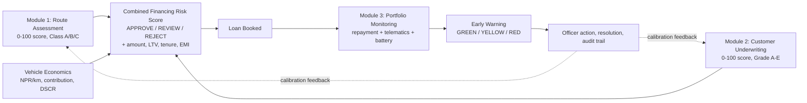

# 0. Executive Summary

**EV Financing Risk Assessment & Portfolio Monitoring Platform**
Prepared for: Chief Technology Officer, Chief Risk Officer, Product Management, Investment Committee

---

## 0.1 The problem in one page

Nepal's commercial EV fleet — taxis, ride-hailing cars, school vans, inter-city micro-buses,
three-wheeler tempos and last-mile cargo vehicles — is the fastest-growing slice of a rapidly
growing EV import market. Lenders want the book. Three things stop them from writing it well.

**1. The collateral only earns money on a route, and nobody scores the route.**
A Mahindra Treo on the Ring Road with four public chargers inside 6 km and 90 passenger-trips a day
is a different credit from the identical Treo on a mid-hill road with one charger 55 km away and a
three-month monsoon interruption. Today both get the same file, the same LTV and the same rate.
Route risk is *transferred silently into the borrower's ability to pay* and only surfaces at
delinquency.

**2. EV unit economics are not in the credit template.**
A traditional auto-loan appraisal asks for income and CIB. It does not ask "what is the energy cost
per km on this route, what is the daily net contribution, and does that contribution cover the EMI
with a buffer?" For a commercial EV the answer is calculable — energy cost is roughly NPR 1.5–3.5
per km against NPR 6–10 per km for diesel — and it is the most reliable predictor of whether the
borrower can service the loan out of operations rather than out of other income.

**3. Post-disbursement blindness.**
Monitoring today means "did the EMI arrive?" That is a lagging indicator by 30–60 days. An EV that
stops running is visible *immediately* in kilometres, charging sessions and trip counts — weeks
before the first bounce. Nobody is watching it.

**Consequence:** lenders either over-price the whole EV segment, losing good customers to a
competitor, or under-price it uniformly and absorb the high-risk-route defaults. Both are avoidable.

---

## 0.2 What we are building

A web platform, deployed inside the financial institution, with three scoring modules and one
monitoring loop.

| Module | What it answers | Core output |
|--------|-----------------|-------------|
| **1. Route Assessment** | Is this operating corridor financially and operationally viable for an EV? | Route Score 0–100, Class A/B/C (A ≥ 88 under the active configuration), charging adequacy verdict, revenue potential, explicit risk and positive factor lists |
| **2. Customer Underwriting** | Is this applicant creditworthy for this vehicle? | Customer Score 0–100, Credit Grade A–E, APPROVE / MANUAL REVIEW / REJECT with reason codes |
| **Combined engine** | What should we actually lend? | Final Risk Score, risk grade, recommended amount, max LTV, tenure, EMI, DSCR |
| **3. Portfolio Monitoring** | Is the financed asset still performing? | Daily behaviour evaluation, GREEN/YELLOW/RED alerts with owner, SLA and resolution |

Every weight, every threshold and every alert rule is **stored in the database and editable by an
administrator through the UI**. Nothing risk-material is hard-coded. Changing a weight creates a new
*version* of the configuration; scores are stamped with the version that produced them, so a
decision made in March can still be explained in September.

---

## 0.3 Why this is defensible

| Differentiator | Why it matters to a lender |
|----------------|----------------------------|
| **Route as a scored, reusable underwriting object** | Assess "Kathmandu–Dhulikhel" once; reuse it across the 40 applications that run it. Marginal underwriting cost collapses. |
| **Explainability by construction** | Every score returns its component breakdown and a human-readable reason list. Satisfies credit committee, internal audit and regulatory inspection. No black box. |
| **Telematics-led early warning** | Detects distress weeks earlier than repayment-only monitoring. Earlier contact means a materially higher cure rate. |
| **Configuration is a product feature, not a code change** | Risk policy changes ship in an afternoon by the Risk Manager, not in a release by engineering. |
| **Full audit trail** | Append-only `audit_logs` on every scoring run, config change, decision and override. |

---

## 0.4 Target users

| Role | Primary job on the platform |
|------|------------------------------|
| Super Admin | Users, roles, system settings, integrations |
| Risk Manager | Owns scoring configuration and risk rules; final approver above delegation limit |
| Credit Officer | Data entry, applicant appraisal, runs assessments, submits recommendations |
| Portfolio Manager | Owns the book post-disbursement; triages and assigns alerts |
| Field Officer | Field verification, alert investigation, resolution notes (mobile-heavy) |
| Viewer / Auditor | Read-only across everything, including audit logs |

---

## 0.5 MVP scope — what ships first

**In (MUST HAVE):** authentication and RBAC; route CRUD and scoring engine; applicant and financial
capture; mock CIB adapter; customer scoring engine; combined risk engine with EMI/DSCR/LTV
calculation; underwriting decision with reasons; loan booking and repayment schedule generation;
repayment recording; mock telematics ingestion; early warning rules engine (YELLOW/RED); alert
workflow; risk and portfolio dashboards; admin configuration screens; audit logs; seeded demo data.

**Out (deferred):** live CIB and telematics contracts; document OCR/KYC automation; ML-based
probability of default; native mobile app; e-signature; core-banking write-back; payment gateway;
IFRS-9 ECL staging; Nepali-language UI.

**Team and timeline:** 4 engineers (1 frontend, 2 backend, 1 full-stack/DevOps) plus a part-time
designer and a PM/BA. **14 weeks to production-ready MVP**, with a demonstrable end-to-end vertical
slice at **week 8**. Detailed phase plan in [11-MVP-ROADMAP.md](11-MVP-ROADMAP.md).

---

## 0.6 Technology, in one line each

- **Frontend:** Next.js 15 (App Router), React 19, TypeScript, Tailwind CSS, shadcn/ui, Recharts, React Hook Form + Zod, TanStack Query
- **Backend:** Python 3.12, FastAPI, Pydantic v2, SQLAlchemy 2.0, Alembic, pytest
- **Database:** PostgreSQL 16
- **Infrastructure (MVP):** Docker Compose, Nginx, Ubuntu 22.04 LTS
- **Infrastructure (production):** adds Redis, Celery + Celery Beat, Prometheus, Grafana, Loki, nightly `pg_dump` plus WAL archiving

FastAPI is chosen because the scoring engine *is* the product: Pydantic gives one type-checked
definition of a scoring payload that is simultaneously the validation layer, the OpenAPI contract and
the source for generated TypeScript client types — so a weight added by the Risk Manager cannot
silently diverge between engine, API and UI. Full rationale in [02-TRD.md](02-TRD.md) §3.

---

## 0.7 Success metrics

| Metric | Baseline (manual today) | Target at 6 months |
|--------|------------------------|--------------------|
| Time from application intake to credit decision | 5–10 working days | **< 24 hours** for Class A / Grade A–B files |
| Underwriting files per credit officer per month | ~25 | **60+** |
| Share of EV applications with a scored route attached | 0% | **100%** |
| Distressed accounts detected before first missed EMI | ~0% | **≥ 40%** of eventual NPLs |
| 90+ DPD ratio on the platform-underwritten EV book | n/a | **< 3%** at 12 months on book |
| Decisions carrying a complete machine-generated explanation | 0% | **100%** |
| Risk Manager override rate on engine recommendations | n/a | **< 15%** (higher means the model needs recalibration) |

---

## 0.8 Principal risks

| Risk | Severity | Mitigation |
|------|----------|------------|
| Weights are expert judgement, not statistically fitted — no EV default history exists yet in this market | **High** | Ship as an explicitly labelled *expert scorecard*. Persist every score component in `route_score_components` and `credit_scores` so the book can be re-fitted logistically once roughly 300 matured loans exist. Quarterly calibration review is a standing agenda item. |
| Telematics data quality and device tampering | High | Corroborate multiple signals (kilometres **and** charging sessions **and** trip count). A stale feed is itself a YELLOW condition, so silence is never read as health. |
| Charging station data goes stale | Medium | The charging registry is versioned with `verified_at`; assessments older than the configured staleness window are flagged for re-assessment on the route detail screen. |
| Officer overrides become routine, hollowing out the model | Medium | Overrides require a typed justification, are audit-logged, and override rate is a dashboard KPI reviewed monthly. |
| Commercial terms with the credit bureau delay live integration | Medium | Adapter pattern: mock and live implement one interface. The MVP demo is unaffected. |
| Scope creep into a full loan-origination / core-banking replacement | High | Explicit MUST/SHOULD/COULD tagging in every document. Anything touching general ledger, disbursement or payment rails is COULD. |

---

## 0.9 The ask

Approve the 14-week MVP build (4 engineers plus design and PM support) against the frozen scope in
[11-MVP-ROADMAP.md](11-MVP-ROADMAP.md), with a go/no-go review at the week-8 vertical-slice demo
described in [12-DEMO-FLOW.md](12-DEMO-FLOW.md).
