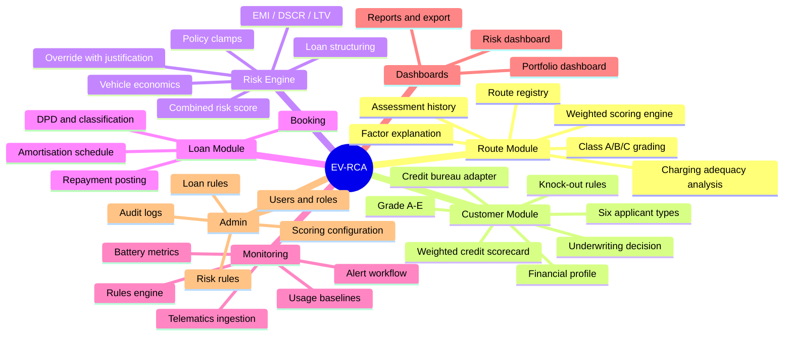
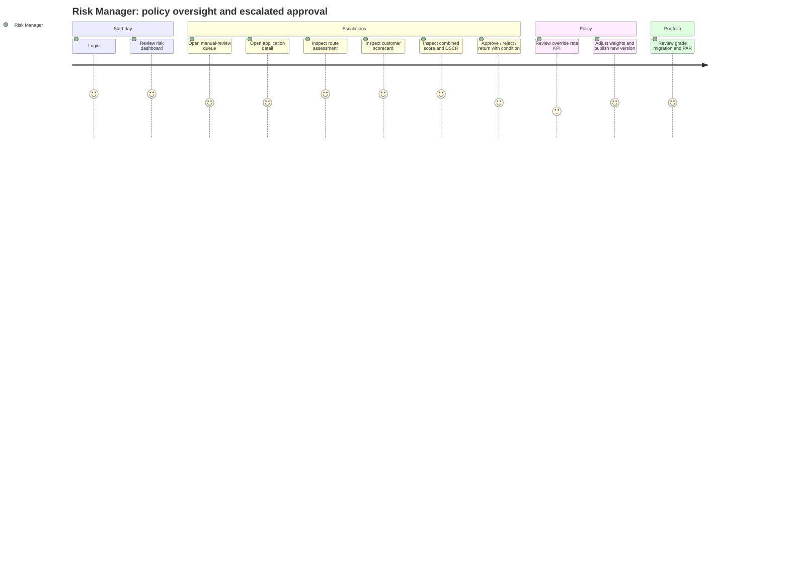

# 1. Product Requirement Document (PRD)

**Product:** EV Financing Risk Assessment, Customer Underwriting & Portfolio Monitoring Platform
**Codename:** EV-RCA
**Version:** 1.0 · **Owner:** Product Management · **Status:** Approved for build

---

## 1.1 Executive summary

EV-RCA is an internal lending platform for Nepali banks and finance companies that turns commercial
EV financing from a judgement-driven, paper-based appraisal into a scored, explainable, continuously
monitored process. It scores three objects — the **route**, the **borrower** and the **vehicle's unit
economics** — combines them into a single **Final Financing Risk Score**, converts that score into a
concrete credit structure (amount, LTV, tenure, EMI, DSCR), and then keeps watching the loan after
disbursement using repayment plus telematics signals, raising YELLOW and RED early-warning alerts
that are routed to a named officer with an SLA.

---

## 1.2 Problem statement

| # | Problem | Evidence / manifestation | Cost to the lender |
|---|---------|--------------------------|--------------------|
| P1 | Route viability is not assessed | No field in any current appraisal form captures charging density, road condition or corridor demand | Identical pricing for materially different risks; concentration in unviable corridors |
| P2 | EV unit economics not modelled | Appraisals reuse the ICE template (fuel cost, resale) | Ability-to-pay is estimated from declared income only, which is unverifiable for informal transport operators |
| P3 | Underwriting is slow and inconsistent | 5–10 working days; two officers reach different conclusions on the same file | Lost applications; regulatory findings on inconsistent credit standards |
| P4 | Decisions are not explainable after the fact | Rationale lives in a free-text memo, if at all | Weak audit position; impossible to calibrate the policy |
| P5 | Post-disbursement monitoring is repayment-only | First signal of distress is a bounced EMI | Recovery effort begins 30–60 days after the operational failure; cure rate collapses |
| P6 | Risk policy changes require IT | Thresholds live in spreadsheets or in developers' code | Policy cannot respond to a changing market |

---

## 1.3 Background and context

Nepal's policy environment favours electric vehicles: substantially lower customs and excise duty
than comparable internal-combustion vehicles, and central-bank treatment that permits a higher
loan-to-value ratio for EVs than for petrol/diesel vehicles. The result is a rapid shift in the
commercial transport segment — three-wheeler tempos, taxis, ride-hailing sedans, school and staff
vans, small cargo carriers and inter-city micro-buses.

Two structural features of this market drive the product design:

1. **Charging infrastructure is corridor-shaped, not area-shaped.** Public DC fast chargers cluster
   on the Kathmandu Valley ring, along the East–West Highway and in a handful of urban centres. A
   route either has adequate charging or it does not, and that fact dominates operational viability.
2. **Borrower income is largely informal.** A tempo driver or a small transport operator cannot
   produce audited statements. The vehicle's own earning capacity on a known route is a *better*
   evidence base than a declared income figure — but only if the route is characterised.

Regulatory context the product must respect: credit information bureau enquiry before sanction,
blacklist checking, KYC record retention, loan classification and provisioning by days-past-due, and
inspectability of credit decisions. The platform is a **decision-support and monitoring system**; it
does not replace the core banking system, the general ledger or the disbursement rails.

---

## 1.4 Objectives and goals

### Business objectives

| ID | Objective | Measure |
|----|-----------|---------|
| BO-1 | Cut time-to-decision on EV applications | < 24 h for Class A / Grade A–B files |
| BO-2 | Grow EV disbursement volume without raising delinquency | 90+ DPD < 3% at 12 months on book |
| BO-3 | Detect distress before it becomes delinquency | ≥ 40% of eventual NPLs flagged pre-first-miss |
| BO-4 | Make every credit decision auditable and explainable | 100% of decisions carry machine-generated reasons |
| BO-5 | Let Risk own risk policy | Zero code deploys required for weight/threshold changes |

### Product goals

- One screen that tells a credit officer everything needed to recommend a decision.
- No scoring output without an explanation attached.
- Configuration is versioned; scores are reproducible.
- Usable by an officer with modest computer literacy; desktop-first, mobile-tolerable.

### Non-goals (MVP)

Disbursement, accounting entries, payment collection, e-KYC/OCR, credit-bureau reporting,
customer-facing portal, insurance integration, dealer/vendor portal, machine-learning models.

---

## 1.5 Target users and personas

### Persona 1 — Sabina, Risk Manager (age 38, Kathmandu HO)

- **Owns:** credit policy, scorecard weights, alert rules, portfolio quality.
- **Day:** reviews escalated files, watches the portfolio dashboard, adjusts thresholds after the
  monthly credit committee, answers audit queries.
- **Pain:** "I cannot tell you why we approved that file in Ashad. The memo says 'satisfactory'."
- **Needs:** configuration UI with versioning, override audit, portfolio concentration by route.
- **Success:** she can change the charging-infrastructure weight from 30% to 35% herself and see the
  effect on a simulated portfolio before publishing.

### Persona 2 — Ramesh, Credit Officer (age 29, branch)

- **Owns:** file quality and the initial recommendation.
- **Day:** meets applicants, captures data, pulls CIB, runs assessments, writes the recommendation.
- **Pain:** re-keying the same route information for every applicant on the same corridor; arguing
  with the branch manager about a subjective score.
- **Needs:** fast forms with inline validation, autosave, reusable routes, a defensible printout.
- **Success:** he completes a full file in under 25 minutes and the recommendation defends itself.

### Persona 3 — Kiran, Portfolio Manager (age 34, HO)

- **Owns:** the book after disbursement.
- **Day:** triages the alert queue, assigns field visits, chases cures, reports to management.
- **Pain:** finds out about problems from the collections spreadsheet, 45 days late.
- **Needs:** a prioritised alert queue with severity, SLA, assignment and resolution tracking.
- **Success:** he calls a borrower in week 2 of declining usage, not month 3 of arrears.

### Persona 4 — Dipesh, Field Officer (age 26, field)

- **Owns:** ground truth.
- **Day:** on a motorcycle, verifying vehicles, meeting borrowers, photographing chargers.
- **Pain:** paper forms, then evening data entry.
- **Needs:** mobile-usable alert detail screen, few fields, works on a weak connection.
- **Success:** he closes an investigation from the field with a note and a photo.

### Persona 5 — Anita, Internal Auditor (age 45, HO)

- **Owns:** assurance.
- **Needs:** read-only access to everything, immutable audit logs, the ability to reproduce any
  historical score from the stored configuration version.

### Persona 6 — Bikash, Super Admin / IT (age 31, HO)

- **Owns:** users, roles, integrations, uptime, backups.

---

## 1.6 User stories

Format: `As a <role>, I want <capability>, so that <benefit>.`
Priority: **P0** critical (MVP blocker) · **P1** high · **P2** medium · **P3** low.
Full backlog with complexity and dependencies is in [14-DEVELOPMENT-BACKLOG.md](14-DEVELOPMENT-BACKLOG.md).

### Epic A — Access & identity

| ID | Story | Pri |
|----|-------|-----|
| US-A1 | As any user, I want to log in with email and password and receive a session, so that I can use the platform securely. | P0 |
| US-A2 | As any user, I want my session to refresh silently so I am not logged out mid-form. | P0 |
| US-A3 | As a Super Admin, I want to create users and assign exactly one role, so that access matches job function. | P0 |
| US-A4 | As a Super Admin, I want to deactivate a user immediately, so that a departing employee loses access the same day. | P0 |
| US-A5 | As any user, I want to reset a forgotten password via an emailed single-use link. | P1 |
| US-A6 | As a Super Admin, I want to see and configure which permissions each role holds. | P1 |

### Epic B — Route assessment

| ID | Story | Pri |
|----|-------|-----|
| US-B1 | As a Credit Officer, I want to create a route with its physical, demand and revenue attributes, so it can be assessed. | P0 |
| US-B2 | As a Credit Officer, I want to run an assessment on a route and see a 0–100 score with a Class A/B/C grade. | P0 |
| US-B3 | As a Credit Officer, I want to see which factors helped and which hurt the score, so I can explain it to the applicant and the committee. | P0 |
| US-B4 | As a Credit Officer, I want a charging-infrastructure verdict (adequate / marginal / inadequate) with the reasoning. | P0 |
| US-B5 | As a Credit Officer, I want to reuse an already-assessed route across many applications, so I do not re-key data. | P0 |
| US-B6 | As a Risk Manager, I want to see the full assessment history of a route, so I can see how a corridor is changing. | P1 |
| US-B7 | As a Risk Manager, I want routes whose assessment is older than N days flagged as stale. | P1 |
| US-B8 | As a Credit Officer, I want to export a route assessment as PDF for the credit file. | P2 |

### Epic C — Applicant & underwriting

| ID | Story | Pri |
|----|-------|-----|
| US-C1 | As a Credit Officer, I want to register an applicant of any supported type (individual driver, owner-driver, corporate, fleet operator, SME, transport company). | P0 |
| US-C2 | As a Credit Officer, I want to capture income, expenses, existing obligations, bank balance and down payment. | P0 |
| US-C3 | As a Credit Officer, I want to pull a credit bureau report into the file with one click (mock in MVP). | P0 |
| US-C4 | As a Credit Officer, I want a 0–100 customer score with an A–E grade and a component breakdown. | P0 |
| US-C5 | As a Credit Officer, I want an APPROVE / MANUAL REVIEW / REJECT recommendation with explicit reasons. | P0 |
| US-C6 | As a Credit Officer, I want hard knock-out rules (blacklist, active default, under-age) to reject immediately and say so. | P0 |
| US-C7 | As a Credit Officer, I want to upload identity, income and vehicle quotation documents against the applicant. | P1 |
| US-C8 | As a Risk Manager, I want to override a recommendation with a mandatory typed justification. | P0 |
| US-C9 | As a Credit Officer, I want the applicant's existing EMIs auto-summed into the debt burden calculation. | P0 |

### Epic D — Combined risk & loan structuring

| ID | Story | Pri |
|----|-------|-----|
| US-D1 | As a Credit Officer, I want a Final Risk Score combining route, customer and vehicle economics. | P0 |
| US-D2 | As a Credit Officer, I want the system to propose loan amount, max LTV, tenure and EMI. | P0 |
| US-D3 | As a Credit Officer, I want the DSCR computed from vehicle net contribution against the proposed EMI. | P0 |
| US-D4 | As a Credit Officer, I want a full amortisation schedule generated when the loan is booked. | P0 |
| US-D5 | As a Risk Manager, I want the engine to refuse structures breaching the configured LTV, tenure or amount caps. | P0 |
| US-D6 | As a Credit Officer, I want a what-if control: change down payment or tenure and see DSCR/EMI update before saving. | P1 |

### Epic E — Portfolio monitoring & early warning

| ID | Story | Pri |
|----|-------|-----|
| US-E1 | As a Portfolio Manager, I want repayments recorded against the schedule, with DPD computed. | P0 |
| US-E2 | As the system, I want to ingest daily telematics per vehicle (km, trips, active hours, idle, deviation). | P0 |
| US-E3 | As the system, I want to evaluate configured rules nightly and raise YELLOW/RED alerts. | P0 |
| US-E4 | As a Portfolio Manager, I want an alert queue sorted by severity and age, with assignment. | P0 |
| US-E5 | As a Field Officer, I want to add investigation notes and resolve an alert with a resolution code. | P0 |
| US-E6 | As a Portfolio Manager, I want a per-loan monitoring view: repayment trend, usage trend, battery health. | P0 |
| US-E7 | As a Risk Manager, I want to create, edit, enable and disable alert rules without a code change. | P0 |
| US-E8 | As a Portfolio Manager, I want duplicate alerts suppressed while an identical one is open. | P0 |
| US-E9 | As a Portfolio Manager, I want an email/in-app notification when a RED alert is raised on my portfolio. | P1 |
| US-E10 | As the system, I want to raise an alert when a vehicle's telematics feed goes silent. | P1 |

### Epic F — Dashboards & reporting

| ID | Story | Pri |
|----|-------|-----|
| US-F1 | As any user, I want a role-appropriate dashboard on login with the KPIs I own. | P0 |
| US-F2 | As a Risk Manager, I want portfolio distribution by risk grade and by route class. | P0 |
| US-F3 | As a Portfolio Manager, I want a risk table of all active loans with DPD, usage change and alert status. | P0 |
| US-F4 | As a Risk Manager, I want disbursement, repayment-performance and default trends over time. | P1 |
| US-F5 | As any user, I want to export a report to CSV/PDF. | P1 |
| US-F6 | As a Risk Manager, I want geographic distribution of the book by district/province. | P2 |

### Epic G — Administration

| ID | Story | Pri |
|----|-------|-----|
| US-G1 | As a Risk Manager, I want to edit route and customer scoring weights, with the sum validated to 100%. | P0 |
| US-G2 | As a Risk Manager, I want to edit grade thresholds (Class A/B/C, Grade A–E). | P0 |
| US-G3 | As a Risk Manager, I want to edit loan rules: max LTV, max amount, min down payment, max tenure, rate band. | P0 |
| US-G4 | As a Risk Manager, I want configuration changes versioned, with the ability to see who changed what and when. | P0 |
| US-G5 | As an Auditor, I want a searchable, filterable, read-only audit log. | P0 |
| US-G6 | As a Risk Manager, I want to preview a configuration change against historical applications before publishing. | P2 |

---

## 1.7 Functional requirements

Notation: **[M]** MUST (MVP) · **[S]** SHOULD (Phase 2) · **[C]** COULD (future).

### FR-1 Authentication & authorisation

| ID | Requirement | Scope |
|----|-------------|-------|
| FR-1.1 | Email + password login issuing a short-lived JWT access token and a long-lived rotating refresh token. | [M] |
| FR-1.2 | Passwords hashed with Argon2id; minimum 12 characters, complexity enforced, last 5 reused passwords rejected. | [M] |
| FR-1.3 | Exactly one role per user; permissions derived from role. | [M] |
| FR-1.4 | Every API endpoint declares its required permission; the check is server-side. | [M] |
| FR-1.5 | Account lockout for 15 minutes after 5 failed attempts within 15 minutes. | [M] |
| FR-1.6 | Password reset by single-use, 30-minute, emailed token. | [M] |
| FR-1.7 | Forced password change on first login for admin-created accounts. | [M] |
| FR-1.8 | TOTP two-factor authentication for Super Admin and Risk Manager. | [S] |
| FR-1.9 | LDAP / Active Directory single sign-on. | [C] |

### FR-2 Route management & assessment

| ID | Requirement | Scope |
|----|-------------|-------|
| FR-2.1 | Create, read, update, soft-delete routes. Route name unique per (origin, destination) pair. | [M] |
| FR-2.2 | Capture all route attributes listed in §1.10 Route Data Dictionary. | [M] |
| FR-2.3 | Run an assessment producing a 0–100 score using the **active** scoring configuration version. | [M] |
| FR-2.4 | Persist every component sub-score, its raw input, its normalised value, its weight and its weighted contribution. | [M] |
| FR-2.5 | Classify the route into a configurable band (ROUTE v2: Class A ≥ 88, B 60–87.99, C < 60). | [M] |
| FR-2.6 | Produce structured `risk_factors[]` and `positive_factors[]` with severity and human text. | [M] |
| FR-2.7 | Produce a charging-adequacy verdict derived from range-vs-charging-gap analysis. | [M] |
| FR-2.8 | Recompute on re-assessment; keep all prior assessments immutably. | [M] |
| FR-2.9 | Mark an assessment stale after a configurable number of days (default 180). | [M] |
| FR-2.10 | Compare two assessments of the same route side by side. | [S] |
| FR-2.11 | Map visualisation of the route corridor and charging stations. | [C] |

### FR-3 Applicant management

| ID | Requirement | Scope |
|----|-------------|-------|
| FR-3.1 | Register applicants of six types; type drives which field groups are required. | [M] |
| FR-3.2 | Store personal, contact, address, identity and experience data. | [M] |
| FR-3.3 | Store a financial profile: income, business revenue, expenses, existing loans, existing EMI, bank balance. | [M] |
| FR-3.4 | Store multiple existing-obligation rows and auto-sum monthly EMI. | [M] |
| FR-3.5 | Fetch a credit bureau report through a pluggable provider (mock in MVP), persist the raw response. | [M] |
| FR-3.6 | Upload documents with type, size and MIME validation; store outside the web root. | [M] |
| FR-3.7 | Prevent duplicate applicants on national ID / PAN with a warning and a merge prompt. | [M] |
| FR-3.8 | Financial profile is versioned; assessments reference the version used. | [M] |
| FR-3.9 | OCR extraction from uploaded citizenship/PAN documents. | [C] |

### FR-4 Credit scoring & underwriting

| ID | Requirement | Scope |
|----|-------------|-------|
| FR-4.1 | Compute a 0–100 customer score from six weighted components (configurable). | [M] |
| FR-4.2 | Map the score to grade A–E using configurable thresholds. | [M] |
| FR-4.3 | Evaluate hard knock-out rules **before** scoring; a knock-out forces REJECT and short-circuits. | [M] |
| FR-4.4 | Produce APPROVE / MANUAL REVIEW / REJECT with a reason list carrying reason codes. | [M] |
| FR-4.5 | Compute DTI, FOIR, disposable income and the post-EMI surplus. | [M] |
| FR-4.6 | Compute vehicle economics: energy cost per km, net daily contribution, monthly contribution, payback. | [M] |
| FR-4.7 | Combine route + customer + vehicle economics into a Final Risk Score with configurable weights. | [M] |
| FR-4.8 | Recommend loan amount, max LTV, tenure, EMI and DSCR; clamp all to configured policy caps. | [M] |
| FR-4.9 | Allow an authorised user to override the recommendation with a mandatory justification. | [M] |
| FR-4.10 | Persist the configuration version, engine version and full input snapshot with each assessment. | [M] |
| FR-4.11 | Four-eyes: a decision above a configurable amount requires a second approver. | [S] |
| FR-4.12 | Risk-based pricing: map final grade to an interest-rate premium. | [S] |
| FR-4.13 | Logistic-regression PD model trained on realised performance. | [C] |

### FR-5 Loan management

| ID | Requirement | Scope |
|----|-------------|-------|
| FR-5.1 | Book a loan from an approved application, carrying the approved structure forward. | [M] |
| FR-5.2 | Generate an equal-monthly-instalment amortisation schedule (reducing balance). | [M] |
| FR-5.3 | Record repayments (full, partial, advance) and allocate to principal/interest/penalty. | [M] |
| FR-5.4 | Compute days past due, outstanding principal and overdue amount nightly. | [M] |
| FR-5.5 | Classify the loan by DPD into performing / watchlist / substandard / doubtful / loss buckets (configurable). | [M] |
| FR-5.6 | Support a moratorium / restructure that regenerates the schedule and keeps the old one. | [S] |
| FR-5.7 | Foreclosure and settlement handling. | [C] |

### FR-6 Portfolio monitoring

| ID | Requirement | Scope |
|----|-------------|-------|
| FR-6.1 | Ingest daily telematics per vehicle: km, trips, avg speed, active hours, idle minutes, deviation. | [M] |
| FR-6.2 | Ingest battery metrics: state of charge, state of health, charging sessions, energy consumed. | [M] |
| FR-6.3 | Compute rolling 7-day and 30-day usage baselines and percentage change. | [M] |
| FR-6.4 | Compute an inferred monthly revenue from km and route fare characteristics. | [M] |
| FR-6.5 | Per-loan monitoring view with repayment, usage and battery trends. | [M] |
| FR-6.6 | Detect and flag a stale telematics feed. | [M] |
| FR-6.7 | Maintenance event log per vehicle. | [S] |
| FR-6.8 | Live map of fleet positions. | [C] |

### FR-7 Early warning / rules engine

| ID | Requirement | Scope |
|----|-------------|-------|
| FR-7.1 | Rules stored as data: metric, operator, threshold, window, severity, action. | [M] |
| FR-7.2 | Rules composed of multiple conditions joined by AND/OR. | [M] |
| FR-7.3 | Nightly batch evaluation of all active rules against all active loans. | [M] |
| FR-7.4 | On-demand re-evaluation for a single loan. | [M] |
| FR-7.5 | Deduplication: no second open alert for the same (loan, rule) pair. | [M] |
| FR-7.6 | Auto-resolution when the triggering condition clears, with an audit note. | [M] |
| FR-7.7 | Alert lifecycle: OPEN → ACKNOWLEDGED → IN_PROGRESS → RESOLVED / FALSE_POSITIVE / ESCALATED. | [M] |
| FR-7.8 | Assignment to a user, with SLA by severity. | [M] |
| FR-7.9 | Enable/disable and dry-run a rule against historical data before activating. | [S] |
| FR-7.10 | SMS notification to the borrower on YELLOW payment alerts. | [C] |

### FR-8 Dashboards & reports

| ID | Requirement | Scope |
|----|-------------|-------|
| FR-8.1 | Role-specific dashboard with the KPI cards listed in §1.11. | [M] |
| FR-8.2 | The nine charts listed in §1.11. | [M] (7 of 9) / [S] (geographic, EV usage trend) |
| FR-8.3 | Risk table with server-side pagination, sorting and filtering. | [M] |
| FR-8.4 | Date-range and portfolio filters persisted per user. | [S] |
| FR-8.5 | Scheduled email reports. | [C] |

### FR-9 Administration & audit

| ID | Requirement | Scope |
|----|-------------|-------|
| FR-9.1 | Scoring configuration editor with live weight-sum validation. | [M] |
| FR-9.2 | Publishing a configuration creates a new immutable version; the previous stays queryable. | [M] |
| FR-9.3 | Loan rules editor (LTV, amount, down payment, tenure, rate). | [M] |
| FR-9.4 | Risk rules editor. | [M] |
| FR-9.5 | User and role management. | [M] |
| FR-9.6 | Append-only audit log of every write, with actor, entity, before/after and IP. | [M] |
| FR-9.7 | System settings (institution name, currency, fiscal year, staleness windows, SLA hours). | [M] |
| FR-9.8 | Configuration rollback to a prior version. | [S] |

---

## 1.8 Non-functional requirements

See [02-TRD.md](02-TRD.md) §12 for the engineering treatment. Summary targets:

| Category | MVP target | Production target |
|----------|-----------|-------------------|
| API latency (p95, read) | < 400 ms | < 250 ms |
| API latency (p95, scoring) | < 800 ms | < 500 ms |
| Dashboard first meaningful paint | < 2.5 s | < 1.5 s |
| Concurrent users | 50 | 500 |
| Records | 10k applications / 5k loans | 1M+ applications |
| Availability | 99.0% business hours | 99.5% 24×7 |
| RPO / RTO | 24 h / 8 h | 15 min / 2 h |
| Browser support | Chrome/Edge/Firefox latest 2, Safari 16+ | same |
| Accessibility | WCAG 2.1 AA on core flows | WCAG 2.1 AA throughout |
| Localisation | English UI, NPR currency, AD dates with BS display | + Nepali UI, BS date entry |

---

## 1.9 Product features (feature map)

---

## 1.10 Data dictionary — business inputs

### 1.10.1 Route inputs

| Field | Type | Unit / values | Required | Validation | Used by |
|-------|------|---------------|----------|------------|---------|
| `route_name` | text | e.g. "Kathmandu–Dhulikhel" | Yes | 3–150 chars, unique per origin+destination | identity |
| `origin` | text | place name | Yes | 2–100 chars | identity |
| `destination` | text | place name | Yes | 2–100 chars | identity |
| `province`, `district` | enum/text | Nepal admin units | Yes | from reference list | geographic charts |
| `total_distance_km` | numeric | km | Yes | 0.5–1000 | charging, revenue, energy |
| `road_type` | enum | `PITCH`, `GRAVEL`, `OFF_ROAD`, `MIXED` | Yes | one of | road score |
| `road_condition` | enum | `EXCELLENT`, `GOOD`, `FAIR`, `POOR`, `VERY_POOR` | Yes | one of | road score |
| `gradient_profile` | enum | `FLAT`, `ROLLING`, `HILLY`, `STEEP` | Yes | one of | road score, energy multiplier |
| `charging_station_count` | int | count on/near corridor | Yes | 0–200 | charging score |
| `charging_station_density` | numeric | stations per 10 km (derived, override allowed) | Derived | ≥ 0 | charging score |
| `avg_charging_distance_km` | numeric | mean gap between chargers | Yes | ≥ 0 | charging score |
| `fast_charger_count` | int | DC ≥ 25 kW | Yes | ≤ station count | charging score |
| `passenger_volume_daily` | int | passengers/day on corridor | Conditional | ≥ 0 | demand score |
| `freight_volume_daily_tons` | numeric | tons/day | Conditional | ≥ 0 | demand score |
| `estimated_daily_trips` | numeric | trips/day for one vehicle | Yes | 0.1–60 | demand, revenue |
| `avg_fare_per_trip` | numeric | NPR | Conditional | ≥ 0 | revenue |
| `avg_freight_revenue_per_trip` | numeric | NPR | Conditional | ≥ 0 | revenue |
| `traffic_density` | enum | `LOW`, `MODERATE`, `HIGH`, `SEVERE` | Yes | one of | demand (+), road wear (−) |
| `competition_level` | enum | `LOW`, `MODERATE`, `HIGH`, `SATURATED` | Yes | one of | demand penalty |
| `operator_count` | int | competing vehicles | No | ≥ 0 | competition |
| `seasonal_risk` | enum | `NONE`, `LOW`, `MODERATE`, `HIGH`, `SEVERE` | Yes | one of | risk score |
| `monsoon_disruption_days` | int | days/year | Yes | 0–180 | risk score, revenue haircut |
| `flood_landslide_risk` | enum | `NONE`, `LOW`, `MODERATE`, `HIGH`, `SEVERE` | Yes | one of | risk score |
| `security_risk` | enum | `LOW`, `MODERATE`, `HIGH` | Yes | one of | risk score |
| `estimated_daily_revenue` | numeric | NPR (derived, override allowed) | Derived | ≥ 0 | revenue score |
| `estimated_daily_operating_cost` | numeric | NPR | Yes | ≥ 0 | revenue score |
| `estimated_daily_energy_cost` | numeric | NPR (derived, override allowed) | Derived | ≥ 0 | revenue score |
| `electricity_tariff_per_kwh` | numeric | NPR/kWh | Yes | 1–50 | energy cost |
| `permit_required` | boolean | route permit needed | Yes | — | risk note |

### 1.10.2 Applicant inputs

| Group | Fields |
|-------|--------|
| **Identity** | full name, applicant type, date of birth, gender, citizenship/PAN/registration number, phone, email, permanent + current address (province, district, municipality, ward) |
| **Experience** | total working experience (years), driving experience (years), commercial driving experience (years), business operating experience (years), licence category, licence expiry, previous EV experience (bool) |
| **Financial** | monthly income (NPR), monthly business revenue, monthly household expenses, monthly business expenses, existing loan count, total existing EMI, total existing outstanding, average bank balance (6 months), other income, dependants |
| **Loan request** | requested amount, requested tenure (months), proposed interest rate, down payment amount, co-applicant / guarantor present |
| **Credit** | bureau score, bureau grade, credit history months, previous default count, current overdue amount, max days past due (24 months), active loan count, blacklist status, enquiry count (6 months) |
| **Vehicle** | vehicle category, brand, model, variant, ex-showroom price, on-road price, battery capacity (kWh), certified range (km), real-world range (km), motor power (kW), battery warranty (years/km), vehicle warranty, seating/payload capacity, expected daily km, expected operating days per month |

### 1.10.3 Derived business metrics

| Metric | Formula | Purpose |
|--------|---------|---------|
| Debt-to-income (DTI) | `total_existing_emi / total_monthly_income` | debt component |
| FOIR (post-loan) | `(total_existing_emi + proposed_emi) / total_monthly_income` | affordability |
| Disposable income | `total_income − household_expenses − business_expenses − existing_emi` | affordability |
| Down payment ratio | `down_payment / on_road_price` | LTV, equity skin |
| LTV | `loan_amount / on_road_price` | policy cap |
| Energy cost per km | `(battery_kwh / real_range_km) × tariff × (1 + terrain_factor)` | vehicle economics |
| Daily net contribution | `daily_revenue − energy_cost − driver_cost − maintenance_reserve − permit/insurance daily accrual` | DSCR |
| DSCR | `monthly_net_contribution / proposed_emi` | primary affordability gate |
| Payback period (months) | `down_payment_adjusted_cost / monthly_net_contribution` | sanity check |

---

## 1.11 Dashboard specification (business view)

### KPI cards (all [M] unless noted)

| Card | Definition | Drill-through |
|------|-----------|---------------|
| Total Applications | count of applications in the selected period | Application list |
| Approved | decision = APPROVE | filtered list |
| Rejected | decision = REJECT | filtered list |
| Manual Reviews | decision = MANUAL_REVIEW and still pending | work queue |
| Active Loans | loans with status ACTIVE | loan list |
| Total Portfolio Value | sum of original principal of active loans | loan list |
| Outstanding Amount | sum of current outstanding principal | loan list |
| Overdue Amount | sum of overdue principal + interest | arrears list |
| Yellow Alerts | open alerts, severity YELLOW | alert queue |
| Red Alerts | open alerts, severity RED | alert queue |

### Charts

| # | Chart | Type | Scope |
|---|-------|------|-------|
| 1 | Portfolio by risk grade | Donut | [M] |
| 2 | Applications by decision | Stacked bar by month | [M] |
| 3 | Route risk distribution (Class A/B/C) | Horizontal bar | [M] |
| 4 | Customer risk distribution (Grade A–E) | Bar | [M] |
| 5 | Monthly loan disbursement | Column + cumulative line | [M] |
| 6 | Repayment performance (on-time / late / missed) | Stacked area | [M] |
| 7 | Portfolio at risk by DPD bucket | Bar | [M] |
| 8 | EV usage trend (avg daily km, indexed) | Line | [S] |
| 9 | Geographic distribution by province | Map or ranked bar | [S] |

### Risk table columns

Customer · Vehicle (model + registration) · Route (+ class badge) · Loan amount · Final risk score ·
Risk grade · DPD · Usage change % (30d vs baseline) · Alert status · Action.

---

## 1.12 Business rules

### BR-1 Eligibility knock-outs (evaluated first; any hit forces REJECT)

| ID | Rule | Default | Configurable |
|----|------|---------|--------------|
| KO-1 | Applicant appears on the credit-bureau blacklist | reject | on/off only |
| KO-2 | Any loan currently in default (write-off / loss classification) | reject | on/off |
| KO-3 | Age at maturity outside [21, 65] for individuals | 21 / 65 | yes |
| KO-4 | Bureau score below the absolute floor | 550 | yes |
| KO-5 | Down payment below the policy minimum | 20% | yes |
| KO-6 | Requested amount above the product maximum | NPR 5,000,000 | yes |
| KO-7 | Requested tenure above the product maximum | 84 months | yes |
| KO-8 | Route classified Class C and no risk-manager waiver | reject | yes |
| KO-9 | Commercial driving licence missing/expired where the applicant is the driver | reject | on/off |
| KO-10 | Vehicle older than the permitted age for financing (used EV) | 3 years | yes |

### BR-2 Decision matrix (after scoring; first matching row wins)

| Condition | Decision |
|-----------|----------|
| Any knock-out triggered | **REJECT** |
| Final score ≥ 75 AND customer grade in {A, B} AND route class in {A, B} AND DSCR ≥ 1.30 AND FOIR ≤ 0.50 | **APPROVE** |
| Final score < 50 OR customer grade = E OR DSCR < 1.00 | **REJECT** |
| everything else | **MANUAL REVIEW** |

All thresholds in this matrix live in `system_settings` / `scoring_configurations` and are editable.

### BR-3 Loan structuring rules

| ID | Rule | Default |
|----|------|---------|
| LR-1 | Max LTV by final grade | A 80%, B 75%, C 70%, D 60%, E n/a |
| LR-2 | Absolute LTV ceiling (policy/regulatory) | 80% |
| LR-3 | Recommended amount = `min(requested, on_road_price × max_LTV_for_grade, EMI-capacity-implied principal)` | — |
| LR-4 | EMI capacity = `min(FOIR_cap × income − existing_EMI, net_contribution / DSCR_min)` | FOIR cap 0.55, DSCR min 1.25 |
| LR-5 | Max tenure by grade | A 84, B 72, C 60, D 48 months |
| LR-6 | Tenure may not exceed `battery_warranty_months` + 12 | — |
| LR-7 | Interest rate = base rate + grade premium | base 12.5%; A +0.0, B +0.5, C +1.5, D +3.0 |
| LR-8 | Minimum loan amount | NPR 100,000 |

### BR-4 Repayment & classification

| DPD bucket | Classification | Portfolio flag |
|-----------|----------------|----------------|
| 0 | Performing | GREEN |
| 1–30 | Watchlist | YELLOW |
| 31–90 | Substandard | RED |
| 91–180 | Doubtful | RED |
| 181+ | Loss | RED |

### BR-5 Alert SLA

| Severity | Acknowledge within | Resolve within | Auto-escalates to |
|----------|-------------------|----------------|-------------------|
| YELLOW | 48 h | 10 working days | Portfolio Manager |
| RED | 4 h | 3 working days | Risk Manager |

---

## 1.13 Scoring logic (business summary)

Full formulas, normalisation curves and worked examples are in [07-SCORING-ENGINE.md](07-SCORING-ENGINE.md).

**Route Score** = Charging 30% + Road 20% + Demand 30% + Revenue 10% + Risk 10%
(Class A ≥ 88 under the active ROUTE configuration v2; see [07-SCORING-ENGINE.md](07-SCORING-ENGINE.md) §7.3.7)
**Customer Score** = Credit 30% + Income 25% + Debt 15% + Down payment 10% + Experience 10% + Vehicle economics 10%
**Final Risk Score** = Route 40% + Customer 40% + Vehicle economics 20%

All weights are rows in `scoring_config_components`, editable in Admin → Scoring Configuration, and
validated to sum to exactly 100% before a configuration version can be published.

---

## 1.14 Risk rules (business summary)

Full rule catalogue with JSON definitions is in [08-RISK-RULE-ENGINE.md](08-RISK-RULE-ENGINE.md).

| Signal | YELLOW default | RED default |
|--------|---------------|-------------|
| EMI overdue | 1–30 days | > 30 days, or 2 consecutive missed |
| Daily km vs 30-day baseline | down 20–35% for 7 days | down > 50% for 7 days |
| Vehicle inactive | 0 km for 3 consecutive days | 0 km for 7 consecutive days |
| Inferred revenue vs projection | down 20–35% | down > 40% |
| Charging sessions vs baseline | down > 30% | down > 60% |
| Battery state of health | < 80% | < 70% |
| Route deviation | > 30% of trips off corridor | > 60% of trips off corridor |
| Telematics feed silent | 2 days | 5 days |
| Partial payment | any partial payment | 2 consecutive partials |

---

## 1.15 User journeys

Detailed, screen-by-screen journeys with states are in [03-UIUX-DESIGN.md](03-UIUX-DESIGN.md) §5.

### J1 — Risk Manager

### J2 — Credit Officer

Login → Applications → **New application** → select/create applicant → capture financials → pull
bureau report → select/create route → run route assessment → select vehicle → run customer
assessment → run final risk assessment → review recommendation and reasons → attach documents →
submit for approval.

### J3 — Portfolio Manager

Login → Portfolio dashboard → Alerts queue (filter RED, unassigned) → open alert → read trigger
evidence (usage chart, repayment history) → assign to field officer with instruction → track SLA →
review resolution → close or escalate.

### J4 — Administrator

Login → Admin panel → Scoring configuration → edit weights (sum validated) → save as draft →
preview against last 50 applications → publish version → Risk rules → adjust thresholds → User
management → create/deactivate users → Audit logs → filter by actor and date → export.

---

## 1.16 Acceptance criteria (representative)

Given/When/Then form. The full set is attached per story in
[14-DEVELOPMENT-BACKLOG.md](14-DEVELOPMENT-BACKLOG.md).

**AC for US-B2 (route assessment):**
1. Given a route with all required fields and an active scoring configuration, when I run an
   assessment, then a score between 0 and 100 with two decimal places is returned within 2 seconds.
2. Given the same route and the same configuration version, when I run the assessment twice, then
   both runs return an identical score (determinism).
3. Given a route with score 84.0 and default thresholds, then the class returned is `A`.
4. Given any assessment, then the response contains one entry per configured component, and the sum
   of `weighted_score` across components equals the total score within ±0.01.
5. Given a route missing a required field, when I run an assessment, then a 422 is returned naming
   every missing field, and no assessment row is written.
6. Given weights that do not sum to 100, then the configuration cannot be published (400).

**AC for US-C5 (underwriting decision):**
1. Given a blacklisted applicant, the decision is REJECT, the reason list contains
   `KO_BLACKLIST`, and no component scoring is performed.
2. Given final score 78, grade B, route class A, DSCR 1.42, FOIR 0.44, the decision is APPROVE.
3. Given DSCR 0.95, the decision is REJECT with reason code `DSCR_BELOW_MINIMUM`, regardless of score.
4. Every decision persists `scoring_config_version`, `engine_version`, `input_snapshot` and the
   ordered reason list.
5. An override requires a justification of at least 20 characters and writes an audit-log entry with
   the original and overridden values.

**AC for US-E3 (alert generation):**
1. Given a loan with an instalment 5 days overdue and the default rules, the nightly job creates
   exactly one YELLOW alert with rule code `EMI_OVERDUE_1_30`.
2. Given that alert is already OPEN, the next night's run does not create a duplicate; it updates
   `last_evaluated_at` and the current metric value.
3. Given the instalment is then paid, the next run auto-resolves the alert with resolution code
   `AUTO_CONDITION_CLEARED`.
4. Given a loan crosses 31 days overdue, the YELLOW alert is superseded by a RED alert with rule code
   `EMI_OVERDUE_30_PLUS`, and the YELLOW is closed as `SUPERSEDED`.
5. Every alert row records the rule id, the evaluated metric value and the threshold that fired.

---

## 1.17 MVP scope statement

**The MVP is complete when a user can, on a clean install with seeded data, execute the 17-step demo
flow in [12-DEMO-FLOW.md](12-DEMO-FLOW.md) without a developer present, on a server other than a
developer's laptop, with role-based access enforced and every action audit-logged.**

| In MVP | Out of MVP |
|--------|-----------|
| All FR items tagged [M] | All [S] and [C] items |
| Mock CIB, mock telematics | Live bureau/telematics contracts |
| Email notifications (SMTP) | SMS, push, WhatsApp |
| CSV export | Scheduled PDF report distribution |
| Single institution, single currency | Multi-tenant, multi-currency |
| English UI | Nepali UI |
| Manual repayment entry | Payment gateway / core-banking sync |

---

## 1.18 Future scope

Prioritised in [13-FUTURE-ENHANCEMENTS.md](13-FUTURE-ENHANCEMENTS.md). Headlines: live bureau and
telematics integration, ML probability-of-default and loss-given-default models, dealer and borrower
portals, IFRS-9 expected-credit-loss staging, battery-health-based residual value and refinancing,
charging-network partnership data feeds, Nepali localisation, and a native mobile app for field
officers.

---

## 1.19 Assumptions

| ID | Assumption | Owner to validate | If wrong |
|----|-----------|-------------------|----------|
| A-1 | The regulator permits a higher LTV for EVs than for ICE vehicles; modelled at 80% and configurable | Compliance | Change one setting in Admin → Loan Rules |
| A-2 | Bureau data is available per enquiry with a score, history and blacklist flag | Credit ops | Reduce the credit component weight; increase the weight on documentary income |
| A-3 | Telematics can be sourced per financed vehicle (OEM cloud, aftermarket OBD, or fleet app) | Business / Ops | Monitoring degrades to repayment-only; usage rules are disabled by configuration |
| A-4 | The institution accepts an expert scorecard pending statistical calibration | CRO | Delay launch until a pilot book exists |
| A-5 | All amounts are NPR; no FX | Finance | Add a currency dimension (significant rework) |
| A-6 | Users have reliable office internet; field officers have intermittent mobile data | IT | Add an offline-capable field module |
| A-7 | Charging station data can be maintained manually at first (a few hundred rows) | Ops | Prioritise a charging-network API integration |
| A-8 | The institution's core banking system remains the system of record for disbursement and GL | IT | Add an integration layer in Phase 2 |

---

## 1.20 Risks

| ID | Risk | Likelihood | Impact | Mitigation | Owner |
|----|------|-----------|--------|------------|-------|
| R-1 | Expert weights mis-rank real risk | High | High | Persist all components; quarterly calibration; conservative initial thresholds | Risk Manager |
| R-2 | Telematics tampering or device removal | Medium | High | Multi-signal corroboration; stale-feed alert; contractual device covenant | Portfolio Manager |
| R-3 | Officers treat MANUAL REVIEW as APPROVE by default | Medium | High | Mandatory justification; override-rate KPI; four-eyes above threshold in Phase 2 | Risk Manager |
| R-4 | Data-entry burden slows adoption | Medium | Medium | Route reuse, autosave, sensible defaults, ≤ 25-minute target file | Product |
| R-5 | Scope creep toward a full LOS | High | High | Frozen MUST list; change control through the PM | PM |
| R-6 | PII exposure | Low | Very High | Encryption in transit and at rest, field-level encryption of ID numbers, RBAC, audit logs, no PII in logs | Security |
| R-7 | Single-server MVP outage | Medium | Medium | Documented restore procedure; nightly backups; Phase 2 HA | DevOps |
| R-8 | Bureau integration cost per enquiry not budgeted | Medium | Low | Cache reports for a configurable validity window (default 90 days) | Credit ops |

---

## 1.21 Dependencies

| ID | Dependency | Type | Needed by | Fallback |
|----|-----------|------|-----------|----------|
| D-1 | Approved scorecard weights signed off by the credit committee | Business | Phase 2 | Ship documented defaults |
| D-2 | List of route corridors and charging stations | Data | Phase 2 | Seed from the demo pack |
| D-3 | Vehicle model master (price, battery, range, warranty) | Data | Phase 3 | Seed 10 common models |
| D-4 | SMTP relay for notifications | Infra | Phase 5 | In-app notifications only |
| D-5 | Ubuntu VM (4 vCPU / 8 GB / 100 GB SSD) with TLS certificate | Infra | Phase 7 | Developer VPS for the demo |
| D-6 | Bureau API contract and credentials | External | Post-MVP | Mock adapter |
| D-7 | Telematics provider contract | External | Post-MVP | Mock adapter |
| D-8 | Compliance sign-off on data retention and PII handling | Business | Phase 7 | Block go-live |

---

## 1.22 Success metrics and instrumentation

| Metric | Source | Reviewed |
|--------|--------|----------|
| Time-to-decision (p50, p90) | `loan_applications.created_at` → `underwriting_decisions.decided_at` | weekly |
| Files per officer per month | count grouped by `created_by` | monthly |
| Override rate | `underwriting_decisions.is_override` / total | monthly |
| Pre-delinquency detection rate | alerts raised before first missed EMI on loans that later went 30+ DPD | quarterly |
| Alert precision | resolved as genuine / total resolved (excluding auto-cleared) | monthly |
| Score-to-default separation (Gini) | realised defaults by score decile | quarterly, once ≥ 300 matured loans |
| p95 API latency, error rate, uptime | Prometheus | continuous |
