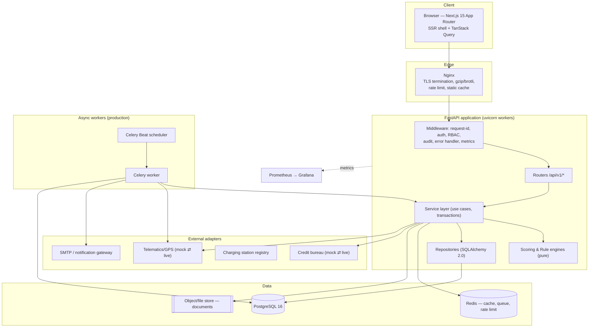
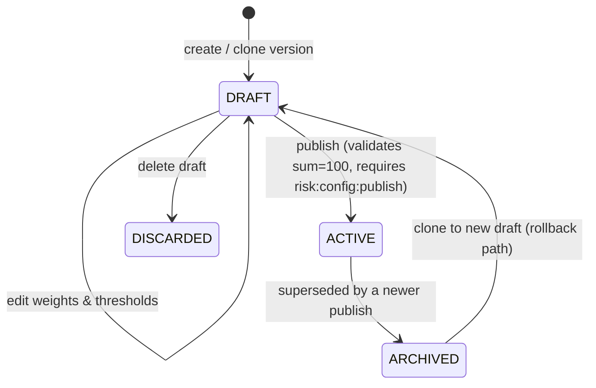
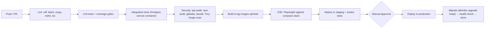

# 2. Technical Requirement Document (TRD)

**System:** EV-RCA — EV Financing Risk Assessment & Portfolio Monitoring Platform
**Version:** 1.0 · **Owner:** Engineering · **Audience:** CTO, architects, backend/frontend engineers, DevOps

---

## 2.1 Technical overview

EV-RCA is a **modular monolith**: one FastAPI application organised into strictly bounded internal
modules, one PostgreSQL database, one Next.js frontend, deployed as containers behind Nginx. It is
deliberately not a microservice system at MVP — the domain boundaries are still moving, the team is
four engineers, and the dominant workload is transactional CRUD plus deterministic in-process
scoring. The module boundaries are enforced in code (import rules, per-module service layer) so that
`scoring`, `monitoring` or `notifications` can be extracted into separate services later without a
rewrite.

**Core technical properties the design must guarantee:**

| Property | How it is achieved |
|----------|--------------------|
| **Deterministic scoring** | Pure functions over an explicit input DTO. No I/O, no clock, no randomness inside the engine. Same input + same config version ⇒ same output, forever. |
| **Reproducible decisions** | Every assessment persists the full input snapshot (JSONB), the configuration version id and the engine semantic version. |
| **Configurable risk policy** | All weights, thresholds and rules are rows, not constants. Publishing creates a new immutable version. |
| **Explainability** | The engine returns a component breakdown and structured reason codes; nothing is emitted without them. |
| **Auditability** | Append-only `audit_logs`, written in the same transaction as the change, with before/after JSONB. |
| **Safe evolution** | Alembic migrations, URL-versioned API (`/api/v1`), generated TypeScript client from OpenAPI. |

---

## 2.2 Architecture at a glance

Detail, flows and diagrams: [04-SYSTEM-ARCHITECTURE.md](04-SYSTEM-ARCHITECTURE.md).



---

## 2.3 Technology stack and rationale

### 2.3.1 Frontend

| Component | Choice | Version | Rationale |
|-----------|--------|---------|-----------|
| Framework | **Next.js** (App Router) | 15.x | Server components for heavy read-only dashboards, file-system routing, route groups matching the RBAC layout, first-class TypeScript. |
| UI library | **React** | 19.x | Ecosystem, team familiarity. |
| Language | **TypeScript** (strict) | 5.6+ | Types generated from the backend OpenAPI schema — the API contract is compile-time enforced. |
| Styling | **Tailwind CSS** | 3.4+ | Design tokens map 1:1 to the design system in [03-UIUX-DESIGN.md](03-UIUX-DESIGN.md); no CSS drift across 30 screens. |
| Components | **shadcn/ui** (Radix primitives) | latest | Accessible, unstyled-then-themed primitives that we own in-repo; no vendor upgrade risk. |
| Charts | **Recharts** | 2.x | Declarative, composable, adequate for the nine dashboard charts; SVG output is print/PDF friendly. |
| Forms | **React Hook Form** | 7.x | Uncontrolled inputs keep 40-field financial forms fast. |
| Validation | **Zod** | 3.x | The *same* schema validates the form and types the API payload; mirrors Pydantic on the server. |
| Server state | **TanStack Query** | 5.x | Caching, background refetch, optimistic updates, retry — removes hand-written fetch state. |
| Tables | **TanStack Table** | 8.x | Headless; server-side pagination/sort/filter for the risk table. |
| Dates | **date-fns** + BS converter | — | AD storage, Bikram Sambat display. |
| Testing | Vitest, Testing Library, Playwright | — | Unit, component, end-to-end. |

### 2.3.2 Backend — and why FastAPI is the right choice here

| Component | Choice | Version |
|-----------|--------|---------|
| Language | Python | 3.12 |
| Framework | **FastAPI** | 0.115+ |
| Validation/serialisation | **Pydantic v2** | 2.9+ |
| ORM | **SQLAlchemy 2.0** (typed, async engine) | 2.0+ |
| Migrations | Alembic | 1.13+ |
| Server | uvicorn (managed by gunicorn in prod) | — |
| Auth | python-jose (JWT), argon2-cffi | — |
| Testing | pytest, pytest-asyncio, httpx, factory-boy, hypothesis | — |
| Quality | ruff, mypy (strict on `domain/` and `engines/`), black | — |

**Why FastAPI specifically for a scoring/risk engine:**

1. **One schema, three jobs.** A Pydantic model such as `RouteScoringInput` is simultaneously the
   request validator (rejecting a negative distance with a precise 422), the OpenAPI contract, and —
   via `openapi-typescript` — the TypeScript type used by the form. When the Risk Manager adds a
   scoring component, there is exactly one place where the shape changes, and everything downstream
   fails to compile rather than silently diverging. In a lending system, a silent field mismatch
   between engine and UI is a mis-priced loan.
2. **Validation is the risk control.** Financial inputs need range, cross-field and conditional
   validation (`avg_fare_per_trip` required only when the route carries passengers). Pydantic v2
   validators express this declaratively and produce machine-readable error payloads the UI can map
   straight onto form fields.
3. **The engine is naturally functional Python.** Scoring is arithmetic over normalised inputs —
   piecewise-linear curves, weighted sums, threshold lookups. Python expresses this in code a risk
   analyst can *read and check against the policy document*, which matters more than raw speed.
   The whole numeric/analytics ecosystem (pandas, numpy, statsmodels, scikit-learn) is available in
   the same language for the Phase-3 statistical recalibration — no rewrite to move from an expert
   scorecard to a fitted PD model.
4. **Async where it pays.** Bureau calls, telematics pulls and notification dispatch are I/O-bound;
   `async def` handlers keep the API responsive without a thread-per-request model. Scoring itself
   is CPU-trivial (sub-millisecond) and runs inline.
5. **Automatic, always-correct API documentation.** `/api/v1/docs` is generated from the code, so the
   frontend team and any future integrator are never reading a stale wiki page.
6. **Dependency injection for authorisation.** `Depends(require_permission("route:assess"))` makes
   the permission a visible part of every endpoint signature — auditable by reading the router file.
7. **Operationally boring.** Single binary-ish container, gunicorn + uvicorn workers, well-understood
   deployment on Ubuntu. Appropriate for a four-person team and a bank's own datacentre.

*Considered and rejected:* Node/NestJS (would duplicate validation logic in a second language and
lose the analytics ecosystem), Django (heavier, DRF serialisers less expressive than Pydantic for
nested scoring payloads, admin not suitable for a risk-configuration UI), Java/Spring (team size and
delivery speed).

### 2.3.3 Database

**PostgreSQL 16.** Chosen for: strict transactional integrity across the score→decision→loan chain;
`NUMERIC` for money (never floats); `JSONB` for input snapshots, rule definitions and audit diffs
with GIN indexing; native partitioning for the telemetry tables; window functions for rolling usage
baselines and DPD ageing; row-level security available if multi-tenancy is ever needed; and mature
backup tooling (`pg_dump`, WAL archiving, PITR).

### 2.3.4 Infrastructure

| Component | MVP | Production | Notes |
|-----------|-----|-----------|-------|
| Docker + Docker Compose | **Required** | Required | Single compose file, environment-specific overrides. |
| Nginx | **Required** | Required | TLS, HTTP/2, gzip/brotli, static caching, IP rate limiting, security headers. |
| Ubuntu 22.04 LTS | **Required** | Required | 4 vCPU / 8 GB / 100 GB SSD is sufficient for MVP. |
| PostgreSQL 16 | **Required** | Required (+ streaming replica) | MVP: same host, separate container, named volume. |
| Redis 7 | *Optional* | **Required** | MVP uses in-process caching and a `SELECT ... FOR UPDATE SKIP LOCKED` job table; production uses Redis for cache, Celery broker and distributed rate limiting. |
| Celery + Beat | *Optional* | **Required** | MVP: nightly jobs run via a container `cron` entry calling a CLI command. Production: Celery for retries, concurrency and visibility. |
| Prometheus + Grafana | *Optional* | **Required** | `/metrics` endpoint is exposed from day 1 regardless. |
| Loki / Promtail | *Optional* | **Recommended** | Structured JSON logs are emitted from day 1. |
| Sentry (or GlitchTip) | *Optional* | **Recommended** | Error aggregation. |
| MinIO / S3-compatible store | *Optional* | **Recommended** | MVP stores documents on a mounted volume with a UUID filename. |

**MVP minimum viable deployment = 4 containers:** `web` (Next.js), `api` (FastAPI), `db`
(PostgreSQL), `nginx`. Everything else is additive and does not change application code.

---

## 2.4 Application architecture (backend)

### 2.4.1 Layering

```
HTTP router  →  service (use case)  →  engine (pure)      ← domain models
                     │                      ▲
                     ├→ repository → SQLAlchemy → PostgreSQL
                     └→ integration adapter (CIB / telematics / SMTP)
```

Rules enforced by review and by `ruff` import-linting:

- Routers contain **no business logic** — parse, authorise, delegate, serialise.
- Services own **transaction boundaries** and orchestration; one public method per use case.
- Engines are **pure**: no database session, no `datetime.now()`, no network. Time and config are
  passed in.
- Repositories are the **only** place SQLAlchemy appears.
- Integration adapters implement an abstract base class; mock and live are interchangeable by
  configuration.

### 2.4.2 Module map

| Module | Responsibility | Key services |
|--------|---------------|--------------|
| `auth` | login, refresh, password reset, sessions | `AuthService`, `TokenService` |
| `users` | users, roles, permissions | `UserService`, `RbacService` |
| `routes` | route CRUD, assessment orchestration | `RouteService`, `RouteAssessmentService` |
| `applicants` | applicants, financials, documents | `ApplicantService`, `FinancialProfileService` |
| `vehicles` | vehicle models, financed vehicles | `VehicleService` |
| `applications` | loan applications, workflow states | `ApplicationService` |
| `scoring` | route/customer/final engines, configuration | `ScoringService`, `ConfigService` |
| `underwriting` | knock-outs, decision matrix, structuring | `UnderwritingService`, `LoanStructuringService` |
| `loans` | booking, schedule, repayments, DPD | `LoanService`, `ScheduleService`, `RepaymentService` |
| `monitoring` | telemetry ingestion, baselines, metrics | `TelemetryService`, `BaselineService` |
| `risk` | rule engine, alert lifecycle | `RuleEngine`, `AlertService` |
| `dashboard` | aggregations, reports | `DashboardService`, `ReportService` |
| `admin` | settings, configuration publishing | `SettingsService` |
| `audit` | audit log writer and reader | `AuditService` |
| `notifications` | in-app + email dispatch | `NotificationService` |
| `integrations` | CIB, telematics, charging, SMTP adapters | adapter classes |

### 2.4.3 The scoring engine contract

```python
# backend/app/engines/base.py
from abc import ABC, abstractmethod
from decimal import Decimal
from pydantic import BaseModel

class ComponentResult(BaseModel):
    code: str                 # "CHARGING_INFRASTRUCTURE"
    label: str                # "Charging Infrastructure"
    raw_inputs: dict          # {"station_count": 6, "avg_gap_km": 12.5, ...}
    normalized_score: Decimal # 0-100 before weighting
    weight: Decimal           # 0.30
    weighted_score: Decimal   # 25.50
    explanation: str          # human sentence
    factors: list["Factor"]   # positive / negative contributors

class ScoreResult(BaseModel):
    total_score: Decimal          # 0-100, 2dp, HALF_UP
    grade: str                    # "A" | "B" | "C" ...
    components: list[ComponentResult]
    risk_factors: list["Factor"]
    positive_factors: list["Factor"]
    reason_codes: list[str]
    config_version_id: int
    engine_version: str           # semantic, e.g. "route-engine@1.2.0"

class ScoringEngine(ABC):
    engine_version: str
    @abstractmethod
    def score(self, payload: BaseModel, config: "ScoringConfig") -> ScoreResult: ...
```

**Invariants (enforced by tests):**
`sum(c.weighted_score) == total_score ± 0.01` · `0 ≤ total_score ≤ 100` ·
weights sum to `1.0000` · all `Decimal`, quantised `HALF_UP`, never `float` for money or score ·
engine is a pure function of `(payload, config)`.

### 2.4.4 Configuration versioning model



Exactly one `ACTIVE` configuration exists per `config_type` at any time, enforced by a partial
unique index. Assessments store `config_version_id`, so an archived version remains fully queryable
and any historical score can be recomputed and byte-matched.

---

## 2.5 Frontend architecture

- **Rendering:** App Router. Dashboards and list pages are React Server Components fetching through
  a server-side API client with the httpOnly session cookie. Forms, charts and tables are client
  components hydrated with TanStack Query.
- **Route groups:** `(auth)` for unauthenticated pages, `(app)` for the shell with sidebar/header.
  A server-side layout guard reads the session and redirects unauthenticated users.
- **Permission gating:** the session carries the permission list; a `<Can permission="route:create">`
  wrapper and a `usePermission()` hook hide UI. **Server-side checks remain authoritative** — hidden
  UI is a usability feature, never a security control.
- **API client:** generated from OpenAPI into `lib/api/generated/`, wrapped by thin typed hooks
  (`useRoutes`, `useAssessRoute`). Token refresh is handled by a single fetch interceptor with
  request de-duplication so a 401 storm cannot occur.
- **Forms:** one Zod schema per form in `lib/validation/`, mirroring the Pydantic model; server 422s
  are mapped back onto fields by pointer.
- **State:** server state in TanStack Query; ephemeral UI state in `useState`/`useReducer`; a small
  Zustand store only for cross-cutting UI (sidebar collapse, active filter set).
- **Money and numbers:** a single `formatNPR()` helper using `Intl.NumberFormat('ne-NP')` with lakh/
  crore grouping; a `<ScoreBadge>` component is the only place score→colour mapping exists.

---

## 2.6 Database architecture

Full DDL, column-by-column dictionary, ER description and indexing strategy:
[05-DATABASE-DESIGN.md](05-DATABASE-DESIGN.md) and [db/schema.sql](../db/schema.sql).

Principles applied:

| Principle | Implementation |
|-----------|----------------|
| Normalised to 3NF for transactional data | 28 core tables, FK-enforced |
| Money as `NUMERIC(14,2)`, never float | all monetary columns |
| Scores as `NUMERIC(5,2)` | 0.00–100.00 |
| Surrogate `BIGSERIAL` PKs + external `UUID` for API exposure | avoids enumeration attacks |
| Enumerations as PostgreSQL `ENUM` where the set is stable, lookup tables where it is user-editable | e.g. `road_type` enum vs `risk_rules` rows |
| Every table has `created_at`, `updated_at`; mutable business tables also have `created_by`, `updated_by` | audit |
| Soft delete (`deleted_at`) on business entities; hard delete never used | referential and audit integrity |
| Immutable event tables (`route_assessments`, `credit_scores`, `underwriting_decisions`, `audit_logs`) — insert only | reproducibility |
| High-volume time-series (`vehicle_telemetry`, `battery_metrics`, `charging_sessions`) partitioned monthly by date | pruning and retention |
| `updated_at` maintained by a trigger, not the application | consistency |

---

## 2.7 API architecture

Full specification with request/response bodies, validation and error codes:
[06-API-SPECIFICATION.md](06-API-SPECIFICATION.md).

- **Style:** REST over JSON, resource-oriented, `/api/v1` prefix.
- **Versioning:** URL path. `v1` is supported for 12 months after `v2` ships.
- **Auth:** `Authorization: Bearer <access_token>` for the API; the Next.js server also keeps an
  httpOnly refresh cookie.
- **Pagination:** `?page=1&page_size=25` with an envelope `{items, total, page, page_size, pages}`;
  `page_size` capped at 100.
- **Filtering/sorting:** explicit allow-listed query params per endpoint; `?sort=-created_at`.
- **Idempotency:** `Idempotency-Key` header supported on `POST /loans`, `POST /repayments` and
  `POST /*/assess`; a 24-hour key store returns the original response on replay.
- **Errors:** RFC 7807-style envelope, always the same shape.

```json
{
  "error": {
    "code": "VALIDATION_ERROR",
    "message": "Request validation failed",
    "details": [
      {"field": "total_distance_km", "code": "GREATER_THAN", "message": "must be greater than 0"}
    ],
    "request_id": "01JBQ9X2K7M4N8P3R5T7V9W1Y3",
    "timestamp": "2026-09-08T10:14:22Z"
  }
}
```

- **Status codes:** 200, 201, 202 (queued job), 204, 400, 401, 403, 404, 409 (conflict/duplicate),
  422 (validation), 423 (locked account), 429 (rate limited), 500, 503.
- **Correlation:** every request gets a ULID `request_id`, returned in `X-Request-ID`, present in
  every log line and in every error body.

---

## 2.8 Authentication and authorisation

### 2.8.1 Token design

| Token | Lifetime | Storage | Contents |
|-------|----------|---------|----------|
| Access (JWT, HS256 at MVP, RS256 in production) | 15 min | memory / Authorization header | `sub`, `email`, `role`, `permissions[]`, `jti`, `iat`, `exp`, `iss`, `aud` |
| Refresh (opaque, 256-bit random, hashed at rest) | 7 days, rotating | httpOnly + Secure + SameSite=Lax cookie | server-side row in `user_sessions` |

Refresh rotation with **reuse detection**: presenting an already-rotated refresh token revokes the
entire session family and writes a `SECURITY_REFRESH_REUSE` audit event.

### 2.8.2 RBAC model

`users → roles → role_permissions → permissions`, permission strings shaped `resource:action`
(`route:create`, `application:approve`, `risk:config:publish`, `audit:read`).

| Permission group | Super Admin | Risk Manager | Credit Officer | Portfolio Manager | Field Officer | Viewer |
|---|---|---|---|---|---|---|
| `user:*` | ✅ | — | — | — | — | — |
| `route:read` | ✅ | ✅ | ✅ | ✅ | ✅ | ✅ |
| `route:create` / `route:update` | ✅ | ✅ | ✅ | — | — | — |
| `route:assess` | ✅ | ✅ | ✅ | — | — | — |
| `applicant:*` | ✅ | ✅ | ✅ | read | read | read |
| `application:create` / `submit` | ✅ | ✅ | ✅ | — | — | — |
| `application:assess` | ✅ | ✅ | ✅ | — | — | — |
| `application:approve` / `reject` | ✅ | ✅ | — | — | — | — |
| `application:override` | ✅ | ✅ | — | — | — | — |
| `loan:create` | ✅ | ✅ | ✅ | — | — | — |
| `repayment:create` | ✅ | — | — | ✅ | — | — |
| `portfolio:read` | ✅ | ✅ | ✅ | ✅ | ✅ | ✅ |
| `alert:read` | ✅ | ✅ | ✅ | ✅ | ✅ | ✅ |
| `alert:assign` | ✅ | ✅ | — | ✅ | — | — |
| `alert:resolve` | ✅ | ✅ | — | ✅ | ✅ | — |
| `risk:config:read` | ✅ | ✅ | ✅ | ✅ | — | ✅ |
| `risk:config:publish` | ✅ | ✅ | — | — | — | — |
| `audit:read` | ✅ | ✅ | — | — | — | ✅ |

Enforcement: `Depends(require_permission("..."))` on every non-public route, plus **row-scope**
checks in services (a Field Officer sees only alerts assigned to them; a branch user sees only their
branch's applications when branch scoping is enabled).

---

## 2.9 Rule engine architecture

Full catalogue and JSON grammar: [08-RISK-RULE-ENGINE.md](08-RISK-RULE-ENGINE.md).

- Rules are rows in `risk_rules` with child rows in `risk_rule_conditions`.
- A condition is `(metric_code, operator, threshold_value, window_days, aggregation)`.
- Conditions are combined by the rule's `condition_logic` (`ALL` / `ANY`).
- **Metric providers** are a registry: `metric_code → callable(loan_id, as_of_date) -> Decimal|None`.
  Adding a metric is a new provider registration plus a seed row — no engine change.
- Evaluation is a pure function over a pre-fetched `MetricSnapshot`, so it is unit-testable without a
  database and can be dry-run against historical snapshots.
- The nightly job builds one metric snapshot per active loan (a handful of set-based SQL queries,
  not N+1) and evaluates every active rule against it.

---

## 2.10 Background jobs

| Job | Schedule | MVP mechanism | Production mechanism |
|-----|----------|---------------|----------------------|
| `ingest_telemetry` | hourly | container cron → CLI | Celery Beat |
| `recompute_dpd_and_outstanding` | 00:30 daily | cron | Celery Beat |
| `rebuild_usage_baselines` | 01:00 daily | cron | Celery Beat |
| `evaluate_risk_rules` | 01:30 daily | cron | Celery Beat |
| `auto_resolve_cleared_alerts` | 01:45 daily | cron | Celery Beat |
| `escalate_sla_breached_alerts` | hourly | cron | Celery Beat |
| `dispatch_notifications` | every 5 min | cron | Celery worker queue |
| `refresh_dashboard_materialized_views` | 02:00 daily + on demand | cron | Celery Beat |
| `purge_expired_sessions_and_idempotency_keys` | 03:00 daily | cron | Celery Beat |
| `database_backup` | 02:30 daily | host cron | managed backup + WAL |

Every job is: idempotent, safe to re-run for a given `as_of_date`, wrapped in a `job_runs` row
(`started_at`, `finished_at`, `status`, `records_processed`, `error`), and exposes a Prometheus
`last_success_timestamp` gauge so a silent failure is alertable.

---

## 2.11 Logging, monitoring and observability

**Logging** — structured JSON to stdout (`structlog`), one line per request plus domain events.
Mandatory fields: `timestamp`, `level`, `request_id`, `user_id`, `role`, `method`, `path`,
`status`, `duration_ms`, `event`. **Prohibited in logs:** passwords, tokens, national ID numbers,
full bureau payloads, account numbers. A redaction filter enforces this by key name.

**Metrics** (`/metrics`, Prometheus format):

| Metric | Type | Use |
|--------|------|-----|
| `http_request_duration_seconds{route,method,status}` | histogram | latency SLO |
| `http_requests_total` | counter | traffic, error rate |
| `scoring_runs_total{engine,result_grade}` | counter | engine usage, grade drift |
| `scoring_duration_seconds{engine}` | histogram | engine performance |
| `alerts_generated_total{severity,rule_code}` | counter | rule noise detection |
| `job_last_success_timestamp{job}` | gauge | dead-job alerting |
| `db_pool_in_use` / `db_pool_size` | gauge | connection saturation |
| `external_call_duration_seconds{provider,status}` | histogram | bureau/telematics health |

**Alerting rules (Grafana/Alertmanager):** API 5xx rate > 1% over 5 min · p95 latency > 1 s over
10 min · any job with no success in 26 h · DB connections > 80% of pool · disk > 85% · certificate
expiry < 14 days.

**Health endpoints:** `/health/live` (process up) and `/health/ready` (DB reachable, migrations at
head, active scoring configuration present).

---

## 2.12 Non-functional requirements — engineering treatment

### Performance

| Target | Design measure |
|--------|----------------|
| p95 read API < 400 ms (MVP) / < 250 ms (prod) | indexed access paths, no N+1 (eager loading declared per query), server-side pagination |
| p95 scoring API < 800 ms / < 500 ms | engine is sub-millisecond; budget is DB reads + validation; config cached in-process with a version-keyed invalidation |
| Dashboard < 2.5 s / < 1.5 s | materialised views for aggregates, refreshed nightly and on demand; server components stream |
| Telemetry ingest 10k rows/run | `COPY`/bulk insert, monthly partitions |
| Nightly rule evaluation for 10k loans | set-based snapshot SQL, target < 3 minutes |

### Availability

| Environment | Target | Means |
|-------------|--------|-------|
| MVP | 99.0% during business hours (07:00–20:00 NPT) | single VM, Docker restart policies, documented 8-hour restore |
| Production | 99.5% 24×7 | 2 app instances behind Nginx, PostgreSQL streaming replica with manual promotion, monitored |
| Future | 99.9% | managed Postgres with automated failover, multi-AZ, blue/green deploys |

### Scalability path

| Stage | Volume | Action |
|-------|--------|--------|
| **1** | ≤ 100 applications, ≤ 50 loans | Single VM, 4 containers, no Redis. Nothing to do. |
| **2** | ~1,000 applications, ~500 loans | Add Redis (cache + rate limit), add materialised views for dashboards, add read indexes surfaced by `pg_stat_statements`. Still one VM. |
| **3** | ~10,000 applications, ~5,000 loans, ~2M telemetry rows | Separate DB host; 4 uvicorn workers × 2 app containers; Celery workers on their own container; telemetry partitioning active with 24-month retention; PgBouncer in transaction pooling mode. |
| **4** | 100,000+ applications, 50,000+ loans, 50M+ telemetry rows | Read replica for dashboards and reports; extract `monitoring` + `risk` into a separate deployable (module boundaries already exist); move telemetry to a time-series store or partition-per-week with aggressive rollups; object storage for documents; horizontal app scaling behind a load balancer (the app is stateless — sessions live in Postgres/Redis). |

Load characteristics that make this tractable: writes are low-volume and human-paced; the expensive
work is nightly batch, which scales by partition and by worker count; scoring is CPU-cheap and
stateless.

### Reliability

- **Error handling:** one global exception handler, one error envelope. Domain errors are typed
  (`InsufficientPermission`, `ConfigNotPublished`, `KnockOutTriggered`) and mapped to status codes.
- **Retries:** external calls use exponential backoff with jitter (3 attempts, 0.5/1/2 s) and a
  circuit breaker per provider; a bureau outage degrades to "manual bureau entry", never a 500.
- **Transactions:** one transaction per use case; scoring + persistence + audit write commit together
  or not at all.
- **Concurrency:** optimistic locking (`version` column) on `loan_applications`, `risk_alerts` and
  `scoring_configurations`; a stale write returns 409.
- **Idempotency:** header-based keys on money-moving and job-creating endpoints.
- **Graceful degradation:** if telematics is unavailable, usage rules are skipped and the loan is
  flagged `MONITORING_DEGRADED` rather than silently scoring as healthy.

### Maintainability

- Clean layering (§2.4.1) with import rules enforced in CI.
- `mypy --strict` on `domain/` and `engines/`; ruff + black on everything; pre-commit hooks.
- Every engine change bumps `engine_version`; a changelog entry is required by CI.
- API versioning in the URL; breaking changes require a new version, never a silent edit.
- Test coverage gates: **≥ 90%** on `engines/` and `domain/`, **≥ 70%** overall.
- Architecture Decision Records in `docs/adr/`.

---

## 2.13 Testing

Full plan, matrices and example cases: [10-TESTING-STRATEGY.md](10-TESTING-STRATEGY.md).
Pyramid: ~60% unit (engines, calculators, rules), ~30% integration (API + real Postgres via
testcontainers), ~10% end-to-end (Playwright over the demo flow). Plus contract tests that assert the
generated TypeScript client compiles against the live OpenAPI schema, and property-based tests
(hypothesis) asserting the scoring invariants for any valid input.

---

## 2.14 Deployment and CI/CD

### Environments

| Env | Purpose | Data | Deploy trigger |
|-----|---------|------|----------------|
| Local | development | seeded demo data | `docker compose up` |
| CI | verification | ephemeral | every push |
| Staging | UAT and demo | anonymised/synthetic | merge to `main` |
| Production | live | real | manual approval on a tag |

### Pipeline (GitHub Actions / GitLab CI)



**Migration policy:** expand-then-contract. Deploy backward-compatible schema first, then code, then
remove old columns in a later release. Migrations run as a one-shot container before the app starts;
a failed migration aborts the deploy and leaves the previous version serving.

**Rollback:** re-tag the previous image and redeploy (under one minute). Schema rollback is only via
a forward-fixing migration; `downgrade()` is written but never relied upon in production.

**Secrets:** injected as environment variables from Docker secrets / the host's secret store; never
in the image, never in git. `.env.example` documents every variable with no values.

---

## 2.15 Backup, retention and disaster recovery

| Item | MVP | Production |
|------|-----|-----------|
| Full database backup | nightly `pg_dump -Fc`, 30 daily + 12 monthly retained | nightly base backup + continuous WAL archiving (PITR) |
| Backup location | second volume + weekly off-site copy | off-site object storage, encrypted, separate credentials |
| Restore drill | documented, tested once before go-live | quarterly, timed, signed off |
| Uploaded documents | nightly volume snapshot | versioned object storage with lifecycle rules |
| Configuration | in the database, therefore in the backup; also exportable as JSON | same |
| **RPO / RTO** | 24 h / 8 h | 15 min / 2 h |

**Retention:** applications and decisions 7 years (regulatory); audit logs 7 years; telemetry raw
24 months then rolled up to daily aggregates; sessions 30 days; notification history 12 months.
Retention is implemented as a scheduled job with a dry-run mode and an audit entry per purge.

**DR runbook (summary):** provision a clean host → `docker compose up db` → restore the latest dump →
`alembic upgrade head` (no-op if current) → start `api`/`web`/`nginx` → run the readiness checklist
(login, run a route assessment, open the dashboard, verify the last audit entry) → repoint DNS.
Full runbook in `docs/runbooks/disaster-recovery.md` (to be written in Phase 7).

---

## 2.16 Security

Full treatment: [09-SECURITY-ARCHITECTURE.md](09-SECURITY-ARCHITECTURE.md). Headline controls:
Argon2id password hashing · short-lived JWT with rotating, reuse-detecting refresh tokens ·
server-side RBAC on every endpoint · Pydantic validation on every input · parameterised queries only
(no string-built SQL) · React auto-escaping plus a strict Content-Security-Policy · SameSite cookies
and a double-submit CSRF token on cookie-authenticated routes · rate limiting at Nginx and in the
application · TLS 1.2+ everywhere · `pgcrypto` field-level encryption for national ID, PAN and
account numbers · encrypted volumes at rest · secrets from the environment · append-only audit log ·
dependency and image scanning in CI.

---

## 2.17 Configuration reference (environment variables)

| Variable | Example | Notes |
|----------|---------|-------|
| `APP_ENV` | `production` | `local` / `ci` / `staging` / `production` |
| `DATABASE_URL` | `postgresql+asyncpg://evrca:***@db:5432/evrca` | required |
| `JWT_SECRET_KEY` / `JWT_PRIVATE_KEY_PATH` | — | HS256 in MVP, RS256 in production |
| `ACCESS_TOKEN_EXPIRE_MINUTES` | `15` | |
| `REFRESH_TOKEN_EXPIRE_DAYS` | `7` | |
| `CORS_ORIGINS` | `https://evrca.bank.com.np` | comma-separated, no wildcard in production |
| `CIB_PROVIDER` | `mock` \| `live` | selects the adapter |
| `CIB_BASE_URL` / `CIB_API_KEY` | — | live only |
| `TELEMATICS_PROVIDER` | `mock` \| `live` | |
| `REDIS_URL` | `redis://redis:6379/0` | optional in MVP |
| `SMTP_HOST` / `SMTP_PORT` / `SMTP_USER` / `SMTP_PASSWORD` | — | notifications |
| `FILE_STORAGE_PATH` \| `S3_*` | `/var/lib/evrca/documents` | documents |
| `RATE_LIMIT_LOGIN_PER_MINUTE` | `5` | |
| `LOG_LEVEL` | `INFO` | |
| `SENTRY_DSN` | — | optional |

---

## 2.18 Technical constraints and decisions log (abridged ADRs)

| ADR | Decision | Status | Consequence |
|-----|----------|--------|-------------|
| ADR-001 | Modular monolith over microservices | Accepted | Faster delivery; extraction path preserved via module boundaries |
| ADR-002 | PostgreSQL as the single datastore at MVP | Accepted | No Mongo/Elastic/TSDB to operate; JSONB covers snapshot and rule storage |
| ADR-003 | Scoring configuration in the database, versioned | Accepted | Risk owns policy; every score is reproducible |
| ADR-004 | `Decimal` everywhere for money and scores | Accepted | No floating-point drift in EMI or score arithmetic |
| ADR-005 | Adapter pattern for all external providers | Accepted | Demo runs without any third-party contract |
| ADR-006 | JWT access + rotating opaque refresh with reuse detection | Accepted | Stateless API, revocable sessions |
| ADR-007 | Redis and Celery optional at MVP | Accepted | 4-container deployment; cron-driven jobs; no code change to adopt them |
| ADR-008 | Generated TypeScript types from OpenAPI | Accepted | Contract drift becomes a compile error |
| ADR-009 | Append-only audit log written in the business transaction | Accepted | An audit entry cannot be missing for a committed change |
| ADR-010 | Monthly partitioning on telemetry tables from day 1 | Accepted | Retention and pruning are cheap later |
