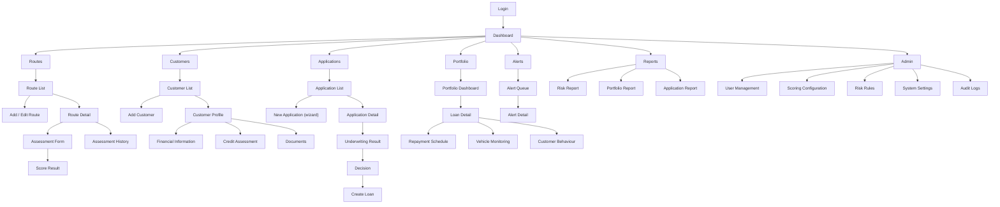

# 3. UI/UX Design Document

**Product:** EV-RCA · **Style:** Modern FinTech dashboard — professional, clean, data-dense, calm
**Approach:** Desktop-first (1440px design width), fully responsive down to 375px
**Audience:** UI/UX designer, frontend engineers, PM

---

## 3.1 UX goals

| # | Goal | How it is measured |
|---|------|--------------------|
| 1 | A credit officer completes a full application file in **under 25 minutes** | Task timing in UAT |
| 2 | Any user can explain *why* a score is what it is, from the screen alone | Comprehension test with 5 officers |
| 3 | The alert queue tells you **what to do next** without opening anything | First-click test |
| 4 | Zero data loss from a dropped connection mid-form | Autosave verified |
| 5 | Risk-critical information is never conveyed by colour alone | WCAG 2.1 AA audit |
| 6 | A new officer is productive after one 45-minute walkthrough | Onboarding observation |

---

## 3.2 Design principles

1. **Explain, don't just score.** Every number is one click from its breakdown. A score badge that
   cannot be expanded is a bug.
2. **Decision-first layout.** The recommendation and its reasons sit above the evidence, not below
   it. Officers scroll to verify, not to discover.
3. **Progressive disclosure.** A 60-field application is presented as six steps of ten, not one wall.
4. **Calm by default, loud when it matters.** Neutral greys carry the interface; red is reserved for
   genuine risk, never for decoration.
5. **Density with air.** Financial users want many rows visible; give them a compact table with
   generous vertical rhythm in forms.
6. **Never lose work.** Autosave every 20 seconds on multi-step forms plus a visible "saved" state.
7. **Honest states.** Show "as of" times on aggregated data. Never render a stale number as live.
8. **Keyboard-complete.** Every action reachable without a mouse; tables navigable with arrows.

---

## 3.3 Information architecture



### 3.3.1 Sitemap and route table

| # | Screen | URL | Primary roles |
|---|--------|-----|---------------|
| 1 | Login | `/login` | all |
| 2 | Forgot / Reset password | `/forgot-password`, `/reset-password` | all |
| 3 | Main Dashboard | `/dashboard` | all |
| 4 | Route List | `/routes` | all (read); CO/RM (write) |
| 5 | Add / Edit Route | `/routes/new`, `/routes/{id}/edit` | CO, RM |
| 6 | Route Assessment Form | `/routes/{id}/assess` | CO, RM |
| 7 | Route Score Result | `/routes/{id}/assessments/{aid}` | all |
| 8 | Route Details | `/routes/{id}` | all |
| 9 | Customer List | `/customers` | all |
| 10 | Add Customer | `/customers/new` | CO, RM |
| 11 | Customer Profile | `/customers/{id}` | all |
| 12 | Financial Information | `/customers/{id}/financials` | CO, RM |
| 13 | Credit Assessment | `/applications/{id}/credit` | CO, RM |
| 14 | Underwriting Result | `/applications/{id}/result` | CO, RM |
| 15 | Loan Application (wizard) | `/applications/new`, `/applications/{id}` | CO, RM |
| 16 | Loan Details | `/loans/{id}` | PM, RM, CO |
| 17 | Repayment Schedule | `/loans/{id}/schedule` | PM, RM, CO |
| 18 | Portfolio Dashboard | `/portfolio` | PM, RM |
| 19 | Vehicle Monitoring | `/loans/{id}/monitoring` | PM, RM, FO |
| 20 | Customer Behaviour | `/loans/{id}/behaviour` | PM, RM |
| 21 | Risk Alerts | `/alerts` | PM, RM, FO |
| 22 | Alert Details | `/alerts/{id}` | PM, RM, FO |
| 23 | Risk Report | `/reports/risk` | RM, PM, Viewer |
| 24 | Portfolio Report | `/reports/portfolio` | RM, PM, Viewer |
| 25 | Application Report | `/reports/applications` | RM, CO, Viewer |
| 26 | User Management | `/admin/users` | SA |
| 27 | Scoring Configuration | `/admin/scoring` | SA, RM |
| 28 | Risk Rules | `/admin/risk-rules` | SA, RM |
| 29 | System Settings | `/admin/settings` | SA, RM |
| 30 | Audit Logs | `/admin/audit-logs` | SA, RM, Viewer |

*SA = Super Admin, RM = Risk Manager, CO = Credit Officer, PM = Portfolio Manager, FO = Field Officer.*

---

## 3.4 Global layout

```
┌──────────────────────────────────────────────────────────────────────────────────────┐
│ HEADER  h=64px  sticky                                                                │
│ [☰] [EV-RCA logo]   Breadcrumb: Applications / LA-2026-000123        [🔍 ⌘K] [🔔 3] [SK ▾]│
├────────────────┬─────────────────────────────────────────────────────────────────────┤
│ SIDEBAR w=256  │ CONTENT  max-width 1440, padding 24-32px                             │
│ (collapsed 72) │ ┌───────────────────────────────────────────────────────────────┐   │
│                │ │ Page title  +  subtitle              [Secondary] [Primary CTA] │   │
│ ⌂ Dashboard    │ ├───────────────────────────────────────────────────────────────┤   │
│ ⤳ Routes       │ │ Filter bar / tabs                                             │   │
│ ⚇ Customers    │ ├───────────────────────────────────────────────────────────────┤   │
│ ▤ Applications │ │                                                               │   │
│ ▣ Portfolio    │ │   Page content: KPI row → charts → tables → panels             │   │
│ ⚠ Alerts   (5) │ │                                                               │   │
│ ▦ Reports      │ └───────────────────────────────────────────────────────────────┘   │
│ ⚙ Admin        │                                                                     │
│ ───────────    │                                                                     │
│ ? Help         │                                                                     │
│ [User card]    │                                                                     │
└────────────────┴─────────────────────────────────────────────────────────────────────┘
```

### 3.4.1 Header (global)

| Element | Behaviour |
|---------|-----------|
| Sidebar toggle | Collapses to a 72px icon rail; state persisted per user |
| Logo / product name | Links to `/dashboard` |
| Breadcrumb | Auto-generated from the route; each level clickable; truncates from the middle on narrow screens |
| Global search (`⌘K` / `Ctrl+K`) | Command palette: applicants, routes, applications, loans, alerts by code or name; keyboard-navigable |
| Notification bell | Unread count badge; dropdown of the 10 most recent; "mark all read"; links deep into the entity |
| User menu | Name, role chip, Profile, Change password, Theme, Sign out |
| Environment ribbon | A coloured strip reading `STAGING` / `TRAINING` on non-production, so a demo is never mistaken for live |

### 3.4.2 Sidebar (global)

Items render only if the user holds the governing permission. Each item shows an icon plus label
(icon only when collapsed, with tooltip). The **Alerts** item carries a live count badge — red if any
RED alert is open, amber otherwise. The active item has a 3px left accent bar plus a filled
background — never colour alone.

### 3.4.3 Responsive behaviour (global rules)

| Breakpoint | Layout |
|-----------|--------|
| `≥1280px` (desktop) | Full sidebar, 3–4 column KPI grid, side-by-side charts, full tables |
| `1024–1279px` | Sidebar collapses to the icon rail, 2-column KPI grid |
| `768–1023px` (tablet) | Sidebar becomes an overlay drawer; charts stack; tables scroll horizontally with the first column pinned |
| `<768px` (mobile) | Bottom tab bar for the 4 top destinations; tables become stacked cards; multi-step forms show one field group per screen with a sticky progress bar |

Tables never squeeze below legibility: below 1024px they either scroll horizontally with a pinned
identity column, or switch to the card renderer (specified per table).

---

## 3.5 Design system

### 3.5.1 Colour tokens

Light theme is primary; a dark theme uses the same token names with swapped values.

| Token | Light | Usage |
|-------|-------|-------|
| `--bg-app` | `#F7F8FA` | Page background |
| `--bg-surface` | `#FFFFFF` | Cards, tables, modals |
| `--bg-subtle` | `#F1F3F6` | Table header, hover, disabled fill |
| `--border` | `#E3E7EC` | Dividers, input borders |
| `--border-strong` | `#C7CDD6` | Focused/selected borders |
| `--text-primary` | `#111827` | Headings, key numbers |
| `--text-secondary` | `#4B5563` | Body |
| `--text-muted` | `#8A94A6` | Labels, helper text |
| `--brand-600` | `#1B57D6` | Primary actions, links, active nav |
| `--brand-700` | `#1544AC` | Hover |
| `--brand-50` | `#EEF3FE` | Selected rows, info surfaces |
| `--success-600` | `#0E8A4F` | Low risk, approved, on-time |
| `--success-50` | `#E7F6EE` | |
| `--warning-600` | `#B26A00` | Medium risk, YELLOW alert, manual review |
| `--warning-50` | `#FDF3E3` | |
| `--danger-600` | `#C22B2B` | High risk, RED alert, rejected, overdue |
| `--danger-50` | `#FCECEC` | |
| `--neutral-600` | `#5A6472` | Draft, closed, inactive |
| `--chart-1..8` | `#1B57D6 #0E8A4F #B26A00 #C22B2B #6E4BC4 #0E7C86 #A2557A #55606E` | Categorical series, in order |

**Contrast:** all text/background pairs meet WCAG AA (≥ 4.5:1 body, ≥ 3:1 large). The `600` risk
colours were chosen specifically to pass on white *and* on their own `50` tint.

### 3.5.2 Typography

**Font:** `Inter` (UI), fallback `-apple-system, "Segoe UI", Roboto, "Noto Sans Devanagari", sans-serif`.
**Numeric font feature:** `font-variant-numeric: tabular-nums` on every money, score and date column
so figures align in columns.

| Token | Size / line-height | Weight | Usage |
|-------|--------------------|--------|-------|
| `display` | 32 / 40 | 700 | Score result hero number |
| `h1` | 24 / 32 | 600 | Page title |
| `h2` | 20 / 28 | 600 | Section title |
| `h3` | 16 / 24 | 600 | Card title |
| `body` | 14 / 20 | 400 | Default |
| `body-strong` | 14 / 20 | 600 | Emphasis, table key column |
| `small` | 13 / 18 | 400 | Helper, secondary metadata |
| `caption` | 12 / 16 | 500 | Labels, badges, axis ticks |
| `mono` | 13 / 20 | 400 | IDs, account numbers, JSON (`ui-monospace, "JetBrains Mono", monospace`) |

### 3.5.3 Spacing, radius, elevation

**Spacing scale (4px base):** `0, 4, 8, 12, 16, 20, 24, 32, 40, 48, 64`. Only these values.
Section gap 24px · card padding 20px (24px on desktop) · form field vertical gap 16px · label-to-input 6px · inline button gap 8px.

**Radius:** `sm 4px` (badges, inputs) · `md 8px` (buttons, cards) · `lg 12px` (modals, panels) · `full` (avatars, pills).

**Elevation:** `e0` none (default cards, border only) · `e1` `0 1px 2px rgba(16,24,40,.06)` (hover) ·
`e2` `0 4px 12px rgba(16,24,40,.08)` (dropdowns, popovers) · `e3` `0 12px 32px rgba(16,24,40,.14)` (modals).
Cards use borders, not shadows, as the default — shadows are reserved for things that float.

### 3.5.4 Component specifications

**Buttons** — height 36px (`md`), 32px (`sm`), 44px (`lg`, mobile primary). Padding 12/16px. Radius `md`. Weight 600. Icon 16px with 8px gap.

| Variant | Default | Hover | Focus | Disabled | Use |
|---------|---------|-------|-------|----------|-----|
| Primary | `brand-600` bg, white text | `brand-700` | 2px `brand-600` ring, 2px offset | 40% opacity, no pointer | One per screen: the main action |
| Secondary | white bg, `border`, `text-primary` | `bg-subtle` | same ring | as above | Cancel, back, secondary paths |
| Destructive | `danger-600` bg, white | darker | `danger` ring | as above | Reject, delete — always with a confirm dialog |
| Ghost | transparent, `text-secondary` | `bg-subtle` | ring | as above | Table row actions, toolbars |
| Link | `brand-600` text, underline on hover | — | ring | — | Inline navigation |

Loading state: spinner replaces the leading icon, label becomes the present participle ("Assessing…"),
button is disabled and keeps its width to prevent layout shift.

**Inputs** — height 36px, padding 8/12px, border `--border`, radius `sm`, `body` type.
States: default · hover (`border-strong`) · focus (2px `brand-600` ring) · error (`danger-600` border + message + `aria-invalid`) · success (green check, used only after async validation) · disabled (`bg-subtle`, muted text) · readonly (no border, `bg-subtle`).
Anatomy: label (`caption`, 600) · optional helper (`small`, muted) · control · error text (`small`, `danger-600`, with a 14px alert icon).
**Currency inputs** show a `NPR` prefix, right-align, and group in the South-Asian lakh/crore convention (`24,68,000`) with a `small` muted "in words" line beneath for amounts over NPR 100,000.
**Percent inputs** show a `%` suffix and accept 0–100.

**Select / Combobox** — Radix-based, keyboard navigable, type-ahead filtering above 8 options, grouped options with sticky group headers, "no results" empty state, async search variant with a debounce of 300ms and a loading row.

**Date picker** — text input `DD/MM/YYYY` plus a calendar popover. Shows the **Bikram Sambat** equivalent as helper text beneath (`2083-05-23 BS`). Min/max enforced and communicated. Presets on range pickers: Today, Last 7 days, Last 30 days, This month, This quarter, This fiscal year (Shrawan–Ashad), Custom.

**Cards** — `bg-surface`, 1px `--border`, radius `md`, padding 20px. Optional header row (title `h3` + right-aligned actions) with a 1px divider. Optional footer for pagination or summary.

**KPI card** — label (`caption`, muted, uppercase-ish tracking) · value (`h1`, tabular) · delta chip (▲/▼ + % + period, coloured by direction *and* arrow) · optional sparkline (40px tall, no axes) · whole card is a link to the filtered list. Skeleton shows a shimmering bar of the same height.

**Tables** — header `bg-subtle`, `caption` 600, sticky on scroll. Rows 48px (`comfortable`) or 40px (`compact`, user-togglable, persisted). Zebra off; hover `--brand-50`. Column alignment: text left, numbers right, badges centre, actions right and pinned. Sortable headers show a chevron and `aria-sort`. Selection via checkbox column with a bulk-action bar that slides in. Pagination footer: "Showing 1–25 of 143", page-size select (25/50/100), prev/next. Server-side for every list.

**Modals** — `lg` radius, `e3`, max-width 480 (confirm) / 640 (form) / 880 (detail). Title `h2`, body, footer with right-aligned actions (secondary then primary). Focus trapped, `Esc` closes non-destructive modals, backdrop click closes only non-destructive ones. Destructive confirms require typing a matching word for irreversible actions.

**Alerts / banners** — inline, left icon + title + body + optional action, 4px left accent bar in the semantic colour, tinted background. Four kinds: info, success, warning, danger. Dismissible only when informational.

**Toasts** — bottom-right, 4s auto-dismiss (never for errors, which persist until dismissed), max 3 stacked, each with icon + message + optional undo.

**Badges / chips** — height 22px, radius `full`, `caption` 600, 8px horizontal padding, tinted background + `600` text + a 12px leading icon. **Always icon + text, never colour alone.**

**Tabs** — underline style, 40px tall, active tab `brand-600` text with a 2px bottom bar, `role="tablist"` with arrow-key navigation. Counts shown as a muted number after the label.

**Dropdown menus** — `e2`, radius `md`, 8px padding, 32px items, section dividers, destructive items in `danger-600` at the bottom, keyboard navigable.

**Charts (Recharts)** — 240px default height (320px for the primary dashboard chart). Grid lines `--border` at 1px, horizontal only. Axis labels `caption` muted. Legend below, left-aligned, interactive (click to toggle a series). Tooltip: white surface, `e2`, shows the category, every series with its swatch, and formatted values. Money in charts is abbreviated (`24.7L`, `2.5Cr`) with full values in the tooltip. Every chart has a text-alternative table available via a "View as table" toggle for accessibility. Empty state: a centred muted message inside the plot area, axes still drawn.

### 3.5.5 Risk indicator system

**Never colour alone.** Every risk signal carries colour **+ icon + text**, and shapes differ.

| Level | Colour | Icon | Shape | Text | Used for |
|-------|--------|------|-------|------|----------|
| Low / Good | `success-600` on `success-50` | ● shield-check | pill | "Low Risk" / "Class A" / "Grade A" | Route A (≥ 88), grades A–B, GREEN loans, on-time |
| Medium / Watch | `warning-600` on `warning-50` | ▲ alert-triangle | pill | "Medium Risk" / "Class B" / "Yellow Alert" | Route B, grade C, YELLOW alerts, 1–30 DPD |
| High / Critical | `danger-600` on `danger-50` | ■ alert-octagon | pill | "High Risk" / "Class C" / "Red Alert" | Route C, grades D–E, RED alerts, 30+ DPD |
| Neutral | `neutral-600` on `bg-subtle` | ○ circle | pill | "Draft" / "Closed" / "Not assessed" | Non-risk states |

**Score badge** — a filled pill showing `84.5 / 100` with the grade letter in a leading square
(`A` on success, `B` on brand, `C` on warning, `D`/`E` on danger), plus a screen-reader label
`"Final risk score 84.5 out of 100, grade B, low risk"`. Clicking it opens the breakdown popover.

**Score gauge** — a 180° arc, 0–100, with threshold ticks at the configured grade boundaries, the
needle at the score, the grade letter and label beneath. Segments are additionally distinguished by
a subtle pattern (solid / diagonal hatch / dense hatch) so grade regions remain distinguishable in
greyscale and for colour-blind users.

**Sentiment on numbers** — deltas always pair an arrow with the sign (`▼ −38.4%`), and "down is bad"
vs "down is good" is disambiguated by an explicit label ("usage down 38.4% vs baseline").

---

## 3.6 Global state patterns

Defined once here; each screen spec references them rather than repeating.

| State | Pattern |
|-------|---------|
| **Loading (page)** | Skeleton matching the final layout: KPI bars, chart blocks, 8 table rows. No spinners on full pages — skeletons prevent layout shift. Minimum 200ms display to avoid flicker. |
| **Loading (in-place)** | Button spinner + disabled; table body dims to 60% with a 2px top progress bar retained. |
| **Loading (long job)** | Progress modal with step list and a determinate bar where progress is known; otherwise an indeterminate bar plus elapsed time. |
| **Empty (no data yet)** | Centred illustration (line art, 120px), `h3` title, one-sentence explanation, primary CTA. e.g. Routes: "No routes yet — add the first operating corridor to assess." + **Add Route**. |
| **Empty (filtered to nothing)** | Different copy and CTA: "No results match these filters" + **Clear filters**. Never the same as the no-data state. |
| **Error (fetch failed)** | Inline card: alert-octagon icon, "Couldn't load {thing}", the error message, `request_id` in mono for support, **Try again** button. Never a blank screen. |
| **Error (form validation)** | Field-level messages **plus** a summary banner at the top listing each failing field as an anchor link. Focus moves to the first invalid field. |
| **Error (permission)** | Full-page 403 with the required permission named and a "Request access" mailto to the admin. |
| **Error (server 500)** | Full-page with `request_id` displayed and copyable. |
| **Success (save)** | Toast "Saved" + the affected row/card flashes `brand-50` for 600ms. |
| **Success (major action)** | Inline success banner that persists on the page (assessment complete, decision recorded, loan created) with next-step links. |
| **Offline / connection lost** | Sticky top bar "You're offline — changes are saved locally and will sync". Forms keep working; submits queue. |
| **Stale data** | "As of {time}" caption beneath aggregated figures, with a refresh icon button. |

---

## 3.7 Screen specifications

Every screen below inherits the global header, sidebar, states and responsive rules from §3.4–3.6.
Only the deltas are specified.

---

### Screen 1 — Login

**Purpose:** authenticate. **Roles:** all (unauthenticated).

**Layout:** split screen. Left 45% — brand panel: gradient `brand-700 → brand-600`, product name, a
one-line value statement ("Route-aware EV credit risk, from application to portfolio"), and three
muted stat chips (routes assessed, active loans, alerts resolved) pulled from a public counter
endpoint. Right 55% — centred 400px card.

**Components:** logo · `h1` "Sign in" · email input (autofocus, `type=email`, `autocomplete=username`) ·
password input (`autocomplete=current-password`, show/hide toggle) · "Remember me" checkbox ·
"Forgot password?" link · full-width primary **Sign in** · footer with version and environment.

**Validation:** email required and format-valid (on blur); password required, 8–128 (length only).
Submit disabled until both non-empty.

**States:** loading — button "Signing in…", inputs disabled. Error — danger banner above the form:
invalid credentials → "Incorrect email or password" (never which); locked → "Account locked. Try
again in 13 minutes." with a countdown; inactive → "Account deactivated. Contact your administrator."
Rate-limited → "Too many attempts. Try again in 60 seconds." Success — redirect to `/dashboard`, or
to a forced `/change-password` when `must_change_password` is true.

**Responsive:** below 1024px the brand panel collapses to a 120px header band; the card goes
full-width with 24px gutters.

**Accessibility:** `<form>` with a submit button, errors in an `aria-live="polite"` region, the
password toggle labelled, no colour-only error indication.

---

### Screen 2 — Forgot / Reset Password

**Purpose:** self-service recovery. **Roles:** all.

Same split layout. **Forgot:** email input + **Send reset link**; always shows the same neutral
success panel ("If an account exists for that address, we've sent a reset link. It expires in 30
minutes.") — no account enumeration. **Reset:** new password + confirm, with a live requirement
checklist (12+ characters, uppercase, lowercase, number, symbol, not a previous password) where each
item flips from muted circle to green check as satisfied, plus a strength meter. Errors: expired or
already-used token → panel with a **Request a new link** button.

---

### Screen 3 — Main Dashboard

**Purpose:** role-appropriate situational awareness in one screen. **Roles:** all (content varies).

**Layout (desktop)**

```
Page header: "Good morning, Sabina"  ·  "Portfolio as of 08 Sep 2026, 02:00"   [Date range ▾] [Branch ▾] [Export ▾]
────────────────────────────────────────────────────────────────────────────────────────
Row 1 — KPI grid, 5 across × 2 rows (10 cards)
Row 2 — [ Portfolio by Risk Grade (donut, 4 cols) ][ Applications by Decision (stacked bar, 8 cols) ]
Row 3 — [ Monthly Disbursement (column+line, 6) ][ Repayment Performance (stacked area, 6) ]
Row 4 — [ Route Risk Distribution (h-bar, 4) ][ Customer Risk Distribution (bar, 4) ][ DPD Buckets (bar, 4) ]
Row 5 — [ Attention Required — top 8 rows of the risk table (8) ][ Recent Alerts feed (4) ]
```

**KPI cards (10):** Total Applications · Approved · Rejected · Manual Reviews · Active Loans ·
Total Portfolio Value · Outstanding Amount · Overdue Amount · Yellow Alerts · Red Alerts.
Each shows value, period delta, and links to its filtered list. Money cards use lakh/crore
abbreviation with the full figure in the tooltip.

**Role variations**

| Role | Emphasis |
|------|----------|
| Risk Manager | All 10 KPIs; adds an "Override rate" card and a grade-migration chart |
| Credit Officer | My drafts, my pending submissions, my approval rate, my average time-to-decision; application charts only |
| Portfolio Manager | Portfolio KPIs and alert KPIs first; the risk table is the largest element |
| Field Officer | Compact: my assigned alerts, due today, overdue; no portfolio value |
| Viewer | All read-only, no CTAs |

**States:** loading — skeleton grid. Empty (fresh install) — a first-run panel replacing the charts:
"No data yet" with three onboarding CTAs (Add your first route → Register a customer → Create an
application). Error — per-card error with retry, so one failing widget never blanks the page.

**Responsive:** 1024–1279px → KPIs 3 across, charts full-width stacked. <768px → KPIs 2 across in a
horizontally scrollable row, charts full-width at 200px height, the risk table becomes cards.

---

### Screen 4 — Route List

**Purpose:** find, compare and manage operating corridors. **Roles:** all (read); CO/RM (write).

**Header actions:** [Import CSV] (Phase 2, ghost) · **[+ Add Route]** (primary, permission-gated).

**Filter bar:** search (name, code, origin, destination) · Grade multi-select (A/B/C/Not assessed) ·
Province · District · Route type · Status · Score range (dual slider 0–100) · "Stale assessments
only" toggle · [Clear all]. Active filters render as removable chips beneath the bar; the filter set
is encoded in the URL so views are shareable and persisted per user.

**Table columns**

| Column | Content | Sort | Width |
|--------|---------|------|-------|
| Route | Name (`body-strong`, link) + code (`caption` mono, muted) | ✓ | 240 |
| Corridor | `Origin → Destination` | — | 200 |
| Distance | `30.0 km`, right | ✓ | 90 |
| Road | Type badge + condition badge | — | 150 |
| Charging | `6 (3 fast)` + a 3-dot density indicator | ✓ | 120 |
| Score | Score badge `90.1` | ✓ | 100 |
| Grade | Risk pill `● Class A` | ✓ | 120 |
| Assessed | Relative ("12 days ago") + a "Stale" warning chip past the window | ✓ | 120 |
| Loans | Active loan count, links to filtered portfolio | ✓ | 80 |
| Actions | ⋯ menu: View · Assess · Edit · Duplicate · Export PDF · Delete | — | 56 |

**Row click** → route detail. **Bulk selection** → "Assess selected" (Phase 2).

**States:** empty — "No routes yet. Add the corridor your applicants operate on, and assess it once —
every application on that corridor reuses the assessment." + **Add Route**. Filtered-empty — clear
filters CTA. Loading — 8 skeleton rows.

**Responsive:** <1024px → card list: name + corridor on line 1, score badge + grade pill on line 2,
distance/charging/assessed as a metadata row, `⋯` top-right.

---

### Screen 5 — Add / Edit Route

**Purpose:** capture the full route attribute set. **Roles:** CO, RM.

**Layout:** two columns — 8/12 form, 4/12 sticky helper panel showing live derived values
(charging density, estimated daily revenue, energy cost per km, projected margin) that recompute on
change, plus a "What this affects" note naming the scoring components each section feeds.

**Sections (accordion, all expanded by default; step indicator on mobile)**

1. **Identity** — route name*, origin*, destination*, province*, district*, route type*, permit required
2. **Physical** — total distance (km)*, road type*, pitch road % (shown only when `MIXED`), road condition*, gradient profile*
3. **Charging infrastructure** — station count*, fast charger count*, average charging distance (km)*, maximum charging gap (km)*, plus an inline "Link stations from registry" picker that auto-fills counts and gaps from `charging_stations`
4. **Demand** — passenger volume/day, freight volume/day (tons), estimated daily trips*, traffic density*, competition level*, operator count
5. **Revenue** — average fare per trip, average freight revenue per trip, estimated daily operating cost*, electricity tariff per kWh*, with derived revenue/energy cost shown read-only and an "override" toggle
6. **Risk** — seasonal risk*, monsoon disruption days*, flood/landslide risk*, security risk*

**Validation** — as the API table in [06-API-SPECIFICATION.md](06-API-SPECIFICATION.md) §6.3, mirrored
in Zod: inline on blur, section headers show an error count badge, submit blocked with a summary
banner. Cross-field rules surfaced in context: "Fast chargers cannot exceed total stations",
"Maximum gap cannot exceed total distance", "Fare per trip is required because this route carries
passengers".

**Buttons:** [Cancel] · [Save as Draft] · **[Save & Assess]** (primary — saves then routes straight to
the assessment result, which is the flow officers actually want).

**States:** autosave draft every 20s with a "Saved 10:42" caption; unsaved-changes guard on
navigation; duplicate route → 409 handled as an inline banner "A route already exists for
Kathmandu → Dhulikhel" with a **View it** link.

**Responsive:** helper panel moves below the form <1280px; sections become a one-per-screen wizard
<768px with a sticky progress bar and Back/Next.

---

### Screen 6 — Route Assessment Form

**Purpose:** run an assessment, optionally against a specific vehicle model. **Roles:** CO, RM.

Presented as a **modal** from the route detail/list (it has only two inputs) rather than a page:
read-only summary of the route's scoring-relevant attributes with an "Edit route" link · reference
vehicle model select (helper: "Determines usable range for the charging-gap analysis; defaults to a
120 km reference vehicle") · notes textarea · a completeness checklist showing every required field
with ✓/✗ and a link to fix gaps.

**Buttons:** [Cancel] · **[Run Assessment]** (disabled while the checklist has any ✗).

**States:** running — progress modal with the five component steps ticking through (~1.5s total,
deliberately paced so the work is visible); complete → navigate to the score result; config missing
→ error banner "No active route scoring configuration. Ask an administrator to publish one."

---

### Screen 7 — Route Score Result

**Purpose:** present the score, its composition and its meaning. **Roles:** all.
**This is the screen the demo is judged on.**

**Layout**

```
┌───────────────────────────────────────────────────────────────────────────────┐
│  Kathmandu–Dhulikhel · RT-KTM-DHU-001            [Export PDF] [Re-assess]      │
│  Assessed 08 Sep 2026 10:12 by Ramesh Adhikari · Config v7 · route-engine@1.0.0│
├───────────────────────────┬───────────────────────────────────────────────────┤
│   ┌───────────────────┐   │  RECOMMENDATION                                   │
│   │   ╭─────────╮     │   │  ✅ Eligible for EV Financing                      │
│   │  ╱  90.12    ╲    │   │  Class A — Low Risk                               │
│   │ │   / 100     │   │   │                                                   │
│   │  ╲  ●Class A ╱    │   │  Charging infrastructure   ● Adequate             │
│   │   ╰─────────╯     │   │  Revenue potential         ● High                 │
│   └───────────────────┘   │  Est. monthly revenue      NPR 1,97,600           │
│                           │  Est. monthly profit       NPR 1,36,935           │
├───────────────────────────┴───────────────────────────────────────────────────┤
│  SCORE COMPOSITION                                                            │
│  Charging Infrastructure  ████████████████████░  91.13 × 30% =  27.34   [▸]   │
│  Road Quality             ██████████████████░░░  88.25 × 20% =  17.65   [▸]   │
│  Passenger/Freight Demand ██████████████████░░░  87.85 × 30% =  26.36   [▸]   │
│  Revenue Potential        ████████████████████░  98.67 × 10% =   9.87   [▸]   │
│  Route/Environmental Risk ██████████████████░░░  89.05 × 10% =   8.91   [▸]   │
│                                                    TOTAL  =  90.12            │
├──────────────────────────────────┬────────────────────────────────────────────┤
│  ✓ POSITIVE FACTORS (6)          │  ⚠ RISK FACTORS (0)                        │
│  ● Dense charging coverage       │  (empty state: "No material risk factors    │
│  ● 3 DC fast chargers            │   identified for this corridor.")           │
│  ● Fully pitched, good condition │                                            │
│  ● High passenger volume         │                                            │
├──────────────────────────────────┴────────────────────────────────────────────┤
│  DETAILED EXPLANATION                                                          │
│  "Kathmandu-Dhulikhel scores 90.12/100 (Class A - Low Risk). Charging …"       │
├───────────────────────────────────────────────────────────────────────────────┤
│  CHARGING INFRASTRUCTURE ANALYSIS                                              │
│  Corridor strip: ●───●──●────●───●──● stations plotted by distance from origin  │
│  Max gap 12 km  ·  Usable range 140 km  ·  Gap/range 8.57%  ·  Verdict Adequate │
└───────────────────────────────────────────────────────────────────────────────┘
```

**Components:** score gauge (§3.5.5) · recommendation card with the four headline verdicts ·
component bars — each row expandable `[▸]` to reveal sub-factors with their raw inputs, curve
position and contribution · factor lists as two columns with severity icons · generated explanation
in a readable prose block · charging strip visualisation (stations positioned along a horizontal
corridor line with gap annotations, the largest gap highlighted).

**Buttons:** [Export PDF] · [Re-assess] · [View history] · **[Use in Application]** (primary, when
opened from an application context).

**States:** Class C result — the recommendation card turns danger, adds a "Requires Risk Manager
waiver" note and, for RM users, a **[Grant waiver]** action requiring justification.
Stale assessment — an amber banner "This assessment is 214 days old. Route conditions may have
changed." + **Re-assess**.

**Responsive:** gauge and recommendation stack <1024px; component bars keep full width with the
weight/contribution moving to a second line <768px.

---

### Screen 8 — Route Details

**Purpose:** the full record of a corridor. **Roles:** all.

**Header:** name, code, status pill, current score badge · actions [Edit] [Assess] [Export] [⋯].

**Tabs:** Overview · Assessment History · Charging Stations · Linked Loans · Activity.

- **Overview** — attribute cards in the six section groupings, read-only, with an "Edit" pencil per
  section; derived metrics panel; latest assessment summary card linking to the result.
- **Assessment History** — table (date, score, grade, assessed by, config version, [View]) plus a
  score-over-time line chart. Two rows selectable → **[Compare]** opens a side-by-side diff of
  component scores with deltas (Phase 2).
- **Charging Stations** — table of linked stations (name, operator, type, kW, ports, distance from
  origin, operational, verified date) with a staleness warning on rows verified over 12 months ago.
- **Linked Loans** — the portfolio table filtered to this route, with exposure and average DPD
  summary chips — this is how a Risk Manager sees corridor concentration.
- **Activity** — audit trail for this route.

---

### Screen 9 — Customer List

**Purpose:** find and manage applicants. **Roles:** all (read); CO/RM (write).

**Filters:** search (name, code, phone, masked ID) · applicant type · status · province/district ·
"Has active loan" · "Has open alert".

**Columns:** Customer (name + code) · Type badge · Contact (phone, masked) · Location
(district, province) · Experience (`6 yrs commercial`) · Latest credit grade pill · Applications
(count) · Active loans (count) · Status · Actions (View · Edit · New application).

**States:** empty — "No customers yet" + **Add Customer**. Duplicate-detection banner appears on
create, not here.

**Responsive:** card list <1024px with name, type, grade, and counts.

---

### Screen 10 — Add Customer

**Purpose:** register an applicant. **Roles:** CO, RM.

**Layout:** stepper (3 steps) — 1 Identity · 2 Contact & Address · 3 Experience.
**Applicant type is the first field** and drives conditional fields for the rest of the form (a
clear helper explains what changes: "Business types require registration details instead of a
driving licence").

**Fields**

| Step | Fields (\* required) |
|------|----------------------|
| 1 Identity | applicant type\*, full name\*, date of birth\* (individual), gender, ID type\*, ID number\*, PAN number, company registration number\* (business), registration date\* (business) |
| 2 Contact & Address | phone\*, alternate phone, email, province\*, district\*, municipality\*, ward, address line, "current address same as permanent" toggle + current address fields |
| 3 Experience | total experience\*, driving experience\* (individual), commercial driving years\* (individual), licence category\* + expiry\* (individual), business experience\* (business), fleet size (fleet), previous EV experience toggle |

**Validation:** age 18–70 at application; licence expiry in the future; Nepal mobile pattern;
ID number format hinted per ID type; **duplicate ID check on blur** → inline warning card "An
applicant with this citizenship number already exists: Ram Bahadur Tamang (APP-2026-00042)" with
**[Open existing]** / **[Continue anyway]** (the latter requires a reason and is audit-logged).

**Buttons:** [Cancel] · [Back] · [Next] · **[Save & Add Financials]** on the last step.

---

### Screen 11 — Customer Profile

**Purpose:** the 360° view of an applicant. **Roles:** all.

**Header:** avatar initials, name, applicant code, type badge, status pill, latest credit grade
badge · actions **[New Application]** · [Edit] · [⋯ Export profile].

**Layout:** left 8/12 tabbed content, right 4/12 summary rail (key metrics: total income,
disposable income, existing EMI, DTI, bureau score with grade, active loans, total exposure,
open alerts — each with a small trend or status indicator).

**Tabs:** Overview · Financial Information · Credit Report · Applications · Loans · Documents · Activity.

**States:** blacklisted customer — a full-width danger banner at the top of every tab, and the
**New Application** button disabled with an explanatory tooltip.

---

### Screen 12 — Financial Information

**Purpose:** capture and version the financial profile. **Roles:** CO, RM.

**Layout:** form left (8/12), live calculation panel right (4/12) that updates on every keystroke:
total monthly income · total expenses · existing EMI · **disposable income** (large, colour-coded) ·
DTI ratio with a threshold bar · a note reading "A proposed EMI up to NPR 67,350 would keep FOIR
within the 55% policy limit."

**Sections:** Income (monthly income, business revenue, other income, proof type, verified toggle) ·
Expenses (household, business, dependants) · Banking (average 6-month balance, account count) ·
**Existing obligations** (an editable sub-table: lender, type, original amount, outstanding, EMI,
remaining tenure, overdue?, DPD, source — with **[+ Add obligation]** and a derived totals row that
cannot be edited directly) · Guarantor toggle.

**Validation:** all amounts ≥ 0 and ≤ NPR 100,000,000; expenses > income triggers a warning (not a
block) "Declared expenses exceed declared income — verify with the applicant"; a `CIB`-sourced
obligation row is read-only with a "From credit bureau" chip.

**Versioning:** a header chip reads "Version 2 · current"; saving creates version 3. A **[View
history]** link opens a modal diff of versions with changed fields highlighted.

---

### Screen 13 — Credit Assessment

**Purpose:** pull the bureau report and run the customer score. **Roles:** CO, RM.

**Layout:** three stacked cards.

1. **Credit Bureau Report** — if none or expired: an empty card with **[Fetch Credit Report]** and a
   note "Uses one bureau enquiry. Cached for 90 days." If present: score dial (300–900), grade,
   history months, active loans, total EMI, defaults, max DPD, blacklist status (prominent), enquiry
   count, and a 24-month repayment history strip (one square per month: green on-time, amber late,
   red missed, grey no-data) with a legend and per-square tooltips. Footer: "Fetched 08 Sep 2026 ·
   valid until 07 Dec 2026 · Enquiry CIB-MOCK-2026-0000431" + [Refresh].
2. **Knock-out checks** — a checklist of the ten rules with pass/fail icons and the actual value vs
   threshold. Any failure turns the card danger and blocks scoring with "This application cannot
   proceed" plus the specific reason.
3. **Customer Score** — before running: **[Run Customer Assessment]**. After: score badge, grade
   pill, and the six component bars with the same expandable pattern as the route result, plus
   DTI / FOIR / disposable income metric tiles and the positive/risk factor lists.

**States:** bureau unavailable — amber card "Credit bureau is temporarily unavailable" with
**[Retry]** and **[Enter manually]** (opens a modal capturing the same fields, flagged
`Manual entry` thereafter and visibly marked on the assessment).

---

### Screen 14 — Underwriting Result

**Purpose:** present the combined decision and let the officer act. **Roles:** CO, RM.
**The second demo-critical screen.**

**Layout**

```
┌──────────────────────────────────────────────────────────────────────────────────────┐
│  LA-2026-000123 · Ram Bahadur Tamang · BYD e6 · Kathmandu–Dhulikhel   [Export PDF]    │
├──────────────────────────────────────────────────────────────────────────────────────┤
│  ╔════════════════════════════════════════════════════════════════════════════════╗  │
│  ║  ▲  MANUAL REVIEW           Final Risk Score  84.31/100   ● Grade B — Low risk  ║  │
│  ║     Mixed risk indicators — officer judgement required                          ║  │
│  ╚════════════════════════════════════════════════════════════════════════════════╝  │
├──────────────────────────┬──────────────────────────┬────────────────────────────────┤
│  ROUTE     90.12  ●A     │  CUSTOMER   75.17  ●B    │  VEHICLE ECONOMICS  90.96      │
│  × 40% = 36.05           │  × 40% = 30.07           │  × 20% = 18.19                 │
│  [View route assessment] │  [View credit assessment]│  [View economics detail]       │
├──────────────────────────┴──────────────────────────┴────────────────────────────────┤
│  WHY THIS RECOMMENDATION                                                              │
│  ⚠ HIGH   Post-loan FOIR of 58.77% exceeds the 50% approval threshold    0.5877 vs 0.50│
│  ⚠ HIGH   Disposable income barely covers the requested EMI (1.00×)                   │
│  ✓ HIGH   Vehicle generates 2.31× the requested EMI in net contribution               │
│  ✓ HIGH   Route is Class A with adequate charging infrastructure                      │
│  ✓ MED    Clean bureau record: 742, no defaults, 54 months of history                 │
│  ✓ MED    Down payment of 30.4% is above the 20% minimum                              │
├──────────────────────────────────────────────────────────────────────────────────────┤
│  RECOMMENDED STRUCTURE                          REQUESTED        RECOMMENDED          │
│  Loan amount                                 NPR 32,00,000     NPR 29,60,000  ▼ 7.5%  │
│  Tenure                                        60 months         60 months            │
│  Interest rate                                    13.00%           13.00%             │
│  EMI                                          NPR 72,810       NPR 67,349             │
│  LTV                                              69.6%            64.3%              │
│  DSCR                                              2.31             2.49   ✓ ≥1.25    │
│  FOIR (post-loan)                                58.77%           55.00%   ⚠ >50%     │
│  [ What-if:  Down payment ▬▬●▬▬  Tenure ▬▬▬●▬  Amount ▬▬●▬▬ ]  → live recompute        │
├──────────────────────────────────────────────────────────────────────────────────────┤
│  [Return for more information]  [Reject]        [Approve as recommended] [Approve…]   │
└──────────────────────────────────────────────────────────────────────────────────────┘
```

**Components:** decision banner (semantic colour + icon + text) · three score contribution cards ·
reason list sorted negatives-first by impact, each showing the metric value against its threshold ·
requested-vs-recommended comparison table with delta chips · **what-if sliders** calling
`POST /scoring/final` (debounced 400ms) that recompute EMI/DSCR/FOIR/LTV live without persisting,
with a "Values are indicative until saved" caption · action bar.

**Decision modal:** decision radio (pre-selected to the system recommendation) · approved amount /
tenure / rate (pre-filled from the recommendation, editable within policy caps with inline cap
warnings) · sanction conditions (multi-select from a library + free text) · **justification textarea,
required and minimum 20 characters whenever the decision differs from the recommendation**, with a
live counter and a warning banner "You are overriding the system recommendation of MANUAL REVIEW.
This will be recorded in the audit log." · [Cancel] / **[Confirm Decision]**.

**States:** knock-out triggered — the whole page collapses to a danger card listing the failed
knock-out(s) with the actual value and threshold, and only [Reject] / [Return] are available.
Permission-limited (Credit Officer) — approve/reject replaced by **[Submit for Approval]**.

**Responsive:** the three contribution cards stack; the comparison table becomes label/value pairs;
the action bar becomes a sticky bottom bar with the primary action full-width.

---

### Screen 15 — Loan Application (wizard)

**Purpose:** assemble a complete application. **Roles:** CO, RM.

**Six steps** with a horizontal stepper (vertical on mobile), each step showing complete/current/
locked state and a validation count:

1. **Applicant** — search-and-select existing or **[+ New customer]** inline; shows a summary card once chosen
2. **Financials** — reuse the current version or **[Update financials]** (opens Screen 12 in a drawer)
3. **Vehicle** — model select (searchable, grouped by category, showing battery/range/price), then instance details (new/used, purchase price, chassis, manufacture year); an economics preview card appears immediately (energy cost/km, projected daily contribution)
4. **Route** — search-and-select an assessed route (score and grade shown in the option row) or **[+ New route]**; a warning appears for Class C or stale assessments with the appropriate remedy
5. **Loan request** — requested amount, tenure, rate, down payment (amount and % linked), expected daily km, operating days/month, purpose; a live panel shows provisional EMI, LTV and a policy-cap indicator
6. **Review & Assess** — a read-only summary of all five steps with per-section [Edit] links, a document checklist, and **[Run Full Assessment]**

**Validation:** each step validates on Next; the stepper marks incomplete steps; the final step is
locked until every required field is present. Autosave keeps the application in `DRAFT`.

**States:** assessment running — a progress modal with the pipeline steps (Knock-out checks → Route
assessment → Customer scoring → Vehicle economics → Combined risk → Structuring), each ticking to a
check; on completion navigate to Screen 14.

---

### Screen 16 — Loan Details

**Purpose:** the record of a booked loan. **Roles:** PM, RM, CO.

**Header:** account number (mono), customer name, status pill, risk pill, DPD chip if > 0 ·
actions [Record Payment] · [Export statement] · [⋯].

**Summary strip (6 tiles):** Principal · Outstanding · EMI · Paid to date · Overdue · DPD.

**Tabs:** Overview · Repayment Schedule · Monitoring · Behaviour · Alerts · Documents · Activity.

**Overview:** loan terms card · original underwriting snapshot (final score, grades, DSCR at
approval, the decision and its reasons — read-only, linking to the archived assessment) · customer
and vehicle cards · route card with its class · assigned officer with a reassign action.

---

### Screen 17 — Repayment Schedule

**Purpose:** instalment-level position and payment recording. **Roles:** PM, RM, CO.

**Summary chips:** instalments paid / total · next due date and amount · total interest · total paid ·
overdue amount.

**Table:** # · Due date · Opening balance · Principal · Interest · Total due · Paid · Paid date ·
DPD · Status pill (Paid / Partial / Overdue / Pending / Waived) · Actions.
Overdue rows carry a danger left border and a danger-tinted background; the next-due row carries a
brand left border and a "Next" chip. A progress bar above the table shows paid vs remaining
principal.

**Record payment modal:** payment date (default today, cannot be future) · amount (pre-filled with
the oldest outstanding total due) · payment mode · reference number · remarks · a live **allocation
preview** ("NPR 67,349 → penalty 0 · interest 32,067 · principal 35,282; instalment 4 fully settled;
DPD resets to 0"). Idempotency key generated per modal open to prevent double submission.

**Responsive:** <1024px the table shows # / Due / Total due / Status with an expandable row for the
breakdown.

---

### Screen 18 — Portfolio Dashboard

**Purpose:** manage the book. **Roles:** PM, RM.

**Layout:** KPI row (Active loans · Portfolio value · Outstanding · Overdue · PAR30 % · Red alerts) →
charts row (Portfolio by grade donut · DPD bucket bar · Usage trend line) → **the risk table**, which
occupies the majority of the screen.

**Risk table columns:** Customer · Vehicle (reg + model) · Route (name + class pill) · Loan amount ·
Outstanding · Risk score badge · Risk grade · DPD (right, colour-coded with an icon) ·
Usage change (▼ −38.4% with a 60px sparkline) · Behaviour score · Alert status (severity pill +
count) · Assigned officer · Actions (View · View alerts · Assign).

**Filters:** risk status · risk grade · classification · DPD range · usage change below X% ·
alert status · route · assigned officer · branch. Saved-view chips: "My portfolio", "All RED",
"Usage declining", "Approaching NPL" (25–30 DPD).

**Row emphasis:** RED rows get a danger left border; rows breaching an SLA get a small clock icon.

---

### Screen 19 — Vehicle Monitoring

**Purpose:** see how the financed asset is actually operating. **Roles:** PM, RM, FO.

**Header:** vehicle registration, model, telematics status chip (Active / Stale / Not installed),
date-range selector (7d / 30d / 90d / custom).

**Metric tiles (6):** Avg daily km (7d) with delta vs baseline · Active days (30d) · Total trips
(30d) · Avg active hours/day · Charging sessions (30d) with delta · Battery state of health.

**Charts:**
1. **Daily kilometres** — bar chart with a dashed baseline reference line and shaded bands marking
   the YELLOW (−20%) and RED (−50%) thresholds, so the officer sees exactly where the alert sits.
2. **Trips and active hours** — dual-axis combo.
3. **Charging behaviour** — sessions per week (bars) with energy delivered (line).
4. **Battery** — state of health (line, right axis) and average/minimum state of charge (band).
5. **Route adherence** — deviation % over time with the 30%/60% thresholds marked.

**Panels:** maintenance events timeline · data quality panel (last telemetry received, source,
estimated/gap-filled day count).

**States:** no telematics — a full-panel empty state "No telematics device is linked to this
vehicle. Usage monitoring is unavailable and usage-based alerts are disabled for this loan." with
**[Link device]** for permitted roles. Stale feed — an amber banner naming the last received date.

---

### Screen 20 — Customer Behaviour

**Purpose:** combine repayment and operating behaviour into one narrative. **Roles:** PM, RM.

**Components:** behaviour score gauge with its band · a **combined timeline chart** overlaying EMI
events (paid on time / paid late / missed, as markers on a baseline) with the daily-km line — this
single chart is the product's clearest argument, showing usage decline *preceding* payment failure ·
payment punctuality strip (one square per instalment) · a comparison card "This customer vs the
average on Kathmandu–Dhulikhel" (avg daily km, on-time rate, DPD) · alert history timeline ·
contact history from alert activities.

---

### Screen 21 — Risk Alerts (queue)

**Purpose:** work the queue. **Roles:** PM, RM, FO.

**Layout:** summary strip (Open · RED · YELLOW · Unassigned · Breaching SLA · Resolved this month) →
tabs (All · My alerts · Unassigned · Breaching SLA · Resolved) → filter bar → table.

**Default sort:** severity DESC, then trigger date ASC — oldest RED first.

**Columns:** Severity pill · Alert # (mono) · Customer · Vehicle · Rule (name + category chip) ·
Trigger condition (the rendered sentence, truncated with a tooltip) · Trigger date + age ·
SLA (chip: On track / Due in 6h / **Breached**, with a clock icon) · Status · Assigned to ·
Actions (View · Assign · Acknowledge · Resolve).

**Bulk actions:** assign selected · acknowledge selected.

**Row click** → alert detail (a drawer on desktop for speed; a full page on mobile).

**States:** empty (no open alerts) — a *positive* empty state: green check illustration, "No open
alerts. The portfolio is behaving." Filtered-empty — clear filters.

---

### Screen 22 — Alert Details

**Purpose:** understand, act, resolve. **Roles:** PM, RM, FO.

**Layout:** left 8/12 evidence, right 4/12 action rail.

**Left:**
- Alert header: severity pill, alert number, rule name, status, age.
- **Trigger evidence card** — the exact condition in plain language ("Days past due = 47, threshold
  > 30"), the metric table (metric, value, operator, threshold, passed), and the occurrence count.
- **Supporting context** — the mini charts that make the call informed: repayment history strip,
  30-day usage chart with baseline, charging sessions, days since last telemetry.
- **Recommended action** — the rule's playbook text in a bordered callout.
- **Activity timeline** — notes, calls, status changes, assignments, each with actor and timestamp;
  an inline composer at the top (activity type select + textarea + optional attachment).

**Right rail:** customer card (name, phone with a click-to-call link, code) · loan card (account,
outstanding, EMI, DPD) · vehicle card (registration, model, telematics status) · route card ·
assignment control (assignee select + [Assign]) · SLA countdown · **[Acknowledge]** ·
**[Resolve]** (primary) · [Escalate] · [Mark false positive].

**Resolve modal:** resolution code select · notes textarea (≥ 10 chars; ≥ 20 for false positive) ·
optional follow-up date · confirmation copy naming what will happen ("This alert will close. If the
condition recurs tomorrow, a new alert will be raised.").

**States:** already resolved — the action rail becomes a read-only resolution summary card.
Superseded — an info banner linking to the superseding alert.

---

### Screens 23–25 — Reports

**Purpose:** produce artefacts for committees and regulators. **Roles:** RM, PM, CO, Viewer.

**Shared layout:** report title and description · parameter bar (date range, branch, grade,
classification, route class, officer) · **[Generate]** · results area (summary tiles → charts →
detail table) · export actions (CSV always; PDF Phase 2) · "Generated {timestamp} by {user}" footer
that is included in the export.

| Screen | Contents |
|--------|----------|
| **23 Risk Report** | Portfolio by risk grade with exposure and PAR per grade; grade migration since disbursement; route-class concentration; top 20 exposures by risk score; alert statistics by rule; override rate and list of overridden decisions |
| **24 Portfolio Report** | Loan-level schedule (customer, account, disbursed, outstanding, overdue, DPD, classification, risk grade, officer); ageing summary; disbursement and collection by month; closed/written-off summary |
| **25 Application Report** | Funnel (received → assessed → decided → disbursed) with conversion rates; decisions by officer; average time-to-decision; rejection reasons ranked by frequency; approved-vs-requested amount analysis |

**States:** parameters unset — an instructional empty state, not an empty table. Large result —
"This report contains 12,480 rows. Export to CSV for the full set; the first 500 are shown."

---

### Screen 26 — User Management

**Purpose:** control access. **Roles:** SA.

**Table:** Name (+ email) · Employee code · Role pill · Branch · Status pill · Last login (relative) ·
MFA (Phase 2) · Actions (Edit · Reset password · Deactivate · View activity).

**Add/Edit drawer:** full name, email, phone, employee code, role select (with a permission preview
list that updates on selection — "This role can: approve applications, publish scoring
configuration…"), branch, active toggle, "send welcome email with a temporary password" checkbox.

**Deactivate confirm:** danger modal naming the consequences ("All active sessions will be revoked
immediately. 3 alerts assigned to this user will need reassignment.") with a reassignment select.

---

### Screen 27 — Scoring Configuration

**Purpose:** let Risk own the scorecard. **Roles:** SA, RM.
**The screen that proves nothing is hard-coded.**

**Layout:** config-type tabs (Route · Customer · Final) → version bar (current ACTIVE version chip,
version select, [Clone to draft], [View history]) → the editor.

**Editor:**
- **Weights panel** — one row per component: label, a slider and a numeric input bound together,
  and a live contribution preview. A prominent **weight total indicator** reads `100.00% ✓` in green
  or `97.50% ✗ — must total 100%` in danger, and publishing is blocked until it is exact. A
  "Normalise" helper button proportionally rescales to 100%.
- **Grade thresholds panel** — an editable band table (grade, min, max, label, risk level) with a
  visual 0–100 bar showing the bands; overlapping or gapped ranges are flagged inline.
- **Component detail (accordion per component)** — the scoring rule editor: for `BANDED`, a
  value/score table; for `LINEAR`, an editable point table **with a live curve preview chart** so the
  analyst sees the shape they are creating; for `COMPOSITE`, a nested list of sub-factors with their
  own weights (also validated to 100%) and rules.
- **Decision rules panel** (FINAL config only) — the approve/reject parameter form.
- **Impact preview** (Phase 2) — **[Preview against last 50 applications]** producing a migration
  matrix (how many files change grade or decision) before publishing.

**Actions:** [Discard draft] · [Save draft] · **[Publish]** — the publish confirm modal shows a diff
of every changed weight and threshold ("Charging Infrastructure 30% → 35%") and requires a change
note, which is stored on the version and audit-logged.

**States:** viewing an ACTIVE or ARCHIVED version — everything read-only with a banner "Viewing
published version 7. Clone to a draft to make changes." Publish blocked — the danger banner names
the exact failure.

---

### Screen 28 — Risk Rules

**Purpose:** manage the early warning catalogue. **Roles:** SA, RM.

**Layout:** category tabs (All · Repayment · Usage · Revenue · Battery · Route · Data quality) →
rule table.

**Columns:** Enabled toggle · Rule code (mono) · Name · Category chip · Severity pill ·
Conditions (a compact summary, e.g. `DPD > 30`) · SLA (ack/resolve hours) · Alerts raised (30d) ·
Actions (Edit · Duplicate · Test · Delete).

**Rule editor (full-page or wide drawer):** identity (code, name, description) · classification
(category, severity, priority) · **condition builder** — repeatable rows of
`[metric ▾] [operator ▾] [value] [window] [aggregation]` with **[+ Add condition]** and an
ALL/ANY toggle, rendering a live plain-language preview ("Alert when days past due is greater than
30 AND active days in 30 days is at least 5") · behaviour (auto-resolve, suppression hours,
assign-to role, SLA hours) · recommended action textarea · **[Test rule]** running it against the
last 90 days and reporting "This rule would have raised 14 alerts across 9 loans" with a sample list.

**Disable confirm:** "Disabling this rule will auto-resolve its 3 open alerts. Continue?"

---

### Screen 29 — System Settings

**Purpose:** operational parameters. **Roles:** SA, RM.

**Layout:** left sub-navigation (Loan Rules · Underwriting Thresholds · Alert SLA · Assessment
Validity · Integrations · Notifications · General) with a grouped settings form on the right.

Each setting renders as: label · helper text explaining the business effect · input typed to
`value_type` and bounded by `min_value`/`max_value` · current value with a "changed from 75%" marker
when dirty · last-changed-by caption.

**Loan Rules group:** maximum LTV · absolute LTV ceiling · LTV by grade table · minimum down payment
% · maximum loan amount · minimum loan amount · maximum tenure · tenure by grade · base interest rate ·
grade rate premium table · penalty rate.
**Underwriting group:** minimum DSCR · maximum FOIR · bureau score floor · age limits · approve/reject
score thresholds · thin-file handling.
**Alert SLA group:** acknowledge/resolve hours per severity · escalation targets.
**Assessment validity:** route staleness days · bureau report validity days.

**Actions:** [Reset to defaults] (per group, with confirm) · [Discard] · **[Save changes]** — the
confirm modal lists every change as `key: old → new`; each is audit-logged individually.

---

### Screen 30 — Audit Logs

**Purpose:** assurance and investigation. **Roles:** SA, RM, Viewer/Auditor.

**Filters:** date range (default last 7 days) · user · action (grouped select) · entity type ·
entity id · status (success/failure) · free text.

**Table:** Timestamp (with a relative tooltip) · User (name + role) · Action chip · Entity
(type + link to the record) · Summary of changed fields · IP · Status · [View].

**Detail drawer:** full metadata (request id, IP, user agent) and a **side-by-side before/after
JSON diff** with changed keys highlighted and redacted values shown as `***`.

**Constraints:** read-only everywhere — no edit or delete affordances exist. Export to CSV is
permitted, watermarked with the requesting user and timestamp, and is itself audit-logged.

**States:** large result — server-side pagination with an explicit "Showing 1–50 of 148,203"; the
date filter is mandatory beyond 90 days to keep queries bounded.

---

## 3.8 User journeys (screen-level)

### J1 — Risk Manager: escalated approval

`/login` → `/dashboard` (sees "Manual Reviews: 4") → click the KPI → `/applications?status=PENDING_DECISION`
→ open `LA-2026-000123` → `/applications/{id}/result` → expand the FOIR reason → click "View route
assessment" → `/routes/{id}/assessments/{aid}` → back → click "View credit assessment" → back →
adjust the what-if amount slider to NPR 2,800,000 (FOIR falls to 52%) → **[Approve…]** → decision
modal: amount 2,800,000, condition "Comprehensive insurance assigned to the bank", justification
"FOIR brought within policy by reducing exposure; DSCR 2.7 and Class A route support the structure"
→ **[Confirm Decision]** → success banner with **[Create Loan]** next step.

### J2 — Credit Officer: new file

`/login` → `/applications` → **[+ New Application]** → wizard step 1 search "Ram" → select →
step 2 confirm financials → step 3 select BYD e6, enter chassis → step 4 select Kathmandu–Dhulikhel
(Class A, assessed 12 days ago) → step 5 amount/tenure/down payment, watch the live EMI → step 6
review → **[Run Full Assessment]** → progress modal → `/applications/{id}/result` → reads the reasons
→ **[Submit for Approval]**.

### J3 — Portfolio Manager: alert to resolution

`/login` → `/portfolio` (sees 2 RED) → `/alerts?severity=RED&status=OPEN` → open `AL-2026-000451` →
reads trigger evidence and the usage chart showing a decline that began 3 weeks before the missed
EMI → **[Acknowledge]** → adds a `CALL_LOG` activity (borrower's vehicle in the workshop, promise to
pay 15 Sep) → assigns to a Field Officer for verification → field officer adds a `FIELD_VISIT`
activity with a photo → payment posted on 14 Sep → the next nightly run auto-resolves the alert
(`AUTO_CONDITION_CLEARED`), or the PM resolves manually with `PAYMENT_RECEIVED`.

### J4 — Administrator: policy change

`/login` → `/admin/scoring` → Route tab → **[Clone to draft]** from v1 → drag Charging Infrastructure
30% → 35%, Demand 30% → 28%, Road 20% → 18%, Revenue 10% → 9% (total indicator turns green at
100.00%) → adjust the charging density curve, watching the live preview → [Save draft] →
[Preview against last 50 applications] → 3 routes migrate B→A, 0 migrate A→B → **[Publish]** →
change note "Credit committee 2026-09-01: charging adequacy is the dominant failure mode" →
`/admin/audit-logs` filtered to `CONFIG_PUBLISHED` to verify the entry.

---

## 3.9 Form design standards

| Rule | Detail |
|------|--------|
| Label position | Above the input, always. Never placeholder-as-label. |
| Required marking | Red asterisk after the label **and** `aria-required`; a legend appears once per form. |
| Grouping | Maximum 8 fields per visual group; groups get a heading and a one-line description. |
| Field width | Proportional to expected content — a ward number is not the width of an address. |
| Validation timing | On blur for a field, on submit for the form; **never on every keystroke** except password strength and live calculations. |
| Error recovery | Errors clear as soon as the input becomes valid. |
| Money entry | `NPR` prefix, right-aligned, thousands grouped in the lakh/crore convention, "in words" helper above NPR 100,000. |
| Percentages | `%` suffix, 0–100, with a slider companion where a range is meaningful. |
| Dates | `DD/MM/YYYY` with a picker; BS equivalent shown as helper text. |
| Dependent fields | Appear with a 150ms fade rather than instantly, and are announced to screen readers. |
| Destructive submits | Always a confirmation dialog naming the consequence. |
| Long forms | Multi-step with a persistent progress indicator, autosave, and a resume-where-you-left-off banner. |

---

## 3.10 Table design standards

| Rule | Detail |
|------|--------|
| Server-side everything | Pagination, sorting and filtering are server-side on every list. |
| Default sort | The column that matters operationally: alerts by severity then age; portfolio by DPD; routes by score. |
| Identity column | First, `body-strong`, links to the record, never truncated below 24 characters. |
| Numbers | Right-aligned, tabular figures, consistent decimal places within a column. |
| Status | Badges with icon + text, centre-aligned. |
| Actions | Right-most, pinned on horizontal scroll, a `⋯` menu when more than two. |
| Row height | 48px comfortable / 40px compact, user-togglable and persisted. |
| Density aids | Hover highlight, 1px row dividers, sticky header, no zebra striping. |
| Selection | Checkbox column with a select-all that clarifies "all on this page" vs "all matching". |
| Empty vs filtered-empty | Always distinct copy and CTAs. |
| Mobile | Card renderer with the identity, the primary metric, the status badge and a `⋯` menu. |

---

## 3.11 Chart standards

| Rule | Detail |
|------|--------|
| Chart choice | Composition → donut (≤ 5 categories) or stacked bar. Trend → line or area. Comparison → bar. Distribution → histogram. Relationship → scatter (rare here). |
| Colour | `--chart-1..8` in order; risk-semantic charts use the risk palette instead so grades read consistently everywhere. |
| Series limit | Maximum 6 in a legend; beyond that, group into "Other" with a drill-down. |
| Axes | Y always starts at zero for bars and areas; a broken axis is never used. Money axes are abbreviated (`24.7L`). |
| Reference lines | Thresholds (baseline usage, DPD limits, policy caps) are drawn as dashed lines with labels — a chart without its threshold is not actionable. |
| Interaction | Hover tooltip with all series; click a legend item to toggle; click a data point to drill into the filtered list. |
| Accessibility | Every chart has a "View as table" toggle, an `aria-label` summarising the trend, and never relies on colour alone (patterns or direct labels on key series). |
| Empty | Axes still render with a centred "No data for this period" message. |
| Loading | A shimmering block at the chart's exact final height — never a collapsing container. |

---

## 3.12 Accessibility (WCAG 2.1 AA)

| Requirement | Implementation |
|-------------|----------------|
| Colour contrast | All text ≥ 4.5:1; large text and UI borders ≥ 3:1. Verified in CI with axe. |
| Colour independence | Every risk indicator pairs colour with an icon and text; charts add patterns or direct labels. |
| Keyboard | Full operability; visible 2px focus rings; logical tab order; `Esc` closes overlays; arrow-key navigation in tables, tabs and menus. |
| Skip link | "Skip to main content" as the first focusable element. |
| Landmarks | `header`, `nav`, `main`, `aside`, `footer` with `aria-label`s. |
| Forms | Every input has a programmatic label; errors linked via `aria-describedby`; `aria-invalid` set; error summary in an `aria-live="polite"` region. |
| Dynamic updates | Toasts and async results announced politely; alerts of RED severity announced assertively. |
| Motion | All animation ≤ 200ms and disabled under `prefers-reduced-motion`. |
| Zoom | Usable at 200% zoom with no loss of function; no horizontal page scroll at 320px width. |
| Screen readers | Tested with NVDA (Windows) and VoiceOver (macOS) on the six demo-flow screens. |
| Language | `lang="en"`; Devanagari names render correctly via the Noto Sans Devanagari fallback. |

---

## 3.13 Wireframe descriptions (key screens, text form)

**Dashboard (1440px):** a 12-column grid, 24px gutters. Header band 64px. Below it a page-title row
with the date-range and branch selectors right-aligned. KPI row: ten 200×112 cards in two rows of
five, each with a caption label, a 24px value, a delta chip and a 40px sparkline. Charts row: a
4-column donut card 380px tall beside an 8-column stacked bar card of the same height. Two further
chart rows of 6+6 and 4+4+4. The final row places an 8-column "Attention Required" table (8 rows,
no pagination, "View all" in the header) beside a 4-column alert feed of 6 compact items, each with a
severity dot, one-line description and relative time.

**Route Score Result (1440px):** a hero band 280px tall split 5/7 — left holds a 220px semicircular
gauge centred with the grade label beneath; right holds the recommendation card with four
label/value rows. Below, a full-width composition card: five rows, each 56px, laid out as
[220px label][flexible bar][60px score][60px weight][80px contribution][32px expander]. Below that,
two 6-column factor cards side by side. Then a full-width prose explanation card. Finally a
full-width charging analysis card containing a 64px horizontal corridor strip with station markers
positioned proportionally and the maximum gap annotated with a bracket.

**Underwriting Result (1440px):** a full-width decision banner 96px tall with a 32px icon, the
decision in `h1`, the score badge right-aligned. Three equal contribution cards 160px tall. A
reasons card listing six rows of [24px icon][60px impact chip][flexible message][160px metric].
A comparison table card with three columns (label, requested, recommended) and a delta column. A
what-if card with three labelled sliders and a live-values row. A sticky action bar at the bottom of
the viewport, 72px, with destructive actions left and primary right.

**Alert Detail (1440px):** 8/4 split. Left column stacks: header card 88px, trigger evidence card
with a 3-column metric table, supporting-context card containing three 160px mini charts side by
side, recommended-action callout with a 4px left accent, then the activity timeline with a
composer at the top and items below, each showing a 32px avatar, actor, action, timestamp and body.
Right rail stacks five 120–160px cards and a 200px action panel that becomes sticky on scroll.
