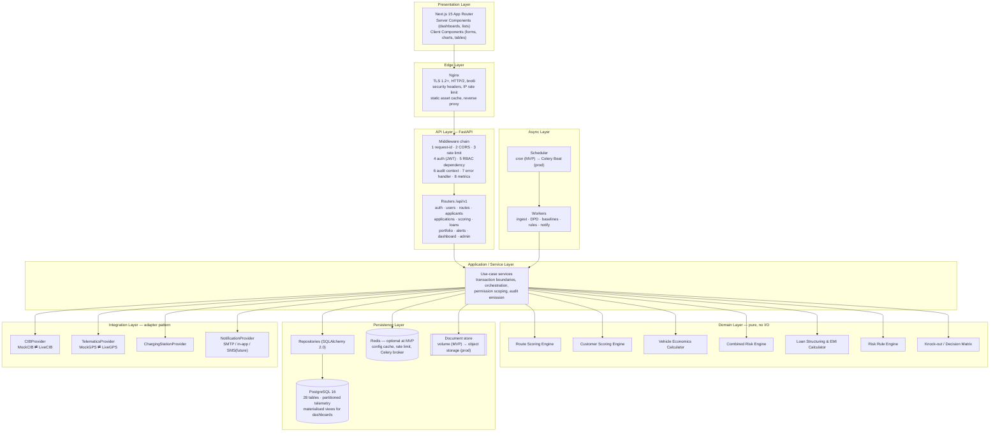
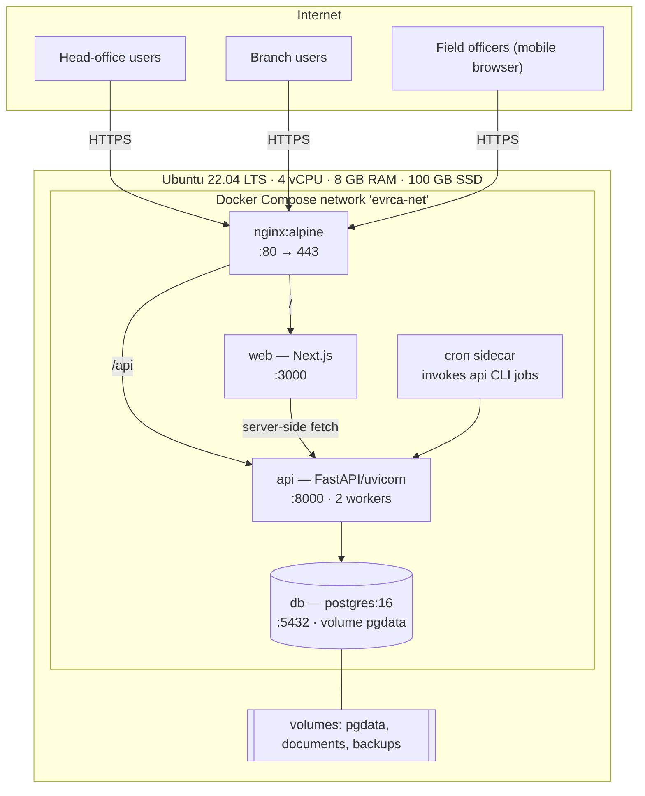
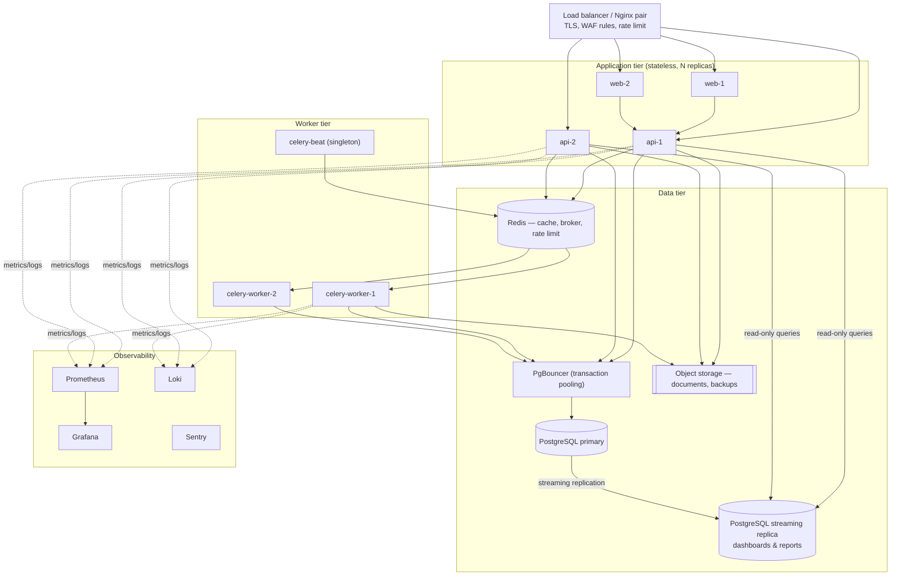
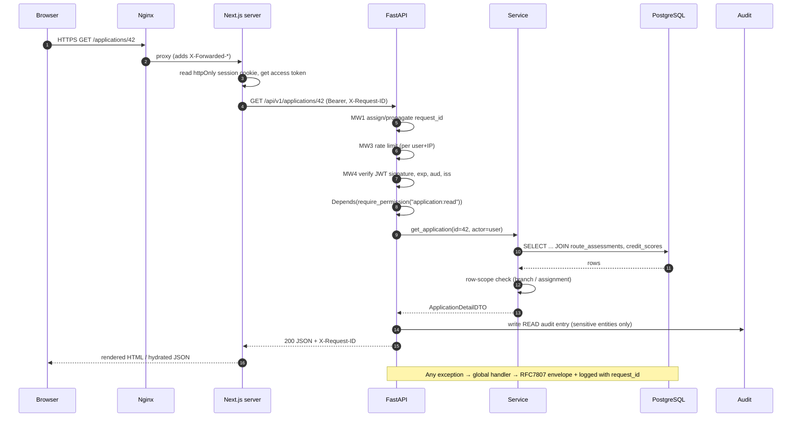
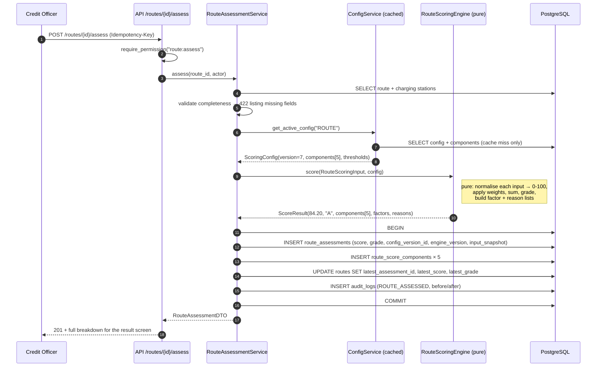
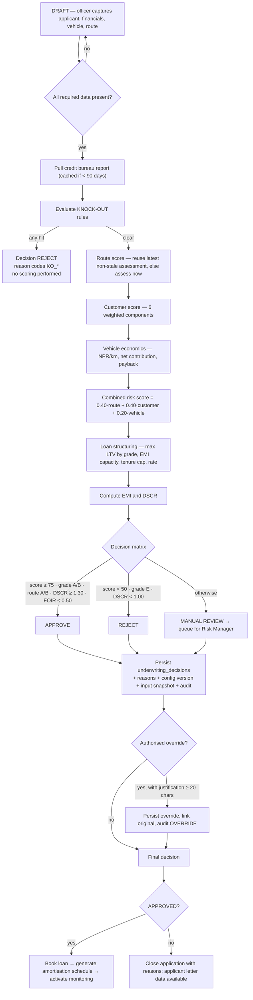
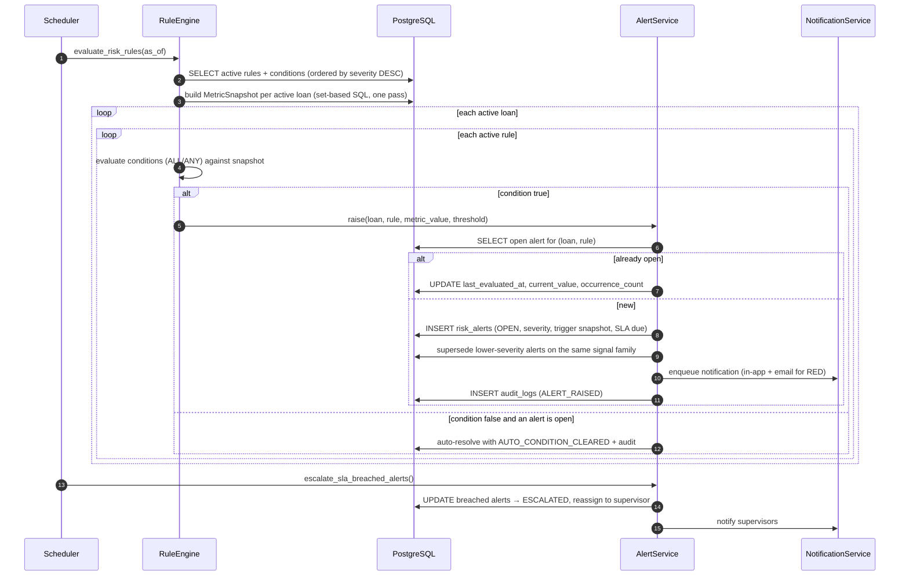
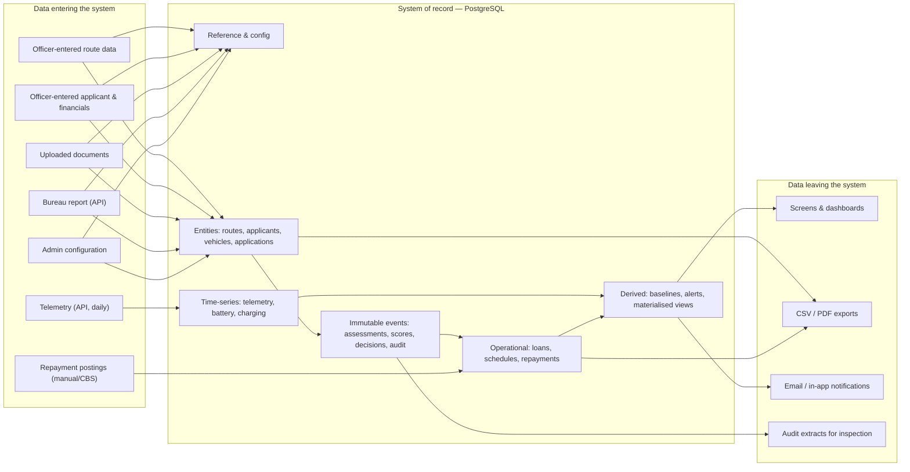

# 4. System Architecture

**System:** EV-RCA · **Version:** 1.0 · **Audience:** Architects, backend/frontend engineers, DevOps

---

## 4.1 Architectural goals and constraints

| Goal | Constraint it must respect |
|------|---------------------------|
| Deterministic, reproducible credit decisions | The engine must never depend on wall-clock time, network state or mutable globals |
| Risk policy owned by the business | Weights, thresholds and rules are data, versioned, publishable without a deploy |
| Auditable end to end | Every state change carries actor, timestamp, before/after and request id |
| Buildable by 4 engineers in 14 weeks | One deployable backend, one frontend, one database, four containers |
| Runs inside a bank's own datacentre | No mandatory managed cloud service; everything is a container on Ubuntu |
| Extractable later | Module boundaries are hard; `monitoring` and `risk` are the designed extraction seams |
| Degrades safely | Loss of an external provider reduces functionality, never corrupts data or silently scores as healthy |

---

## 4.2 Logical architecture



**Dependency rule:** arrows point downward only. The domain layer knows nothing about HTTP, the
database or providers. Services depend on abstractions (`CIBProvider`), never on concrete adapters.

---

## 4.3 Physical / deployment architecture

### 4.3.1 MVP — single host, four containers



### 4.3.2 Production — horizontally scalable



**Why the app tier is trivially horizontal:** no in-process session state (sessions in Postgres/
Redis), no local file writes on the request path (documents go to shared storage), scoring is pure.
The only singleton is Celery Beat.

---

## 4.4 Component inventory

| Component | Technology | Responsibility | Scaling | Failure mode |
|-----------|-----------|----------------|---------|--------------|
| `nginx` | Nginx 1.25 | TLS, routing, static cache, edge rate limit, security headers | vertical / pair | total outage — mitigate with a second instance |
| `web` | Next.js 15 | UI rendering, session cookie, server-side data fetch | horizontal | UI down, API unaffected |
| `api` | FastAPI + uvicorn | All business logic and persistence | horizontal | full outage; health checks + restart policy |
| `db` | PostgreSQL 16 | System of record | vertical + replica | total outage; PITR restore |
| `redis` (prod) | Redis 7 | Cache, broker, distributed rate limit | vertical / cluster | cache miss path still works; jobs queue |
| `celery-worker` (prod) | Celery | Batch jobs | horizontal | jobs delayed, alerts stale; `job_last_success` alerting |
| `celery-beat` (prod) | Celery Beat | Schedule | singleton | no jobs scheduled; monitored gauge |
| Document store | volume / S3 | Uploaded files | storage tier | uploads fail; core flows unaffected |

---

## 4.5 Request flow (generic)



---

## 4.6 Authentication flow

```mermaid
sequenceDiagram
    autonumber
    participant U as Browser
    participant W as Next.js server
    participant A as FastAPI /auth
    participant D as PostgreSQL

    U->>W: POST /login {email, password}
    W->>A: POST /api/v1/auth/login
    A->>D: SELECT user WHERE email, is_active
    alt user missing or inactive
        A-->>W: 401 INVALID_CREDENTIALS (constant-time, generic message)
    else locked
        A-->>W: 423 ACCOUNT_LOCKED (retry_after)
    else valid
        A->>A: argon2.verify(password, hash)
        A->>D: reset failed_attempts; INSERT user_sessions (refresh hash, family_id, UA, IP)
        A->>D: INSERT audit_logs (LOGIN_SUCCESS)
        A-->>W: 200 {access_token(15m), refresh_token, user{role, permissions[]}}
    end
    W->>U: Set-Cookie refresh (httpOnly, Secure, SameSite=Lax) + session payload

    Note over U,A: ── silent refresh ──
    U->>W: any request after access token expiry
    W->>A: POST /api/v1/auth/refresh {refresh_token}
    A->>D: lookup token hash
    alt token already rotated (reuse detected)
        A->>D: revoke ENTIRE session family; audit SECURITY_REFRESH_REUSE
        A-->>W: 401 → force re-login
    else valid
        A->>D: rotate (mark old used, insert new in same family)
        A-->>W: 200 new access + new refresh
    end
```

Logout revokes the presented refresh token and its family; `POST /auth/logout-all` revokes every
session for the user.

---

## 4.7 Route scoring flow



---

## 4.8 Loan application & combined assessment flow



---

## 4.9 Monitoring flow (post-disbursement)

```mermaid
sequenceDiagram
    autonumber
    participant SCH as Scheduler
    participant ING as TelemetryService
    participant TP as TelematicsProvider (mock/live)
    participant D as PostgreSQL
    participant BL as BaselineService
    participant DPD as LoanService

    SCH->>ING: ingest_telemetry(as_of=yesterday)
    ING->>TP: fetch_daily(vehicle_ids[], date)
    TP-->>ING: [{vehicle_id, km, trips, avg_speed, active_hours, idle_min, deviation_pct, soc, soh, sessions}]
    ING->>ING: validate (km ≥ 0, ≤ 800/day; speed plausible; timestamp not future)
    ING->>D: bulk UPSERT vehicle_telemetry (partitioned by month)
    ING->>D: bulk UPSERT battery_metrics, charging_sessions
    ING->>D: flag vehicles with no data → MONITORING_DEGRADED
    SCH->>DPD: recompute_dpd_and_outstanding(as_of)
    DPD->>D: UPDATE repayment_schedules SET days_past_due; UPDATE loans SET outstanding, overdue, dpd, classification
    SCH->>BL: rebuild_usage_baselines(as_of)
    BL->>D: window functions → 7d/30d/90d avg km, trips, sessions, revenue per loan
    BL->>D: UPSERT loan_monitoring_snapshots
```

---

## 4.10 Alert generation flow



---

## 4.11 External integrations

All external systems sit behind an abstract provider. Switching from mock to live is one environment
variable; no service or engine code changes.

```python
# backend/app/integrations/cib/base.py
class CIBProvider(ABC):
    @abstractmethod
    async def fetch_report(self, *, id_type: str, id_number: str,
                           full_name: str) -> CIBReport: ...
```

| Integration | MVP | Production | Contract | Failure behaviour |
|-------------|-----|-----------|----------|-------------------|
| **Credit bureau (CIB)** | `MockCIBProvider` — deterministic pseudo-random report seeded by ID number so demos are stable | REST over TLS with mTLS or API key; per-enquiry billing | `fetch_report(id_type, id_number, full_name) -> CIBReport{score, grade, history_months, defaults[], overdue, max_dpd, active_loans, blacklisted, enquiries_6m, raw}` | 3 retries with backoff → circuit breaker → officer may enter bureau data manually with a `MANUAL_BUREAU_ENTRY` flag; the file cannot auto-APPROVE without bureau data |
| **Telematics / GPS** | `MockTelematicsProvider` — generates plausible daily series per vehicle profile, with injectable "distress" scenarios for the demo | OEM cloud API or aftermarket OBD platform; daily aggregate pull | `fetch_daily(vehicle_ids, date) -> list[TelemetryRecord]` | missing data → `MONITORING_DEGRADED` + stale-feed alert; usage rules skipped, never scored as healthy |
| **Charging stations** | Seeded table maintained by Ops | Optional charging-network API; nightly refresh with `verified_at` | `list_stations(bbox\|corridor) -> list[Station]` | falls back to the stored registry; staleness surfaced on the route screen |
| **Notifications** | SMTP (in-app always) | SMTP + SMS gateway | `send(channel, to, template, context)` | queued with retry; failure is logged and visible in the notification centre, never blocks the business transaction |

**Mock CIB response example** (`api-examples/cib-mock-response.json`):

```json
{
  "provider": "MOCK_CIB",
  "enquiry_id": "CIB-MOCK-2026-0000431",
  "enquiry_date": "2026-09-08",
  "subject": {"id_type": "CITIZENSHIP", "id_number": "27-01-70-04521", "full_name": "Ram Bahadur Tamang"},
  "score": 742,
  "score_range": {"min": 300, "max": 900},
  "grade": "B",
  "credit_history_months": 54,
  "active_loan_count": 2,
  "total_outstanding_npr": 385000.00,
  "total_monthly_emi_npr": 12400.00,
  "previous_default_count": 0,
  "current_overdue_npr": 0.00,
  "max_dpd_last_24m": 12,
  "blacklisted": false,
  "enquiries_last_6m": 1,
  "repayment_history": [
    {"month": "2026-08", "status": "ON_TIME"},
    {"month": "2026-07", "status": "ON_TIME"},
    {"month": "2026-06", "status": "LATE_1_30"}
  ]
}
```

---

## 4.12 Data flow and system boundaries



**Boundary rules:** the platform never writes to the core banking system in MVP; disbursement and
GL remain external. Documents never leave the institution's storage. No PII is sent to any external
service except the bureau enquiry, which is contractual and audit-logged per enquiry.

---

## 4.13 Caching strategy

| Data | Where | TTL / invalidation | Rationale |
|------|-------|--------------------|-----------|
| Active scoring configuration | in-process dict (MVP) / Redis (prod) | keyed by `config_version_id`; publishing a new version invalidates | read on every scoring call, changes rarely |
| Permission set per role | in-process | 5 min or on role change | read on every request |
| Dashboard aggregates | materialised views in Postgres | refreshed nightly + on demand after a booking | expensive multi-join aggregates |
| Bureau report | `credit_bureau_reports` table | configurable validity, default 90 days | per-enquiry cost |
| Vehicle model master | in-process | 1 h | small, static |
| Session/token blacklist | Postgres (MVP) / Redis (prod) | until expiry | revocation correctness over speed |

---

## 4.14 Failure modes and degradation matrix

| Failure | Detection | System behaviour | User-visible result |
|---------|-----------|------------------|---------------------|
| PostgreSQL down | `/health/ready` fails | API returns 503; no writes | Maintenance banner; nothing lost |
| Bureau provider down | circuit breaker opens | Application stays in DRAFT; officer may enter bureau data manually with a flag | "Bureau unavailable — enter manually or retry" |
| Telematics feed silent | ingest job records zero rows for a vehicle | Loan flagged `MONITORING_DEGRADED`; stale-feed alert raised at day 2 and day 5 | Amber banner on the loan monitoring screen |
| Nightly rule job fails | `job_last_success_timestamp` stale > 26 h | Alerting fires; job re-runnable for the same `as_of_date` idempotently | Alerts may be one day late; banner on the alerts screen |
| Redis down (prod) | connection error | Falls back to in-process cache and DB-backed rate limiting; Celery pauses | Slight latency increase; jobs delayed |
| Disk full | Prometheus disk alert at 85% | Uploads rejected with 507; DB protected by reserved space | Upload errors only |
| Scoring config missing/unpublished | readiness check | Scoring endpoints return 409 `CONFIG_NOT_PUBLISHED` | Clear message directing an admin to publish |

---

## 4.15 Security architecture summary

Detail in [09-SECURITY-ARCHITECTURE.md](09-SECURITY-ARCHITECTURE.md).

```mermaid
flowchart LR
    subgraph Perimeter
        TLS["TLS 1.2+ · HSTS · modern ciphers"]
        WAF["Nginx: rate limit, request size cap,<br/>method allow-list, security headers"]
    end
    subgraph AppSec
        AUTH["JWT verify · session validity"]
        RBAC["Permission dependency per endpoint"]
        SCOPE["Row-level scoping in services"]
        VAL["Pydantic validation on every input"]
        ORM["Parameterised SQL only"]
    end
    subgraph DataSec
        ENC["pgcrypto field encryption:<br/>national ID, PAN, account no."]
        REST["Encrypted volumes / disks at rest"]
        MASK["Masked display + reveal permission"]
        AUD["Append-only audit_logs"]
    end
    TLS --> WAF --> AUTH --> RBAC --> SCOPE --> VAL --> ORM --> ENC --> REST --> MASK --> AUD
```



---

## 4.16 Environments and promotion

| Environment | Host | Data | Access | Purpose |
|-------------|------|------|--------|---------|
| Local | developer machine | seeded demo pack | developer | development |
| CI | ephemeral runners | throwaway | pipeline | automated verification |
| Staging | 2 vCPU / 4 GB VM | synthetic/anonymised | internal, IP-restricted | UAT, demo, training |
| Production | 4 vCPU / 8 GB (MVP) | live | internal network / VPN | live operations |

Promotion: tag → CI green → deploy to staging → smoke tests → business UAT sign-off → manual
approval → production deploy with migration step and post-deploy health verification.

---

## 4.17 Key architectural decisions (summary)

| # | Decision | Alternative rejected | Reason |
|---|----------|---------------------|--------|
| 1 | Modular monolith | Microservices | 4-person team; boundaries still moving; extraction seams preserved |
| 2 | Configuration in DB, versioned | Constants / YAML in repo | Risk policy must change without a deploy and remain reproducible |
| 3 | Pure scoring engines | Scoring inside services | Determinism, testability, dry-run capability |
| 4 | PostgreSQL only | Postgres + Mongo + TSDB | Operability for one small team; JSONB and partitioning suffice |
| 5 | Adapter pattern for all externals | Direct client calls | Demo without contracts; testable; swappable |
| 6 | Cron-driven jobs at MVP, Celery later | Celery from day 1 | Fewer moving parts for the MVP; identical CLI entry points |
| 7 | Server-rendered dashboards | Full client-side SPA | Faster first paint on heavy read pages; simpler auth |
| 8 | Append-only event tables | Update-in-place | Historical decisions must be reproducible and inspectable |
| 9 | Monthly partitions on telemetry from day 1 | Add partitioning later | Repartitioning a large live table is painful |
| 10 | Idempotency keys on money/job endpoints | Best-effort | Prevents duplicate loans and duplicate repayment postings |
