# 5. Database Design

**Engine:** PostgreSQL 16 · **Schema:** `public` · **Naming:** `snake_case`, plural table names
**Executable DDL:** [../db/schema.sql](../db/schema.sql) · **Seed:** [../db/seed/](../db/seed/)

---

## 5.1 Design principles

| # | Principle | Implementation |
|---|-----------|----------------|
| 1 | 3NF for transactional data | 28 core tables, all relationships FK-enforced |
| 2 | Money is `NUMERIC(14,2)` | never `float`/`real`; NPR only |
| 3 | Scores are `NUMERIC(5,2)` | 0.00–100.00; percentages `NUMERIC(6,4)` as fractions |
| 4 | Internal `BIGSERIAL` PK + external `uuid` | UUID is what the API exposes; prevents enumeration |
| 5 | Immutable event tables | `route_assessments`, `credit_scores`, `underwriting_decisions`, `repayments`, `audit_logs` — INSERT only, enforced by trigger |
| 6 | Soft delete on business entities | `deleted_at TIMESTAMPTZ NULL`; all queries filter it; partial unique indexes ignore deleted rows |
| 7 | Full audit columns | `created_at`, `updated_at` everywhere; `created_by`, `updated_by` on mutable business tables |
| 8 | `updated_at` by trigger | `trg_set_updated_at()`, never application-set |
| 9 | Enumerations | PostgreSQL `ENUM` for stable technical sets; lookup tables for business-editable sets |
| 10 | Time-series partitioned monthly | `vehicle_telemetry`, `battery_metrics`, `charging_sessions` |
| 11 | JSONB for snapshots and rules | with GIN indexes where queried |
| 12 | All timestamps `TIMESTAMPTZ`, stored UTC | display converted to Asia/Kathmandu (UTC+05:45) |
| 13 | Optimistic locking | `version INT` on `loan_applications`, `risk_alerts`, `scoring_configurations` |
| 14 | Sensitive identifiers encrypted | `pgcrypto` `pgp_sym_encrypt` on national ID, PAN, account number |

---

## 5.2 ER diagram

```mermaid
erDiagram
    ROLES ||--o{ USERS : "assigned to"
    ROLES ||--o{ ROLE_PERMISSIONS : has
    PERMISSIONS ||--o{ ROLE_PERMISSIONS : "granted in"
    USERS ||--o{ USER_SESSIONS : owns
    USERS ||--o{ AUDIT_LOGS : performs
    USERS ||--o{ NOTIFICATIONS : receives

    APPLICANTS ||--o{ APPLICANT_DOCUMENTS : has
    APPLICANTS ||--o{ APPLICANT_FINANCIALS : "has versions of"
    APPLICANTS ||--o{ EXISTING_OBLIGATIONS : owes
    APPLICANTS ||--o{ CREDIT_BUREAU_REPORTS : "enquired for"
    APPLICANTS ||--o{ LOAN_APPLICATIONS : submits

    VEHICLE_MODELS ||--o{ VEHICLES : "instantiated as"
    VEHICLES ||--o{ LOAN_APPLICATIONS : "financed in"
    VEHICLES ||--o{ VEHICLE_TELEMETRY : reports
    VEHICLES ||--o{ BATTERY_METRICS : reports
    VEHICLES ||--o{ CHARGING_SESSIONS : logs
    VEHICLES ||--o{ MAINTENANCE_EVENTS : has

    ROUTES ||--o{ ROUTE_ASSESSMENTS : "assessed by"
    ROUTES ||--o{ CHARGING_STATIONS : "served by"
    ROUTES ||--o{ LOAN_APPLICATIONS : "operated on"
    ROUTE_ASSESSMENTS ||--o{ ROUTE_SCORE_COMPONENTS : "broken into"

    SCORING_CONFIGURATIONS ||--o{ SCORING_CONFIG_COMPONENTS : contains
    SCORING_CONFIGURATIONS ||--o{ ROUTE_ASSESSMENTS : "produced"
    SCORING_CONFIGURATIONS ||--o{ CREDIT_SCORES : "produced"
    SCORING_CONFIGURATIONS ||--o{ LOAN_ASSESSMENTS : "produced"

    LOAN_APPLICATIONS ||--|| APPLICANT_FINANCIALS : "snapshot of"
    LOAN_APPLICATIONS ||--o{ CREDIT_SCORES : "scored by"
    LOAN_APPLICATIONS ||--o{ LOAN_ASSESSMENTS : "combined score"
    LOAN_APPLICATIONS ||--o{ UNDERWRITING_DECISIONS : decided
    LOAN_APPLICATIONS ||--o| LOANS : "becomes"
    CREDIT_SCORES ||--o{ CREDIT_SCORE_COMPONENTS : "broken into"

    LOANS ||--o{ REPAYMENT_SCHEDULES : amortised
    REPAYMENT_SCHEDULES ||--o{ REPAYMENTS : "settled by"
    LOANS ||--o{ RISK_ALERTS : triggers
    LOANS ||--o{ LOAN_MONITORING_SNAPSHOTS : "measured by"

    RISK_RULES ||--o{ RISK_RULE_CONDITIONS : "composed of"
    RISK_RULES ||--o{ RISK_ALERTS : raises
    USERS ||--o{ RISK_ALERTS : "assigned"
    SYSTEM_SETTINGS }o--|| USERS : "last changed by"
```



### 5.2.1 Relationships and cardinality

| Parent | Child | Cardinality | Delete rule | Notes |
|--------|-------|-------------|-------------|-------|
| `roles` → `users` | 1 : N | RESTRICT | a role in use cannot be deleted |
| `roles` ↔ `permissions` | M : N via `role_permissions` | CASCADE on join | |
| `users` → `user_sessions` | 1 : N | CASCADE | |
| `applicants` → `applicant_financials` | 1 : N (versions) | RESTRICT | only one `is_current` per applicant |
| `applicants` → `applicant_documents` | 1 : N | CASCADE | |
| `applicants` → `existing_obligations` | 1 : N | CASCADE | |
| `applicants` → `credit_bureau_reports` | 1 : N | RESTRICT | history retained |
| `applicants` → `loan_applications` | 1 : N | RESTRICT | |
| `vehicle_models` → `vehicles` | 1 : N | RESTRICT | |
| `routes` → `route_assessments` | 1 : N | RESTRICT | immutable history |
| `route_assessments` → `route_score_components` | 1 : N (exactly one per configured component) | CASCADE | |
| `routes` → `charging_stations` | 1 : N (optional corridor link) | SET NULL | a station may serve several routes; MVP models the primary corridor |
| `loan_applications` → `credit_scores` | 1 : N (re-runs) | CASCADE | latest flagged |
| `credit_scores` → `credit_score_components` | 1 : N | CASCADE | |
| `loan_applications` → `loan_assessments` | 1 : N | CASCADE | combined score runs |
| `loan_applications` → `underwriting_decisions` | 1 : N (original + overrides) | RESTRICT | |
| `loan_applications` → `loans` | 1 : 0..1 | RESTRICT | unique index enforces one loan per application |
| `loans` → `repayment_schedules` | 1 : N (one per instalment) | CASCADE | |
| `repayment_schedules` → `repayments` | 1 : N (partials) | RESTRICT | |
| `loans` → `risk_alerts` | 1 : N | CASCADE | |
| `risk_rules` → `risk_rule_conditions` | 1 : N | CASCADE | |
| `vehicles` → `vehicle_telemetry` | 1 : N (daily) | CASCADE | unique (vehicle, date) |

---

## 5.3 Table specifications

Legend: **PK** primary key · **FK** foreign key · **U** unique · **NN** not null ·
Index column lists the recommended index(es).

### 5.3.1 `roles`

| Column | Type | Key | Null | Default | Description |
|--------|------|-----|------|---------|-------------|
| `id` | SMALLSERIAL | PK | NN | | Internal id |
| `code` | VARCHAR(40) | U | NN | | `SUPER_ADMIN`, `RISK_MANAGER`, `CREDIT_OFFICER`, `PORTFOLIO_MANAGER`, `FIELD_OFFICER`, `VIEWER` |
| `name` | VARCHAR(80) | | NN | | Display name |
| `description` | TEXT | | YES | | Purpose of the role |
| `is_system` | BOOLEAN | | NN | `false` | System roles cannot be deleted |
| `created_at` / `updated_at` | TIMESTAMPTZ | | NN | `now()` | |

**Indexes:** `uq_roles_code` UNIQUE(`code`).

### 5.3.2 `permissions`

| Column | Type | Key | Null | Default | Description |
|--------|------|-----|------|---------|-------------|
| `id` | SMALLSERIAL | PK | NN | | |
| `code` | VARCHAR(60) | U | NN | | `resource:action`, e.g. `route:assess` |
| `resource` | VARCHAR(30) | | NN | | `route`, `application`, `alert`, … |
| `action` | VARCHAR(30) | | NN | | `read`, `create`, `approve`, … |
| `description` | TEXT | | YES | | |
| `created_at` | TIMESTAMPTZ | | NN | `now()` | |

**Indexes:** UNIQUE(`code`); INDEX(`resource`).

### 5.3.3 `role_permissions`

| Column | Type | Key | Null | Default | Description |
|--------|------|-----|------|---------|-------------|
| `role_id` | SMALLINT | PK, FK→`roles.id` | NN | | |
| `permission_id` | SMALLINT | PK, FK→`permissions.id` | NN | | |
| `granted_at` | TIMESTAMPTZ | | NN | `now()` | |

**Indexes:** composite PK(`role_id`,`permission_id`); INDEX(`permission_id`) for reverse lookup.

### 5.3.4 `users`

| Column | Type | Key | Null | Default | Description |
|--------|------|-----|------|---------|-------------|
| `id` | BIGSERIAL | PK | NN | | |
| `uuid` | UUID | U | NN | `gen_random_uuid()` | External identifier |
| `email` | CITEXT | U | NN | | Login identity, case-insensitive |
| `password_hash` | TEXT | | NN | | Argon2id |
| `full_name` | VARCHAR(120) | | NN | | |
| `phone` | VARCHAR(20) | | YES | | |
| `employee_code` | VARCHAR(30) | U | YES | | HR identifier |
| `role_id` | SMALLINT | FK→`roles.id` | NN | | Exactly one role |
| `branch_code` | VARCHAR(20) | | YES | | For row scoping |
| `is_active` | BOOLEAN | | NN | `true` | |
| `must_change_password` | BOOLEAN | | NN | `true` | Forced on admin-created accounts |
| `failed_login_attempts` | SMALLINT | | NN | `0` | |
| `locked_until` | TIMESTAMPTZ | | YES | | Lockout expiry |
| `last_login_at` | TIMESTAMPTZ | | YES | | |
| `password_changed_at` | TIMESTAMPTZ | | YES | | Expiry policy |
| `created_by` / `updated_by` | BIGINT | FK→`users.id` | YES | | |
| `created_at` / `updated_at` | TIMESTAMPTZ | | NN | `now()` | |
| `deleted_at` | TIMESTAMPTZ | | YES | | Soft delete |

**Indexes:** UNIQUE(`email`) WHERE `deleted_at IS NULL`; UNIQUE(`uuid`); INDEX(`role_id`);
INDEX(`is_active`, `role_id`); INDEX(`branch_code`).

### 5.3.5 `user_sessions`

| Column | Type | Key | Null | Default | Description |
|--------|------|-----|------|---------|-------------|
| `id` | BIGSERIAL | PK | NN | | |
| `user_id` | BIGINT | FK→`users.id` | NN | | |
| `family_id` | UUID | | NN | `gen_random_uuid()` | Refresh-rotation family |
| `refresh_token_hash` | TEXT | U | NN | | SHA-256 of the opaque token |
| `issued_at` | TIMESTAMPTZ | | NN | `now()` | |
| `expires_at` | TIMESTAMPTZ | | NN | | |
| `rotated_at` | TIMESTAMPTZ | | YES | | Set when superseded |
| `revoked_at` | TIMESTAMPTZ | | YES | | |
| `revoked_reason` | VARCHAR(40) | | YES | `LOGOUT`,`REUSE_DETECTED`,`ADMIN_REVOKE`,`EXPIRED` |
| `ip_address` | INET | | YES | | |
| `user_agent` | TEXT | | YES | | |

**Indexes:** UNIQUE(`refresh_token_hash`); INDEX(`user_id`, `revoked_at`); INDEX(`family_id`);
INDEX(`expires_at`) for the purge job.

### 5.3.6 `applicants`

| Column | Type | Key | Null | Default | Description |
|--------|------|-----|------|---------|-------------|
| `id` | BIGSERIAL | PK | NN | | |
| `uuid` | UUID | U | NN | `gen_random_uuid()` | |
| `applicant_code` | VARCHAR(20) | U | NN | | Human reference, e.g. `APP-2026-00042` |
| `applicant_type` | applicant_type_enum | | NN | | `INDIVIDUAL_DRIVER`,`OWNER_DRIVER`,`CORPORATE`,`FLEET_OPERATOR`,`SME`,`TRANSPORT_COMPANY` |
| `full_name` | VARCHAR(150) | | NN | | Person or entity name |
| `date_of_birth` | DATE | | YES | | Required for individual types |
| `gender` | gender_enum | | YES | | `MALE`,`FEMALE`,`OTHER` |
| `id_type` | id_type_enum | | NN | | `CITIZENSHIP`,`PASSPORT`,`PAN`,`COMPANY_REG` |
| `id_number_enc` | BYTEA | | NN | | pgcrypto-encrypted identifier |
| `id_number_hash` | CHAR(64) | U | NN | | SHA-256 for duplicate detection without decryption |
| `pan_number_enc` | BYTEA | | YES | | |
| `phone` | VARCHAR(20) | | NN | | |
| `alt_phone` | VARCHAR(20) | | YES | | |
| `email` | CITEXT | | YES | | |
| `province` | VARCHAR(40) | | NN | | |
| `district` | VARCHAR(60) | | NN | | |
| `municipality` | VARCHAR(80) | | NN | | |
| `ward_no` | SMALLINT | | YES | | |
| `address_line` | VARCHAR(200) | | YES | | |
| `current_address_same` | BOOLEAN | | NN | `true` | |
| `current_address_line` | VARCHAR(200) | | YES | | |
| `total_experience_years` | NUMERIC(4,1) | | YES | `0` | |
| `driving_experience_years` | NUMERIC(4,1) | | YES | | Individual types |
| `commercial_driving_years` | NUMERIC(4,1) | | YES | | |
| `business_experience_years` | NUMERIC(4,1) | | YES | | Business types |
| `licence_category` | VARCHAR(20) | | YES | | e.g. `B`, `D`, `K` |
| `licence_expiry` | DATE | | YES | | |
| `has_previous_ev_experience` | BOOLEAN | | NN | `false` | |
| `company_reg_number` | VARCHAR(40) | | YES | | Business types |
| `company_reg_date` | DATE | | YES | | |
| `fleet_size` | SMALLINT | | YES | | Fleet operators |
| `status` | applicant_status_enum | | NN | `ACTIVE` | `ACTIVE`,`BLACKLISTED`,`INACTIVE` |
| `created_by` / `updated_by` | BIGINT | FK→`users.id` | YES | | |
| `created_at` / `updated_at` | TIMESTAMPTZ | | NN | `now()` | |
| `deleted_at` | TIMESTAMPTZ | | YES | | |

**Indexes:** UNIQUE(`applicant_code`); UNIQUE(`id_number_hash`) WHERE `deleted_at IS NULL`;
INDEX(`applicant_type`); INDEX(`district`,`province`); GIN trigram index on `full_name` for search;
INDEX(`phone`).

### 5.3.7 `applicant_financials` (versioned)

| Column | Type | Key | Null | Default | Description |
|--------|------|-----|------|---------|-------------|
| `id` | BIGSERIAL | PK | NN | | |
| `applicant_id` | BIGINT | FK→`applicants.id` | NN | | |
| `version_no` | SMALLINT | | NN | `1` | Increments per applicant |
| `is_current` | BOOLEAN | | NN | `true` | One current row per applicant |
| `monthly_income` | NUMERIC(14,2) | | NN | `0` | Salary/personal income NPR |
| `monthly_business_revenue` | NUMERIC(14,2) | | NN | `0` | |
| `monthly_household_expenses` | NUMERIC(14,2) | | NN | `0` | |
| `monthly_business_expenses` | NUMERIC(14,2) | | NN | `0` | |
| `other_monthly_income` | NUMERIC(14,2) | | NN | `0` | |
| `existing_loan_count` | SMALLINT | | NN | `0` | |
| `total_existing_emi` | NUMERIC(14,2) | | NN | `0` | Sum of `existing_obligations` |
| `total_existing_outstanding` | NUMERIC(14,2) | | NN | `0` | |
| `avg_bank_balance_6m` | NUMERIC(14,2) | | NN | `0` | |
| `bank_account_count` | SMALLINT | | NN | `0` | |
| `dependants_count` | SMALLINT | | NN | `0` | |
| `has_guarantor` | BOOLEAN | | NN | `false` | |
| `income_proof_type` | VARCHAR(40) | | YES | | `SALARY_SLIP`,`BANK_STATEMENT`,`SELF_DECLARED`,`AUDITED_FINANCIALS` |
| `income_verified` | BOOLEAN | | NN | `false` | Affects income component confidence |
| `notes` | TEXT | | YES | | |
| `created_by` | BIGINT | FK→`users.id` | YES | | |
| `created_at` / `updated_at` | TIMESTAMPTZ | | NN | `now()` | |

**Derived (generated columns):** `total_monthly_income = monthly_income + monthly_business_revenue + other_monthly_income`,
`total_monthly_expenses`, `disposable_income`.
**Indexes:** UNIQUE(`applicant_id`,`version_no`); UNIQUE(`applicant_id`) WHERE `is_current`;
INDEX(`applicant_id`).

### 5.3.8 `existing_obligations`

| Column | Type | Key | Null | Default | Description |
|--------|------|-----|------|---------|-------------|
| `id` | BIGSERIAL | PK | NN | | |
| `applicant_id` | BIGINT | FK→`applicants.id` | NN | | |
| `lender_name` | VARCHAR(120) | | NN | | |
| `loan_type` | VARCHAR(40) | | NN | | `AUTO`,`HOME`,`BUSINESS`,`PERSONAL`,`OVERDRAFT` |
| `original_amount` | NUMERIC(14,2) | | NN | | |
| `outstanding_amount` | NUMERIC(14,2) | | NN | | |
| `monthly_emi` | NUMERIC(14,2) | | NN | | |
| `remaining_tenure_months` | SMALLINT | | YES | | |
| `is_overdue` | BOOLEAN | | NN | `false` | |
| `days_past_due` | SMALLINT | | NN | `0` | |
| `source` | VARCHAR(20) | | NN | `DECLARED` | `DECLARED`,`CIB` |
| `created_at` / `updated_at` | TIMESTAMPTZ | | NN | `now()` | |

**Indexes:** INDEX(`applicant_id`); INDEX(`applicant_id`,`is_overdue`).

### 5.3.9 `applicant_documents`

| Column | Type | Key | Null | Default | Description |
|--------|------|-----|------|---------|-------------|
| `id` | BIGSERIAL | PK | NN | | |
| `uuid` | UUID | U | NN | `gen_random_uuid()` | Used in the download URL |
| `applicant_id` | BIGINT | FK→`applicants.id` | NN | | |
| `application_id` | BIGINT | FK→`loan_applications.id` | YES | | Optional link |
| `document_type` | document_type_enum | | NN | | `CITIZENSHIP`,`PAN`,`LICENCE`,`INCOME_PROOF`,`BANK_STATEMENT`,`VEHICLE_QUOTATION`,`ROUTE_PERMIT`,`PHOTO`,`OTHER` |
| `file_name` | VARCHAR(255) | | NN | | Original name (sanitised) |
| `storage_key` | VARCHAR(300) | | NN | | UUID-based path; never the original name |
| `mime_type` | VARCHAR(100) | | NN | | Allow-list validated |
| `file_size_bytes` | INTEGER | | NN | | ≤ 10 MB |
| `checksum_sha256` | CHAR(64) | | NN | | Integrity + duplicate detection |
| `is_verified` | BOOLEAN | | NN | `false` | |
| `verified_by` | BIGINT | FK→`users.id` | YES | | |
| `verified_at` | TIMESTAMPTZ | | YES | | |
| `uploaded_by` | BIGINT | FK→`users.id` | NN | | |
| `created_at` | TIMESTAMPTZ | | NN | `now()` | |
| `deleted_at` | TIMESTAMPTZ | | YES | | |

**Indexes:** UNIQUE(`uuid`); INDEX(`applicant_id`,`document_type`); INDEX(`application_id`).

### 5.3.10 `credit_bureau_reports`

| Column | Type | Key | Null | Default | Description |
|--------|------|-----|------|---------|-------------|
| `id` | BIGSERIAL | PK | NN | | |
| `applicant_id` | BIGINT | FK→`applicants.id` | NN | | |
| `provider` | VARCHAR(30) | | NN | `MOCK_CIB` | `MOCK_CIB`,`CIB_LIVE` |
| `enquiry_id` | VARCHAR(60) | U | NN | | Provider reference |
| `enquiry_date` | DATE | | NN | | |
| `valid_until` | DATE | | NN | | `enquiry_date + validity_days` |
| `bureau_score` | SMALLINT | | YES | | 300–900 |
| `bureau_grade` | VARCHAR(5) | | YES | | Provider grade |
| `credit_history_months` | SMALLINT | | NN | `0` | |
| `active_loan_count` | SMALLINT | | NN | `0` | |
| `total_outstanding` | NUMERIC(14,2) | | NN | `0` | |
| `total_monthly_emi` | NUMERIC(14,2) | | NN | `0` | |
| `previous_default_count` | SMALLINT | | NN | `0` | |
| `current_overdue_amount` | NUMERIC(14,2) | | NN | `0` | |
| `max_dpd_last_24m` | SMALLINT | | NN | `0` | |
| `is_blacklisted` | BOOLEAN | | NN | `false` | Knock-out trigger |
| `enquiries_last_6m` | SMALLINT | | NN | `0` | Credit-hunger signal |
| `repayment_history` | JSONB | | YES | | Month-by-month status array |
| `raw_response` | JSONB | | YES | | Full provider payload (retained for audit) |
| `is_manual_entry` | BOOLEAN | | NN | `false` | Set when the provider was unavailable |
| `fetched_by` | BIGINT | FK→`users.id` | YES | | |
| `created_at` | TIMESTAMPTZ | | NN | `now()` | Immutable |

**Indexes:** UNIQUE(`enquiry_id`); INDEX(`applicant_id`,`enquiry_date` DESC);
INDEX(`applicant_id`,`valid_until` DESC) for the cache lookup — note this **cannot** be a partial index on `valid_until >= CURRENT_DATE`, because PostgreSQL requires index predicates to be IMMUTABLE; GIN(`raw_response`).

### 5.3.11 `vehicle_models`

| Column | Type | Key | Null | Default | Description |
|--------|------|-----|------|---------|-------------|
| `id` | SERIAL | PK | NN | | |
| `brand` | VARCHAR(60) | | NN | | |
| `model` | VARCHAR(80) | | NN | | |
| `variant` | VARCHAR(60) | | YES | | |
| `category` | vehicle_category_enum | | NN | | `TWO_WHEELER`,`THREE_WHEELER`,`CAR_TAXI`,`SUV`,`VAN`,`MINI_BUS`,`BUS`,`CARGO_PICKUP`,`TRUCK` |
| `battery_capacity_kwh` | NUMERIC(6,2) | | NN | | |
| `certified_range_km` | SMALLINT | | NN | | Manufacturer claim |
| `real_world_range_km` | SMALLINT | | NN | | Used in economics — always prefer this |
| `motor_power_kw` | NUMERIC(6,2) | | YES | | |
| `seating_capacity` | SMALLINT | | YES | | |
| `payload_capacity_kg` | INTEGER | | YES | | |
| `ex_showroom_price` | NUMERIC(14,2) | | NN | | NPR |
| `on_road_price` | NUMERIC(14,2) | | NN | | Basis for LTV |
| `battery_warranty_years` | SMALLINT | | NN | `0` | |
| `battery_warranty_km` | INTEGER | | YES | | |
| `vehicle_warranty_years` | SMALLINT | | NN | `0` | |
| `charging_type` | VARCHAR(30) | | YES | | `AC_ONLY`,`AC_DC`,`SWAPPABLE` |
| `fast_charge_minutes` | SMALLINT | | YES | | 20–80% |
| `maintenance_cost_per_km` | NUMERIC(6,3) | | NN | `0.5` | NPR/km default reserve |
| `expected_life_years` | SMALLINT | | NN | `10` | |
| `is_active` | BOOLEAN | | NN | `true` | |
| `created_at` / `updated_at` | TIMESTAMPTZ | | NN | `now()` | |

**Indexes:** UNIQUE(`brand`,`model`,`variant`); INDEX(`category`,`is_active`).

### 5.3.12 `vehicles`

| Column | Type | Key | Null | Default | Description |
|--------|------|-----|------|---------|-------------|
| `id` | BIGSERIAL | PK | NN | | |
| `uuid` | UUID | U | NN | `gen_random_uuid()` | |
| `vehicle_model_id` | INT | FK→`vehicle_models.id` | NN | | |
| `registration_number` | VARCHAR(30) | U | YES | | Null until registered |
| `chassis_number` | VARCHAR(40) | U | YES | | |
| `engine_motor_number` | VARCHAR(40) | | YES | | |
| `manufacture_year` | SMALLINT | | YES | | |
| `purchase_price` | NUMERIC(14,2) | | NN | | Actual invoice |
| `is_new` | BOOLEAN | | NN | `true` | |
| `odometer_km` | INTEGER | | NN | `0` | At financing |
| `telematics_device_id` | VARCHAR(60) | U | YES | | Links to the provider |
| `telematics_status` | VARCHAR(20) | | NN | `NOT_INSTALLED` | `ACTIVE`,`STALE`,`NOT_INSTALLED`,`REMOVED` |
| `insurance_expiry` | DATE | | YES | | |
| `permit_number` | VARCHAR(40) | | YES | | |
| `permit_expiry` | DATE | | YES | | |
| `status` | vehicle_status_enum | | NN | `PROPOSED` | `PROPOSED`,`FINANCED`,`REPOSSESSED`,`SOLD`,`WRITTEN_OFF` |
| `created_at` / `updated_at` | TIMESTAMPTZ | | NN | `now()` | |
| `deleted_at` | TIMESTAMPTZ | | YES | | |

**Indexes:** UNIQUE(`registration_number`) WHERE `deleted_at IS NULL`; UNIQUE(`chassis_number`);
INDEX(`vehicle_model_id`); INDEX(`telematics_status`); INDEX(`status`).

### 5.3.13 `routes`

| Column | Type | Key | Null | Default | Description |
|--------|------|-----|------|---------|-------------|
| `id` | BIGSERIAL | PK | NN | | |
| `uuid` | UUID | U | NN | `gen_random_uuid()` | |
| `route_code` | VARCHAR(20) | U | NN | | `RT-KTM-DHU-001` |
| `route_name` | VARCHAR(150) | | NN | | `Kathmandu–Dhulikhel` |
| `origin` | VARCHAR(100) | | NN | | |
| `destination` | VARCHAR(100) | | NN | | |
| `province` | VARCHAR(40) | | NN | | |
| `district` | VARCHAR(60) | | NN | | |
| `route_type` | route_type_enum | | NN | | `URBAN`,`SUBURBAN`,`INTERCITY`,`RURAL`,`HIGHWAY` |
| `total_distance_km` | NUMERIC(7,2) | | NN | | > 0 |
| `road_type` | road_type_enum | | NN | | `PITCH`,`GRAVEL`,`OFF_ROAD`,`MIXED` |
| `road_condition` | road_condition_enum | | NN | | `EXCELLENT`,`GOOD`,`FAIR`,`POOR`,`VERY_POOR` |
| `gradient_profile` | gradient_enum | | NN | `FLAT` | `FLAT`,`ROLLING`,`HILLY`,`STEEP` |
| `pitch_road_percent` | NUMERIC(5,2) | | NN | `100` | For `MIXED` |
| `charging_station_count` | SMALLINT | | NN | `0` | |
| `fast_charger_count` | SMALLINT | | NN | `0` | |
| `charging_station_density` | NUMERIC(6,3) | | NN | `0` | Stations per 10 km (generated, overridable) |
| `avg_charging_distance_km` | NUMERIC(7,2) | | NN | `0` | Mean gap between chargers |
| `max_charging_gap_km` | NUMERIC(7,2) | | YES | | Worst gap — drives adequacy |
| `passenger_volume_daily` | INTEGER | | NN | `0` | |
| `freight_volume_daily_tons` | NUMERIC(8,2) | | NN | `0` | |
| `estimated_daily_trips` | NUMERIC(5,2) | | NN | | Per vehicle |
| `avg_fare_per_trip` | NUMERIC(10,2) | | NN | `0` | |
| `avg_freight_revenue_per_trip` | NUMERIC(10,2) | | NN | `0` | |
| `traffic_density` | traffic_enum | | NN | | `LOW`,`MODERATE`,`HIGH`,`SEVERE` |
| `competition_level` | competition_enum | | NN | | `LOW`,`MODERATE`,`HIGH`,`SATURATED` |
| `operator_count` | SMALLINT | | YES | | Competing vehicles |
| `seasonal_risk` | risk_level_enum | | NN | `LOW` | `NONE`…`SEVERE` |
| `monsoon_disruption_days` | SMALLINT | | NN | `0` | Days/year |
| `flood_landslide_risk` | risk_level_enum | | NN | `LOW` | |
| `security_risk` | risk_level_enum | | NN | `LOW` | |
| `electricity_tariff_per_kwh` | NUMERIC(6,2) | | NN | `12.00` | NPR/kWh |
| `estimated_daily_revenue` | NUMERIC(12,2) | | NN | `0` | Derived, overridable |
| `estimated_daily_operating_cost` | NUMERIC(12,2) | | NN | `0` | |
| `estimated_daily_energy_cost` | NUMERIC(12,2) | | NN | `0` | Derived, overridable |
| `permit_required` | BOOLEAN | | NN | `false` | |
| `latest_assessment_id` | BIGINT | FK→`route_assessments.id` | YES | | Denormalised pointer |
| `latest_score` | NUMERIC(5,2) | | YES | | Denormalised for list/filter |
| `latest_grade` | VARCHAR(2) | | YES | | |
| `latest_assessed_at` | TIMESTAMPTZ | | YES | | Staleness |
| `status` | route_status_enum | | NN | `DRAFT` | `DRAFT`,`ASSESSED`,`ACTIVE`,`SUSPENDED` |
| `created_by` / `updated_by` | BIGINT | FK→`users.id` | YES | | |
| `created_at` / `updated_at` | TIMESTAMPTZ | | NN | `now()` | |
| `deleted_at` | TIMESTAMPTZ | | YES | | |

**Indexes:** UNIQUE(`route_code`); UNIQUE(`origin`,`destination`,`route_name`) WHERE `deleted_at IS NULL`;
INDEX(`latest_grade`,`latest_score` DESC); INDEX(`province`,`district`); INDEX(`status`);
INDEX(`latest_assessed_at`) for the staleness job; GIN trigram on `route_name`.

### 5.3.14 `charging_stations`

| Column | Type | Key | Null | Default | Description |
|--------|------|-----|------|---------|-------------|
| `id` | BIGSERIAL | PK | NN | | |
| `station_name` | VARCHAR(150) | | NN | | |
| `operator` | VARCHAR(80) | | YES | | NEA, private operator |
| `province` / `district` / `municipality` | VARCHAR | | NN/YES | | |
| `latitude` / `longitude` | NUMERIC(9,6) | | YES | | |
| `charger_type` | VARCHAR(20) | | NN | | `AC`,`DC_FAST`,`DC_ULTRA` |
| `power_kw` | NUMERIC(6,2) | | NN | | |
| `connector_types` | VARCHAR(80) | | YES | | `CCS2,Type2,GBT` |
| `port_count` | SMALLINT | | NN | `1` | |
| `is_operational` | BOOLEAN | | NN | `true` | |
| `is_24x7` | BOOLEAN | | NN | `false` | |
| `tariff_per_kwh` | NUMERIC(6,2) | | YES | | |
| `route_id` | BIGINT | FK→`routes.id` | YES | | Primary corridor served |
| `distance_from_origin_km` | NUMERIC(7,2) | | YES | | Position along the corridor |
| `verified_at` | DATE | | YES | | Data freshness |
| `created_at` / `updated_at` | TIMESTAMPTZ | | NN | `now()` | |

**Indexes:** INDEX(`route_id`,`distance_from_origin_km`); INDEX(`district`,`is_operational`);
INDEX(`charger_type`).

### 5.3.15 `scoring_configurations`

| Column | Type | Key | Null | Default | Description |
|--------|------|-----|------|---------|-------------|
| `id` | BIGSERIAL | PK | NN | | |
| `config_type` | config_type_enum | | NN | | `ROUTE`,`CUSTOMER`,`FINAL` |
| `version_no` | INTEGER | | NN | | Increments per type |
| `name` | VARCHAR(120) | | NN | | e.g. "Route scorecard v3 — post-monsoon" |
| `status` | config_status_enum | | NN | `DRAFT` | `DRAFT`,`ACTIVE`,`ARCHIVED`,`DISCARDED` |
| `grade_thresholds` | JSONB | | NN | | `[{"grade":"A","min":88,"max":100,"label":"Low Risk"}, …]` |
| `decision_rules` | JSONB | | YES | | Decision-matrix parameters (FINAL only) |
| `notes` | TEXT | | YES | | Change rationale |
| `published_by` | BIGINT | FK→`users.id` | YES | | |
| `published_at` | TIMESTAMPTZ | | YES | | |
| `archived_at` | TIMESTAMPTZ | | YES | | |
| `version` | INTEGER | | NN | `1` | Optimistic lock |
| `created_by` | BIGINT | FK→`users.id` | NN | | |
| `created_at` / `updated_at` | TIMESTAMPTZ | | NN | `now()` | |

**Indexes:** UNIQUE(`config_type`,`version_no`); **UNIQUE(`config_type`) WHERE `status='ACTIVE'`**
(guarantees exactly one active configuration per type); INDEX(`status`).

### 5.3.16 `scoring_config_components`

| Column | Type | Key | Null | Default | Description |
|--------|------|-----|------|---------|-------------|
| `id` | BIGSERIAL | PK | NN | | |
| `config_id` | BIGINT | FK→`scoring_configurations.id` | NN | | CASCADE |
| `component_code` | VARCHAR(50) | | NN | | `CHARGING_INFRASTRUCTURE`, `INCOME_CASHFLOW`, … |
| `label` | VARCHAR(100) | | NN | | UI label |
| `weight` | NUMERIC(6,4) | | NN | | Fraction; all weights per config must sum to 1.0000 |
| `display_order` | SMALLINT | | NN | `0` | |
| `is_active` | BOOLEAN | | NN | `true` | |
| `scoring_rules` | JSONB | | NN | | Bands/curves — see §5.5 |
| `description` | TEXT | | YES | | Shown as help text in the admin UI |
| `created_at` / `updated_at` | TIMESTAMPTZ | | NN | `now()` | |

**Indexes:** UNIQUE(`config_id`,`component_code`); INDEX(`config_id`,`display_order`).
**Constraint:** a deferred trigger validates `SUM(weight) = 1.0000` before a config may be published.

### 5.3.17 `route_assessments` (immutable)

| Column | Type | Key | Null | Default | Description |
|--------|------|-----|------|---------|-------------|
| `id` | BIGSERIAL | PK | NN | | |
| `uuid` | UUID | U | NN | `gen_random_uuid()` | |
| `route_id` | BIGINT | FK→`routes.id` | NN | | |
| `config_id` | BIGINT | FK→`scoring_configurations.id` | NN | | Version used |
| `engine_version` | VARCHAR(40) | | NN | | `route-engine@1.0.0` |
| `total_score` | NUMERIC(5,2) | | NN | | 0–100 |
| `grade` | VARCHAR(2) | | NN | | `A`,`B`,`C` |
| `risk_level` | VARCHAR(20) | | NN | | `LOW`,`MEDIUM`,`HIGH` |
| `charging_adequacy` | VARCHAR(20) | | NN | | `ADEQUATE`,`MARGINAL`,`INADEQUATE` |
| `revenue_potential` | VARCHAR(20) | | NN | | `HIGH`,`MODERATE`,`LOW` |
| `recommendation` | VARCHAR(40) | | NN | | `ELIGIBLE`,`ELIGIBLE_WITH_CONDITIONS`,`NOT_ELIGIBLE` |
| `risk_factors` | JSONB | | NN | `'[]'` | `[{"code","severity","message","value"}]` |
| `positive_factors` | JSONB | | NN | `'[]'` | |
| `explanation` | TEXT | | NN | | Generated narrative |
| `input_snapshot` | JSONB | | NN | | Exact engine input — enables replay |
| `estimated_monthly_revenue` | NUMERIC(12,2) | | YES | | Derived |
| `estimated_monthly_profit` | NUMERIC(12,2) | | YES | | Derived |
| `assessed_by` | BIGINT | FK→`users.id` | NN | | |
| `assessed_at` | TIMESTAMPTZ | | NN | `now()` | |

**Indexes:** UNIQUE(`uuid`); INDEX(`route_id`,`assessed_at` DESC); INDEX(`grade`);
INDEX(`config_id`); GIN(`input_snapshot`).
**Trigger:** `trg_prevent_update_delete` — rows are insert-only.

### 5.3.18 `route_score_components`

| Column | Type | Key | Null | Default | Description |
|--------|------|-----|------|---------|-------------|
| `id` | BIGSERIAL | PK | NN | | |
| `assessment_id` | BIGINT | FK→`route_assessments.id` | NN | | CASCADE |
| `component_code` | VARCHAR(50) | | NN | | |
| `label` | VARCHAR(100) | | NN | | |
| `raw_inputs` | JSONB | | NN | | Inputs that fed this component |
| `normalized_score` | NUMERIC(5,2) | | NN | | 0–100 pre-weight |
| `weight` | NUMERIC(6,4) | | NN | | As configured at run time |
| `weighted_score` | NUMERIC(6,3) | | NN | | `normalized × weight` |
| `explanation` | TEXT | | NN | | One sentence |
| `display_order` | SMALLINT | | NN | `0` | |

**Indexes:** UNIQUE(`assessment_id`,`component_code`); INDEX(`assessment_id`).

### 5.3.19 `loan_applications`

| Column | Type | Key | Null | Default | Description |
|--------|------|-----|------|---------|-------------|
| `id` | BIGSERIAL | PK | NN | | |
| `uuid` | UUID | U | NN | `gen_random_uuid()` | |
| `application_number` | VARCHAR(25) | U | NN | | `LA-2026-000123` |
| `applicant_id` | BIGINT | FK→`applicants.id` | NN | | |
| `financial_profile_id` | BIGINT | FK→`applicant_financials.id` | NN | | Version used |
| `vehicle_id` | BIGINT | FK→`vehicles.id` | NN | | |
| `route_id` | BIGINT | FK→`routes.id` | NN | | |
| `route_assessment_id` | BIGINT | FK→`route_assessments.id` | YES | | The assessment relied upon |
| `credit_bureau_report_id` | BIGINT | FK→`credit_bureau_reports.id` | YES | | |
| `requested_amount` | NUMERIC(14,2) | | NN | | |
| `requested_tenure_months` | SMALLINT | | NN | | |
| `proposed_interest_rate` | NUMERIC(5,2) | | NN | | Annual % |
| `down_payment_amount` | NUMERIC(14,2) | | NN | | |
| `vehicle_on_road_price` | NUMERIC(14,2) | | NN | | Snapshot at application |
| `expected_daily_km` | NUMERIC(7,2) | | NN | | |
| `expected_operating_days_month` | SMALLINT | | NN | `26` | |
| `expected_monthly_revenue` | NUMERIC(12,2) | | YES | | Officer estimate |
| `purpose` | VARCHAR(200) | | YES | | |
| `status` | application_status_enum | | NN | `DRAFT` | `DRAFT`,`SUBMITTED`,`UNDER_ASSESSMENT`,`PENDING_DECISION`,`APPROVED`,`REJECTED`,`WITHDRAWN`,`DISBURSED`,`EXPIRED` |
| `branch_code` | VARCHAR(20) | | YES | | Row scoping |
| `submitted_at` | TIMESTAMPTZ | | YES | | |
| `decided_at` | TIMESTAMPTZ | | YES | | |
| `version` | INTEGER | | NN | `1` | Optimistic lock |
| `created_by` / `updated_by` | BIGINT | FK→`users.id` | YES | | |
| `created_at` / `updated_at` | TIMESTAMPTZ | | NN | `now()` | |
| `deleted_at` | TIMESTAMPTZ | | YES | | |

**Indexes:** UNIQUE(`application_number`); INDEX(`applicant_id`); INDEX(`status`,`created_at` DESC);
INDEX(`route_id`); INDEX(`branch_code`,`status`); INDEX(`created_by`).
**Constraints:** `down_payment_amount < vehicle_on_road_price`; `requested_amount > 0`;
`requested_tenure_months BETWEEN 6 AND 120`.

### 5.3.20 `credit_scores` (immutable)

| Column | Type | Key | Null | Default | Description |
|--------|------|-----|------|---------|-------------|
| `id` | BIGSERIAL | PK | NN | | |
| `uuid` | UUID | U | NN | `gen_random_uuid()` | |
| `application_id` | BIGINT | FK→`loan_applications.id` | NN | | |
| `config_id` | BIGINT | FK→`scoring_configurations.id` | NN | | |
| `engine_version` | VARCHAR(40) | | NN | | |
| `total_score` | NUMERIC(5,2) | | NN | | 0–100 |
| `grade` | VARCHAR(2) | | NN | | `A`–`E` |
| `risk_level` | VARCHAR(20) | | NN | | |
| `dti_ratio` | NUMERIC(6,4) | | NN | | Existing EMI / income |
| `foir_ratio` | NUMERIC(6,4) | | NN | | (Existing + proposed EMI) / income |
| `disposable_income` | NUMERIC(14,2) | | NN | | |
| `knockouts_triggered` | JSONB | | NN | `'[]'` | Non-empty ⇒ forced REJECT |
| `risk_factors` | JSONB | | NN | `'[]'` | |
| `positive_factors` | JSONB | | NN | `'[]'` | |
| `explanation` | TEXT | | NN | | |
| `input_snapshot` | JSONB | | NN | | |
| `is_latest` | BOOLEAN | | NN | `true` | One latest per application |
| `scored_by` | BIGINT | FK→`users.id` | NN | | |
| `scored_at` | TIMESTAMPTZ | | NN | `now()` | |

**Indexes:** UNIQUE(`uuid`); UNIQUE(`application_id`) WHERE `is_latest`;
INDEX(`application_id`,`scored_at` DESC); INDEX(`grade`).

### 5.3.21 `credit_score_components`

Same shape as `route_score_components`, parented by `credit_scores.id`.

| Column | Type | Key | Null | Description |
|--------|------|-----|------|-------------|
| `id` | BIGSERIAL | PK | NN | |
| `credit_score_id` | BIGINT | FK→`credit_scores.id` | NN | CASCADE |
| `component_code` | VARCHAR(50) | | NN | `CREDIT_HISTORY`,`INCOME_CASHFLOW`,`EXISTING_DEBT`,`DOWN_PAYMENT`,`EXPERIENCE`,`VEHICLE_ECONOMICS` |
| `label` | VARCHAR(100) | | NN | |
| `raw_inputs` | JSONB | | NN | |
| `normalized_score` | NUMERIC(5,2) | | NN | |
| `weight` | NUMERIC(6,4) | | NN | |
| `weighted_score` | NUMERIC(6,3) | | NN | |
| `explanation` | TEXT | | NN | |
| `display_order` | SMALLINT | | NN | |

**Indexes:** UNIQUE(`credit_score_id`,`component_code`).

### 5.3.22 `loan_assessments` (combined risk, immutable)

| Column | Type | Key | Null | Default | Description |
|--------|------|-----|------|---------|-------------|
| `id` | BIGSERIAL | PK | NN | | |
| `uuid` | UUID | U | NN | `gen_random_uuid()` | |
| `application_id` | BIGINT | FK→`loan_applications.id` | NN | | |
| `route_assessment_id` | BIGINT | FK→`route_assessments.id` | NN | | |
| `credit_score_id` | BIGINT | FK→`credit_scores.id` | NN | | |
| `config_id` | BIGINT | FK→`scoring_configurations.id` | NN | | FINAL config |
| `engine_version` | VARCHAR(40) | | NN | | |
| `route_score` | NUMERIC(5,2) | | NN | | Input |
| `customer_score` | NUMERIC(5,2) | | NN | | Input |
| `vehicle_economics_score` | NUMERIC(5,2) | | NN | | Input |
| `route_weight` / `customer_weight` / `vehicle_weight` | NUMERIC(6,4) | | NN | | As configured |
| `final_score` | NUMERIC(5,2) | | NN | | 0–100 |
| `risk_grade` | VARCHAR(2) | | NN | | `A`–`E` |
| `risk_level` | VARCHAR(20) | | NN | | |
| `energy_cost_per_km` | NUMERIC(8,3) | | NN | | NPR/km |
| `daily_net_contribution` | NUMERIC(12,2) | | NN | | |
| `monthly_net_contribution` | NUMERIC(12,2) | | NN | | |
| `recommended_amount` | NUMERIC(14,2) | | NN | | |
| `max_ltv_percent` | NUMERIC(5,2) | | NN | | |
| `applied_ltv_percent` | NUMERIC(5,2) | | NN | | For the recommended amount |
| `recommended_tenure_months` | SMALLINT | | NN | | |
| `recommended_interest_rate` | NUMERIC(5,2) | | NN | | Base + grade premium |
| `estimated_emi` | NUMERIC(12,2) | | NN | | |
| `dscr` | NUMERIC(6,3) | | NN | | Contribution / EMI |
| `foir_post_loan` | NUMERIC(6,4) | | NN | | |
| `payback_months` | NUMERIC(6,2) | | YES | | |
| `recommendation` | decision_enum | | NN | | `APPROVE`,`MANUAL_REVIEW`,`REJECT` |
| `reasons` | JSONB | | NN | `'[]'` | `[{"code","type","message","impact"}]` |
| `input_snapshot` | JSONB | | NN | | |
| `is_latest` | BOOLEAN | | NN | `true` | |
| `assessed_by` | BIGINT | FK→`users.id` | NN | | |
| `assessed_at` | TIMESTAMPTZ | | NN | `now()` | |

**Indexes:** UNIQUE(`uuid`); UNIQUE(`application_id`) WHERE `is_latest`; INDEX(`risk_grade`);
INDEX(`recommendation`); INDEX(`assessed_at` DESC).

### 5.3.23 `underwriting_decisions` (immutable)

| Column | Type | Key | Null | Default | Description |
|--------|------|-----|------|---------|-------------|
| `id` | BIGSERIAL | PK | NN | | |
| `uuid` | UUID | U | NN | `gen_random_uuid()` | |
| `application_id` | BIGINT | FK→`loan_applications.id` | NN | | |
| `loan_assessment_id` | BIGINT | FK→`loan_assessments.id` | NN | | |
| `system_recommendation` | decision_enum | | NN | | What the engine said |
| `final_decision` | decision_enum | | NN | | What the human recorded |
| `is_override` | BOOLEAN | | NN | `false` | `final ≠ system` |
| `override_justification` | TEXT | | YES | | Required when `is_override`; ≥ 20 chars |
| `approved_amount` | NUMERIC(14,2) | | YES | | |
| `approved_tenure_months` | SMALLINT | | YES | | |
| `approved_interest_rate` | NUMERIC(5,2) | | YES | | |
| `conditions` | JSONB | | NN | `'[]'` | Sanction conditions |
| `reasons` | JSONB | | NN | `'[]'` | Copy of engine reasons at decision time |
| `decided_by` | BIGINT | FK→`users.id` | NN | | |
| `decided_at` | TIMESTAMPTZ | | NN | `now()` | |
| `second_approver_id` | BIGINT | FK→`users.id` | YES | | Four-eyes (Phase 2) |
| `second_approved_at` | TIMESTAMPTZ | | YES | | |

**Indexes:** UNIQUE(`uuid`); INDEX(`application_id`,`decided_at` DESC);
INDEX(`final_decision`,`decided_at`); INDEX(`decided_by`); INDEX(`is_override`) WHERE `is_override`.

### 5.3.24 `loans`

| Column | Type | Key | Null | Default | Description |
|--------|------|-----|------|---------|-------------|
| `id` | BIGSERIAL | PK | NN | | |
| `uuid` | UUID | U | NN | `gen_random_uuid()` | |
| `loan_account_number` | VARCHAR(25) | U | NN | | `LN-2026-000087` |
| `application_id` | BIGINT | FK→`loan_applications.id`, U | NN | | One loan per application |
| `applicant_id` | BIGINT | FK→`applicants.id` | NN | | Denormalised for query speed |
| `vehicle_id` | BIGINT | FK→`vehicles.id` | NN | | |
| `route_id` | BIGINT | FK→`routes.id` | NN | | |
| `principal_amount` | NUMERIC(14,2) | | NN | | |
| `interest_rate` | NUMERIC(5,2) | | NN | | Annual %, reducing balance |
| `tenure_months` | SMALLINT | | NN | | |
| `emi_amount` | NUMERIC(12,2) | | NN | | |
| `down_payment` | NUMERIC(14,2) | | NN | | |
| `ltv_percent` | NUMERIC(5,2) | | NN | | |
| `disbursement_date` | DATE | | NN | | |
| `first_emi_date` | DATE | | NN | | |
| `maturity_date` | DATE | | NN | | |
| `total_interest` | NUMERIC(14,2) | | NN | | |
| `total_payable` | NUMERIC(14,2) | | NN | | |
| `outstanding_principal` | NUMERIC(14,2) | | NN | | Maintained nightly |
| `total_paid` | NUMERIC(14,2) | | NN | `0` | |
| `overdue_amount` | NUMERIC(14,2) | | NN | `0` | |
| `days_past_due` | SMALLINT | | NN | `0` | Maximum across unpaid instalments |
| `installments_paid` | SMALLINT | | NN | `0` | |
| `installments_overdue` | SMALLINT | | NN | `0` | |
| `classification` | loan_classification_enum | | NN | `PERFORMING` | `PERFORMING`,`WATCHLIST`,`SUBSTANDARD`,`DOUBTFUL`,`LOSS` |
| `risk_status` | VARCHAR(10) | | NN | `GREEN` | `GREEN`,`YELLOW`,`RED` |
| `final_risk_score` | NUMERIC(5,2) | | NN | | Snapshot at booking |
| `risk_grade` | VARCHAR(2) | | NN | | |
| `monitoring_status` | VARCHAR(25) | | NN | `ACTIVE` | `ACTIVE`,`DEGRADED`,`NOT_MONITORED` |
| `status` | loan_status_enum | | NN | `ACTIVE` | `ACTIVE`,`CLOSED`,`FORECLOSED`,`WRITTEN_OFF`,`RESTRUCTURED` |
| `assigned_officer_id` | BIGINT | FK→`users.id` | YES | | Portfolio owner |
| `branch_code` | VARCHAR(20) | | YES | | |
| `closed_at` | TIMESTAMPTZ | | YES | | |
| `created_by` | BIGINT | FK→`users.id` | NN | | |
| `created_at` / `updated_at` | TIMESTAMPTZ | | NN | `now()` | |

**Indexes:** UNIQUE(`loan_account_number`); UNIQUE(`application_id`); INDEX(`applicant_id`);
INDEX(`status`,`risk_status`); INDEX(`days_past_due` DESC) WHERE `status='ACTIVE'`;
INDEX(`classification`); INDEX(`assigned_officer_id`,`status`); INDEX(`route_id`);
INDEX(`disbursement_date`).

### 5.3.25 `repayment_schedules`

| Column | Type | Key | Null | Default | Description |
|--------|------|-----|------|---------|-------------|
| `id` | BIGSERIAL | PK | NN | | |
| `loan_id` | BIGINT | FK→`loans.id` | NN | | CASCADE |
| `installment_no` | SMALLINT | | NN | | 1..n |
| `due_date` | DATE | | NN | | |
| `opening_balance` | NUMERIC(14,2) | | NN | | |
| `principal_due` | NUMERIC(12,2) | | NN | | |
| `interest_due` | NUMERIC(12,2) | | NN | | |
| `total_due` | NUMERIC(12,2) | | NN | | = EMI (last instalment adjusted) |
| `closing_balance` | NUMERIC(14,2) | | NN | | |
| `principal_paid` | NUMERIC(12,2) | | NN | `0` | |
| `interest_paid` | NUMERIC(12,2) | | NN | `0` | |
| `penalty_due` | NUMERIC(12,2) | | NN | `0` | Late fee accrued |
| `penalty_paid` | NUMERIC(12,2) | | NN | `0` | |
| `total_paid` | NUMERIC(12,2) | | NN | `0` | |
| `paid_date` | DATE | | YES | | Date of full settlement |
| `days_past_due` | SMALLINT | | NN | `0` | Recomputed nightly |
| `status` | installment_status_enum | | NN | `PENDING` | `PENDING`,`PAID`,`PARTIAL`,`OVERDUE`,`WAIVED` |
| `created_at` / `updated_at` | TIMESTAMPTZ | | NN | `now()` | |

**Indexes:** UNIQUE(`loan_id`,`installment_no`); INDEX(`loan_id`,`due_date`);
INDEX(`due_date`,`status`) — drives the overdue sweep; INDEX(`status`) WHERE `status IN ('OVERDUE','PARTIAL')`.

### 5.3.26 `repayments` (immutable)

| Column | Type | Key | Null | Default | Description |
|--------|------|-----|------|---------|-------------|
| `id` | BIGSERIAL | PK | NN | | |
| `uuid` | UUID | U | NN | `gen_random_uuid()` | |
| `loan_id` | BIGINT | FK→`loans.id` | NN | | |
| `schedule_id` | BIGINT | FK→`repayment_schedules.id` | YES | | Null for advance payments |
| `receipt_number` | VARCHAR(30) | U | NN | | |
| `payment_date` | DATE | | NN | | |
| `amount_paid` | NUMERIC(12,2) | | NN | | > 0 |
| `principal_component` | NUMERIC(12,2) | | NN | | Allocation |
| `interest_component` | NUMERIC(12,2) | | NN | | |
| `penalty_component` | NUMERIC(12,2) | | NN | `0` | |
| `payment_mode` | VARCHAR(25) | | NN | | `CASH`,`CHEQUE`,`BANK_TRANSFER`,`DIGITAL_WALLET`,`STANDING_INSTRUCTION` |
| `reference_number` | VARCHAR(60) | | YES | | |
| `days_late` | SMALLINT | | NN | `0` | Relative to the due date |
| `is_advance` | BOOLEAN | | NN | `false` | |
| `idempotency_key` | VARCHAR(80) | U | YES | | Prevents double posting |
| `remarks` | TEXT | | YES | | |
| `recorded_by` | BIGINT | FK→`users.id` | NN | | |
| `created_at` | TIMESTAMPTZ | | NN | `now()` | |

**Indexes:** UNIQUE(`receipt_number`); UNIQUE(`idempotency_key`); INDEX(`loan_id`,`payment_date` DESC);
INDEX(`schedule_id`); INDEX(`payment_date`).

### 5.3.27 `vehicle_telemetry` (partitioned monthly by `telemetry_date`)

| Column | Type | Key | Null | Default | Description |
|--------|------|-----|------|---------|-------------|
| `id` | BIGSERIAL | | NN | | Part of the composite PK |
| `vehicle_id` | BIGINT | FK→`vehicles.id` | NN | | |
| `loan_id` | BIGINT | FK→`loans.id` | YES | | Denormalised for fast joins |
| `telemetry_date` | DATE | PK part | NN | | Partition key |
| `daily_km` | NUMERIC(8,2) | | NN | `0` | 0–800 sanity bound |
| `trip_count` | SMALLINT | | NN | `0` | |
| `avg_speed_kmph` | NUMERIC(5,2) | | YES | | |
| `max_speed_kmph` | NUMERIC(5,2) | | YES | | |
| `active_hours` | NUMERIC(5,2) | | NN | `0` | ≤ 24 |
| `idle_minutes` | SMALLINT | | NN | `0` | |
| `route_deviation_percent` | NUMERIC(5,2) | | NN | `0` | Share of distance off the financed corridor |
| `harsh_braking_count` | SMALLINT | | NN | `0` | Driver-behaviour signal |
| `night_driving_hours` | NUMERIC(5,2) | | NN | `0` | |
| `geofence_exits` | SMALLINT | | NN | `0` | |
| `estimated_revenue` | NUMERIC(12,2) | | YES | | Inferred from km × route fare characteristics |
| `data_source` | VARCHAR(20) | | NN | `MOCK` | `MOCK`,`OBD`,`OEM_API`,`MANUAL` |
| `is_estimated` | BOOLEAN | | NN | `false` | Gap-filled |
| `created_at` | TIMESTAMPTZ | | NN | `now()` | |

**Primary key:** (`vehicle_id`, `telemetry_date`) — natural, and unique per day.
**Indexes:** INDEX(`loan_id`,`telemetry_date` DESC); INDEX(`telemetry_date`);
BRIN(`telemetry_date`) on large partitions.
**Partitioning:** `PARTITION BY RANGE (telemetry_date)`, one partition per month, created 3 months
ahead by a maintenance job; partitions older than 24 months are rolled up and detached.

### 5.3.28 `battery_metrics` (partitioned monthly)

| Column | Type | Key | Null | Default | Description |
|--------|------|-----|------|---------|-------------|
| `vehicle_id` | BIGINT | PK part, FK→`vehicles.id` | NN | | |
| `metric_date` | DATE | PK part | NN | | |
| `loan_id` | BIGINT | FK→`loans.id` | YES | | |
| `avg_state_of_charge` | NUMERIC(5,2) | | YES | | % |
| `min_state_of_charge` | NUMERIC(5,2) | | YES | | Deep-discharge signal |
| `state_of_health` | NUMERIC(5,2) | | YES | | % of original capacity |
| `estimated_range_km` | SMALLINT | | YES | | |
| `energy_consumed_kwh` | NUMERIC(8,2) | | NN | `0` | |
| `efficiency_km_per_kwh` | NUMERIC(6,3) | | YES | | Derived |
| `charge_cycles` | NUMERIC(6,2) | | NN | `0` | |
| `battery_temp_avg_c` | NUMERIC(5,2) | | YES | | |
| `fault_codes` | JSONB | | YES | | |
| `created_at` | TIMESTAMPTZ | | NN | `now()` | |

**Indexes:** PK(`vehicle_id`,`metric_date`); INDEX(`loan_id`,`metric_date` DESC);
INDEX(`state_of_health`) for degradation queries.

### 5.3.29 `charging_sessions` (partitioned monthly)

| Column | Type | Key | Null | Default | Description |
|--------|------|-----|------|---------|-------------|
| `id` | BIGSERIAL | | NN | | |
| `vehicle_id` | BIGINT | FK→`vehicles.id` | NN | | |
| `loan_id` | BIGINT | FK→`loans.id` | YES | | |
| `session_date` | DATE | PK part | NN | | |
| `started_at` / `ended_at` | TIMESTAMPTZ | | NN/YES | | |
| `duration_minutes` | SMALLINT | | YES | | |
| `energy_delivered_kwh` | NUMERIC(8,2) | | NN | `0` | |
| `soc_start` / `soc_end` | NUMERIC(5,2) | | YES | | |
| `charger_type` | VARCHAR(20) | | YES | | `AC`,`DC_FAST`,`HOME` |
| `charging_station_id` | BIGINT | FK→`charging_stations.id` | YES | | |
| `estimated_cost` | NUMERIC(10,2) | | YES | | kWh × tariff |
| `is_home_charging` | BOOLEAN | | NN | `false` | |
| `created_at` | TIMESTAMPTZ | | NN | `now()` | |

**Indexes:** PK(`id`,`session_date`); INDEX(`vehicle_id`,`session_date` DESC);
INDEX(`loan_id`,`session_date`); INDEX(`charging_station_id`).

### 5.3.30 `maintenance_events`

| Column | Type | Key | Null | Default | Description |
|--------|------|-----|------|---------|-------------|
| `id` | BIGSERIAL | PK | NN | | |
| `vehicle_id` | BIGINT | FK→`vehicles.id` | NN | | |
| `event_date` | DATE | | NN | | |
| `event_type` | VARCHAR(30) | | NN | | `SCHEDULED_SERVICE`,`BREAKDOWN`,`ACCIDENT`,`BATTERY_SERVICE`,`TYRE`,`OTHER` |
| `description` | TEXT | | YES | | |
| `cost` | NUMERIC(12,2) | | NN | `0` | |
| `downtime_days` | SMALLINT | | NN | `0` | Feeds availability |
| `odometer_km` | INTEGER | | YES | | |
| `is_warranty_claim` | BOOLEAN | | NN | `false` | |
| `recorded_by` | BIGINT | FK→`users.id` | YES | | |
| `created_at` | TIMESTAMPTZ | | NN | `now()` | |

**Indexes:** INDEX(`vehicle_id`,`event_date` DESC); INDEX(`event_type`).

### 5.3.31 `loan_monitoring_snapshots` (derived, rebuilt nightly)

| Column | Type | Key | Null | Description |
|--------|------|-----|------|-------------|
| `loan_id` | BIGINT | PK part, FK→`loans.id` | NN | |
| `snapshot_date` | DATE | PK part | NN | |
| `avg_daily_km_7d` / `_30d` / `_90d` | NUMERIC(8,2) | | YES | Rolling averages |
| `baseline_daily_km` | NUMERIC(8,2) | | YES | 30-day baseline established after 30 days on book |
| `usage_change_percent` | NUMERIC(6,2) | | YES | 7d vs baseline; negative = decline |
| `active_days_30d` | SMALLINT | | NN | |
| `zero_km_streak_days` | SMALLINT | | NN | Consecutive inactive days |
| `avg_trips_7d` / `_30d` | NUMERIC(6,2) | | YES | |
| `charging_sessions_30d` | SMALLINT | | NN | |
| `charging_change_percent` | NUMERIC(6,2) | | YES | |
| `estimated_revenue_30d` | NUMERIC(12,2) | | YES | |
| `revenue_change_percent` | NUMERIC(6,2) | | YES | vs the projection at underwriting |
| `avg_route_deviation_percent` | NUMERIC(5,2) | | YES | |
| `latest_state_of_health` | NUMERIC(5,2) | | YES | |
| `days_since_last_telemetry` | SMALLINT | | NN | Stale-feed detection |
| `days_past_due` | SMALLINT | | NN | Copied from the loan |
| `behaviour_score` | NUMERIC(5,2) | | YES | 0–100 composite health score |
| `created_at` | TIMESTAMPTZ | | NN | |

**Indexes:** PK(`loan_id`,`snapshot_date`); INDEX(`snapshot_date`);
INDEX(`usage_change_percent`) for dashboard sorting.

### 5.3.32 `risk_rules`

| Column | Type | Key | Null | Default | Description |
|--------|------|-----|------|---------|-------------|
| `id` | BIGSERIAL | PK | NN | | |
| `rule_code` | VARCHAR(50) | U | NN | | `EMI_OVERDUE_1_30` |
| `name` | VARCHAR(150) | | NN | | |
| `description` | TEXT | | YES | | Shown in the alert |
| `category` | rule_category_enum | | NN | | `REPAYMENT`,`USAGE`,`REVENUE`,`BATTERY`,`ROUTE`,`DATA_QUALITY` |
| `severity` | severity_enum | | NN | | `YELLOW`,`RED` |
| `condition_logic` | VARCHAR(5) | | NN | `ALL` | `ALL` (AND) or `ANY` (OR) |
| `evaluation_frequency` | VARCHAR(20) | | NN | `DAILY` | `DAILY`,`HOURLY`,`ON_EVENT` |
| `suppression_hours` | SMALLINT | | NN | `24` | Re-raise cool-down |
| `auto_resolve` | BOOLEAN | | NN | `true` | Close when the condition clears |
| `assign_to_role_id` | SMALLINT | FK→`roles.id` | YES | | Default assignee role |
| `sla_hours_acknowledge` | SMALLINT | | NN | `48` | |
| `sla_hours_resolve` | SMALLINT | | NN | `240` | |
| `recommended_action` | TEXT | | YES | | Playbook text shown to the officer |
| `is_active` | BOOLEAN | | NN | `true` | |
| `priority` | SMALLINT | | NN | `100` | Lower = evaluated first |
| `created_by` / `updated_by` | BIGINT | FK→`users.id` | YES | | |
| `created_at` / `updated_at` | TIMESTAMPTZ | | NN | `now()` | |

**Indexes:** UNIQUE(`rule_code`); INDEX(`is_active`,`priority`); INDEX(`category`,`severity`).

### 5.3.33 `risk_rule_conditions`

| Column | Type | Key | Null | Default | Description |
|--------|------|-----|------|---------|-------------|
| `id` | BIGSERIAL | PK | NN | | |
| `rule_id` | BIGINT | FK→`risk_rules.id` | NN | | CASCADE |
| `metric_code` | VARCHAR(50) | | NN | | `DAYS_PAST_DUE`, `USAGE_CHANGE_PCT`, `ZERO_KM_STREAK`, … |
| `operator` | operator_enum | | NN | | `GT`,`GTE`,`LT`,`LTE`,`EQ`,`NEQ`,`BETWEEN`,`IN` |
| `threshold_value` | NUMERIC(14,4) | | YES | | |
| `threshold_value_2` | NUMERIC(14,4) | | YES | | For `BETWEEN` |
| `threshold_values` | JSONB | | YES | | For `IN` |
| `window_days` | SMALLINT | | YES | | Aggregation window |
| `aggregation` | VARCHAR(20) | | YES | | `AVG`,`SUM`,`MIN`,`MAX`,`COUNT`,`LATEST` |
| `sequence_no` | SMALLINT | | NN | `1` | Display/evaluation order |
| `created_at` | TIMESTAMPTZ | | NN | `now()` | |

**Indexes:** INDEX(`rule_id`,`sequence_no`); INDEX(`metric_code`).

### 5.3.34 `risk_alerts`

| Column | Type | Key | Null | Default | Description |
|--------|------|-----|------|---------|-------------|
| `id` | BIGSERIAL | PK | NN | | |
| `uuid` | UUID | U | NN | `gen_random_uuid()` | |
| `alert_number` | VARCHAR(25) | U | NN | | `AL-2026-000451` |
| `loan_id` | BIGINT | FK→`loans.id` | NN | | |
| `applicant_id` | BIGINT | FK→`applicants.id` | NN | | Denormalised |
| `vehicle_id` | BIGINT | FK→`vehicles.id` | NN | | Denormalised |
| `rule_id` | BIGINT | FK→`risk_rules.id` | NN | | |
| `alert_type` | VARCHAR(50) | | NN | | Copy of `rule.category` |
| `severity` | severity_enum | | NN | | `YELLOW`,`RED` |
| `trigger_condition` | TEXT | | NN | | Rendered, e.g. "Days past due = 47 (> 30)" |
| `trigger_metrics` | JSONB | | NN | | `{"DAYS_PAST_DUE": {"value":47,"threshold":30,"operator":"GT"}}` |
| `trigger_date` | DATE | | NN | | |
| `current_metric_value` | NUMERIC(14,4) | | YES | | Refreshed each evaluation |
| `occurrence_count` | SMALLINT | | NN | `1` | Consecutive evaluations still true |
| `status` | alert_status_enum | | NN | `OPEN` | `OPEN`,`ACKNOWLEDGED`,`IN_PROGRESS`,`RESOLVED`,`FALSE_POSITIVE`,`ESCALATED`,`SUPERSEDED` |
| `assigned_to` | BIGINT | FK→`users.id` | YES | | |
| `assigned_at` | TIMESTAMPTZ | | YES | | |
| `assigned_by` | BIGINT | FK→`users.id` | YES | | |
| `acknowledge_due_at` | TIMESTAMPTZ | | YES | | SLA |
| `acknowledged_at` | TIMESTAMPTZ | | YES | | |
| `resolve_due_at` | TIMESTAMPTZ | | YES | | SLA |
| `resolution_code` | VARCHAR(40) | | YES | | `PAYMENT_RECEIVED`,`CUSTOMER_CONTACTED`,`RESTRUCTURE_PROPOSED`,`VEHICLE_VERIFIED`,`FALSE_POSITIVE`,`AUTO_CONDITION_CLEARED`,`ESCALATED_TO_LEGAL` |
| `resolution_notes` | TEXT | | YES | | |
| `resolved_by` | BIGINT | FK→`users.id` | YES | | |
| `resolution_date` | TIMESTAMPTZ | | YES | | |
| `superseded_by_alert_id` | BIGINT | FK→`risk_alerts.id` | YES | | Escalation chain |
| `last_evaluated_at` | TIMESTAMPTZ | | NN | `now()` | |
| `version` | INTEGER | | NN | `1` | Optimistic lock |
| `created_at` / `updated_at` | TIMESTAMPTZ | | NN | `now()` | |

**Indexes:** UNIQUE(`alert_number`); UNIQUE(`loan_id`,`rule_id`) WHERE `status IN ('OPEN','ACKNOWLEDGED','IN_PROGRESS')`
— **this is the deduplication guarantee**; INDEX(`status`,`severity`,`trigger_date` DESC);
INDEX(`assigned_to`,`status`); INDEX(`loan_id`,`trigger_date` DESC); INDEX(`resolve_due_at`) WHERE `status NOT IN ('RESOLVED','FALSE_POSITIVE')`.

### 5.3.35 `alert_activities`

| Column | Type | Key | Null | Description |
|--------|------|-----|------|-------------|
| `id` | BIGSERIAL | PK | NN | |
| `alert_id` | BIGINT | FK→`risk_alerts.id` | NN | CASCADE |
| `activity_type` | VARCHAR(30) | | NN | `NOTE`,`STATUS_CHANGE`,`ASSIGNMENT`,`CALL_LOG`,`FIELD_VISIT`,`ATTACHMENT` |
| `description` | TEXT | | NN | |
| `metadata` | JSONB | | YES | Previous/new status, contact outcome, GPS of visit |
| `performed_by` | BIGINT | FK→`users.id` | NN | |
| `created_at` | TIMESTAMPTZ | | NN | |

**Indexes:** INDEX(`alert_id`,`created_at`).

### 5.3.36 `audit_logs` (append-only)

| Column | Type | Key | Null | Default | Description |
|--------|------|-----|------|---------|-------------|
| `id` | BIGSERIAL | PK | NN | | |
| `event_time` | TIMESTAMPTZ | | NN | `now()` | |
| `request_id` | VARCHAR(40) | | YES | | ULID correlation |
| `user_id` | BIGINT | FK→`users.id` | YES | | Null for system jobs |
| `actor_type` | VARCHAR(20) | | NN | `USER` | `USER`,`SYSTEM`,`JOB` |
| `user_email` | VARCHAR(150) | | YES | | Denormalised — survives user deletion |
| `user_role` | VARCHAR(40) | | YES | | |
| `action` | VARCHAR(60) | | NN | | `LOGIN_SUCCESS`,`ROUTE_ASSESSED`,`DECISION_OVERRIDE`,`CONFIG_PUBLISHED`,… |
| `entity_type` | VARCHAR(50) | | YES | | `route`,`loan_application`,… |
| `entity_id` | BIGINT | | YES | | |
| `entity_uuid` | UUID | | YES | | |
| `before_state` | JSONB | | YES | | Redacted of secrets |
| `after_state` | JSONB | | YES | | |
| `changed_fields` | TEXT[] | | YES | | Fast filtering |
| `ip_address` | INET | | YES | | |
| `user_agent` | TEXT | | YES | | |
| `status` | VARCHAR(15) | | NN | `SUCCESS` | `SUCCESS`,`FAILURE` |
| `error_message` | TEXT | | YES | | |

**Indexes:** INDEX(`event_time` DESC); INDEX(`user_id`,`event_time` DESC);
INDEX(`entity_type`,`entity_id`,`event_time` DESC); INDEX(`action`,`event_time` DESC);
GIN(`changed_fields`); BRIN(`event_time`) once large.
**Trigger:** UPDATE and DELETE are rejected. Consider monthly partitioning beyond ~50M rows.

### 5.3.37 `notifications`

| Column | Type | Key | Null | Default | Description |
|--------|------|-----|------|---------|-------------|
| `id` | BIGSERIAL | PK | NN | | |
| `user_id` | BIGINT | FK→`users.id` | NN | | Recipient |
| `channel` | VARCHAR(15) | | NN | `IN_APP` | `IN_APP`,`EMAIL`,`SMS` |
| `notification_type` | VARCHAR(40) | | NN | | `ALERT_RAISED`,`ALERT_ASSIGNED`,`SLA_BREACH`,`APPLICATION_DECIDED`,`CONFIG_PUBLISHED` |
| `title` | VARCHAR(150) | | NN | | |
| `body` | TEXT | | NN | | |
| `link_url` | VARCHAR(300) | | YES | | Deep link |
| `entity_type` / `entity_id` | VARCHAR(50) / BIGINT | | YES | | |
| `priority` | VARCHAR(10) | | NN | `NORMAL` | `LOW`,`NORMAL`,`HIGH` |
| `is_read` | BOOLEAN | | NN | `false` | |
| `read_at` | TIMESTAMPTZ | | YES | | |
| `delivery_status` | VARCHAR(15) | | NN | `PENDING` | `PENDING`,`SENT`,`FAILED` |
| `delivery_attempts` | SMALLINT | | NN | `0` | |
| `sent_at` | TIMESTAMPTZ | | YES | | |
| `error_message` | TEXT | | YES | | |
| `created_at` | TIMESTAMPTZ | | NN | `now()` | |

**Indexes:** INDEX(`user_id`,`is_read`,`created_at` DESC);
INDEX(`delivery_status`,`created_at`) WHERE `delivery_status='PENDING'`.

### 5.3.38 `system_settings`

| Column | Type | Key | Null | Default | Description |
|--------|------|-----|------|---------|-------------|
| `id` | SERIAL | PK | NN | | |
| `setting_key` | VARCHAR(80) | U | NN | | `loan.max_ltv_percent` |
| `setting_value` | TEXT | | NN | | Stored as text |
| `value_type` | VARCHAR(15) | | NN | | `STRING`,`NUMBER`,`BOOLEAN`,`JSON`,`DATE` |
| `category` | VARCHAR(40) | | NN | | `LOAN_RULES`,`ALERT_SLA`,`GENERAL`,`INTEGRATION`,`SECURITY` |
| `label` | VARCHAR(150) | | NN | | Admin UI label |
| `description` | TEXT | | YES | | |
| `min_value` / `max_value` | NUMERIC(14,4) | | YES | | Validation bounds |
| `allowed_values` | JSONB | | YES | | Enumerated options |
| `is_editable` | BOOLEAN | | NN | `true` | |
| `requires_restart` | BOOLEAN | | NN | `false` | |
| `updated_by` | BIGINT | FK→`users.id` | YES | | |
| `created_at` / `updated_at` | TIMESTAMPTZ | | NN | `now()` | |

**Indexes:** UNIQUE(`setting_key`); INDEX(`category`).

### 5.3.39 `job_runs`

| Column | Type | Key | Null | Description |
|--------|------|-----|------|-------------|
| `id` | BIGSERIAL | PK | NN | |
| `job_name` | VARCHAR(60) | | NN | |
| `as_of_date` | DATE | | YES | Business date processed |
| `started_at` / `finished_at` | TIMESTAMPTZ | | NN/YES | |
| `status` | VARCHAR(15) | | NN | `RUNNING`,`SUCCESS`,`FAILED`,`PARTIAL` |
| `records_processed` | INTEGER | | NN | |
| `records_failed` | INTEGER | | NN | |
| `error_message` | TEXT | | YES | |
| `metadata` | JSONB | | YES | Counts by category |

**Indexes:** INDEX(`job_name`,`started_at` DESC); UNIQUE(`job_name`,`as_of_date`) WHERE `status='SUCCESS'`
— makes re-runs idempotent by construction.

---

## 5.4 Materialised views (dashboard performance)

| View | Contents | Refresh |
|------|----------|---------|
| `mv_portfolio_summary` | counts and sums by status, classification, risk grade, branch | nightly + after booking/repayment |
| `mv_application_funnel` | applications by month × decision | nightly |
| `mv_route_risk_distribution` | route count and exposure by class | nightly |
| `mv_repayment_performance` | on-time / late / missed instalments by month | nightly |
| `mv_geographic_exposure` | outstanding and DPD by province/district | nightly |

All use `REFRESH MATERIALIZED VIEW CONCURRENTLY` (each has a unique index), so dashboards are never
blocked during a refresh.

---

## 5.5 `scoring_rules` JSONB grammar

Each `scoring_config_components.scoring_rules` describes how a raw input becomes a 0–100 sub-score.
Three rule kinds are supported; the engine dispatches on `type`.

**Banded (categorical or step):**

```json
{
  "type": "BANDED",
  "input": "road_condition",
  "bands": [
    {"value": "EXCELLENT", "score": 100},
    {"value": "GOOD",      "score": 85},
    {"value": "FAIR",      "score": 65},
    {"value": "POOR",      "score": 35},
    {"value": "VERY_POOR", "score": 10}
  ],
  "default_score": 50
}
```

**Piecewise-linear (continuous, monotonic):**

```json
{
  "type": "LINEAR",
  "input": "avg_charging_distance_km",
  "direction": "LOWER_IS_BETTER",
  "points": [
    {"x": 0,   "y": 100},
    {"x": 15,  "y": 90},
    {"x": 30,  "y": 70},
    {"x": 50,  "y": 45},
    {"x": 80,  "y": 20},
    {"x": 120, "y": 0}
  ],
  "clamp": true
}
```

**Composite (weighted sub-factors inside one component):**

```json
{
  "type": "COMPOSITE",
  "sub_factors": [
    {"code": "STATION_DENSITY",  "weight": 0.40, "rule": {"type": "LINEAR", "input": "charging_station_density", "direction": "HIGHER_IS_BETTER", "points": [{"x":0,"y":0},{"x":0.5,"y":40},{"x":1.0,"y":70},{"x":2.0,"y":90},{"x":3.0,"y":100}]}},
    {"code": "MAX_GAP_VS_RANGE", "weight": 0.35, "rule": {"type": "LINEAR", "input": "gap_to_range_ratio", "direction": "LOWER_IS_BETTER", "points": [{"x":0,"y":100},{"x":0.4,"y":85},{"x":0.6,"y":60},{"x":0.8,"y":30},{"x":1.0,"y":0}]}},
    {"code": "FAST_CHARGER_SHARE","weight": 0.25, "rule": {"type": "LINEAR", "input": "fast_charger_share", "direction": "HIGHER_IS_BETTER", "points": [{"x":0,"y":20},{"x":0.25,"y":60},{"x":0.5,"y":85},{"x":1.0,"y":100}]}}
  ]
}
```

---

## 5.6 Indexing strategy

**Principles**

1. Index every foreign key used in a join (PostgreSQL does not create these automatically).
2. Index the columns behind every list screen's default sort and its filter facets.
3. Prefer **partial indexes** for the "hot" subset: active loans, open alerts, undeleted rows.
4. Prefer **composite** indexes ordered `(equality columns…, range/sort column)`.
5. Use **BRIN** on append-only, date-ordered, large tables (`vehicle_telemetry`, `audit_logs`) —
   a fraction of the size of a B-tree with adequate selectivity for date-range scans.
6. Use **GIN** on JSONB columns that are actually queried (`raw_response`, `input_snapshot`,
   `changed_fields`), never on every JSONB column.
7. Use **pg_trgm GIN** for the name-search boxes (`applicants.full_name`, `routes.route_name`).
8. Review `pg_stat_user_indexes` quarterly; drop unused indexes — each one taxes every write.

**Critical query paths and their supporting indexes**

| Screen / query | Index |
|----------------|-------|
| Alert queue: open alerts by severity then age | `idx_alerts_status_severity_date` on (`status`,`severity`,`trigger_date` DESC) |
| Risk table: active loans sorted by DPD | `idx_loans_active_dpd` on (`days_past_due` DESC) WHERE `status='ACTIVE'` |
| Overdue sweep | `idx_schedules_due_status` on (`due_date`,`status`) |
| Application work queue | `idx_applications_status_created` on (`status`,`created_at` DESC) |
| Route list sorted by score | `idx_routes_grade_score` on (`latest_grade`,`latest_score` DESC) |
| Usage baseline build | PK(`vehicle_id`,`telemetry_date`) + monthly partition pruning |
| Audit search by entity | `idx_audit_entity` on (`entity_type`,`entity_id`,`event_time` DESC) |
| Bureau cache lookup | `idx_cib_valid` on (`applicant_id`,`valid_until` DESC) |
| My assigned alerts | `idx_alerts_assignee` on (`assigned_to`,`status`) |

---

## 5.7 Audit strategy

**Three complementary layers.**

1. **Application-level audit (primary).** Every service that mutates state calls
   `AuditService.record(...)` **inside the same transaction**. If the business write commits, the
   audit row commits; if either fails, both roll back. Captures actor, role, request id, IP,
   before/after JSONB and the changed-field list. This is the layer that answers "who approved this
   and why".

2. **Immutable event tables.** Assessments, scores, decisions and repayments are never updated. A
   re-run creates a new row and flips `is_latest`. History is the table, not a shadow copy.

3. **Database-level guard (defence in depth).** `BEFORE UPDATE OR DELETE` triggers on `audit_logs`
   and the immutable event tables raise an exception. The application database role is granted only
   `SELECT, INSERT, UPDATE` (no `DELETE`) on business tables and only `INSERT, SELECT` on
   `audit_logs`; `TRUNCATE` and DDL are reserved for the migration role.

**What is always audited:** authentication events (success, failure, lockout, refresh reuse), every
create/update/soft-delete of a business entity, every scoring run, every decision and override,
every configuration publish, every rule change, every user/role change, every document upload and
download, every alert status transition, and every data export.

**Redaction:** the audit writer runs a key-based redactor over `before_state`/`after_state` —
`password*`, `*token*`, `*secret*`, `id_number_enc`, `pan_number_enc` are replaced with `"***"`.
Encrypted identifier columns are never written to the audit in plaintext; the hash is recorded
instead, which is sufficient to prove which record changed.

**Retention and access:** 7 years. Read access requires `audit:read` (Super Admin, Risk Manager,
Viewer/Auditor). Audit reads of sensitive entities are themselves audited. Exports are watermarked
with the requesting user and timestamp.

---

## 5.8 Data volume and growth projections

| Table | Rows at MVP | Rows at 10k loans | Growth driver |
|-------|------------|-------------------|---------------|
| `applicants` | 20 | 25,000 | applications |
| `loan_applications` | 15 | 25,000 | 2.5 applications per loan |
| `loans` | 10 | 10,000 | approvals |
| `repayment_schedules` | ~500 | ~600,000 | loans × 60 instalments |
| `repayments` | ~200 | ~500,000 | instalments paid |
| `vehicle_telemetry` | ~1,800 | **~3.6M/year** | loans × 365 |
| `battery_metrics` | ~1,800 | ~3.6M/year | loans × 365 |
| `charging_sessions` | ~600 | ~7M/year | ~2 sessions/vehicle/day |
| `risk_alerts` | ~25 | ~60,000/year | ~6 alerts per loan per year |
| `audit_logs` | ~2,000 | ~15M/year | every write |
| **Estimated size** | < 100 MB | **~45–60 GB/year** | dominated by telemetry and audit |

Mitigations already designed in: monthly partitioning with 24-month raw retention and daily rollups
thereafter; BRIN indexes on the append-only date columns; `audit_logs` partitioning beyond ~50M rows;
document bytes kept out of the database entirely.

---

## 5.9 Migration and seeding

- **Alembic**, one migration per logical change, both `upgrade()` and `downgrade()` written.
- **Expand/contract**: add nullable column → backfill → make NOT NULL → remove old column, across
  separate releases. Never a destructive change in the same release as the code that needs it.
- **Seeds are split**: `01_reference_data.sql` (roles, permissions, settings, scoring configs, risk
  rules, vehicle models, charging stations) is required in **every** environment including
  production; `02_demo_data.sql` (routes, applicants, applications, loans, telemetry, alerts) is for
  local, CI and staging only and is guarded by an `APP_ENV != production` check.
- **Partition maintenance** migration creates the next three months of partitions and is re-run
  monthly by a job.
