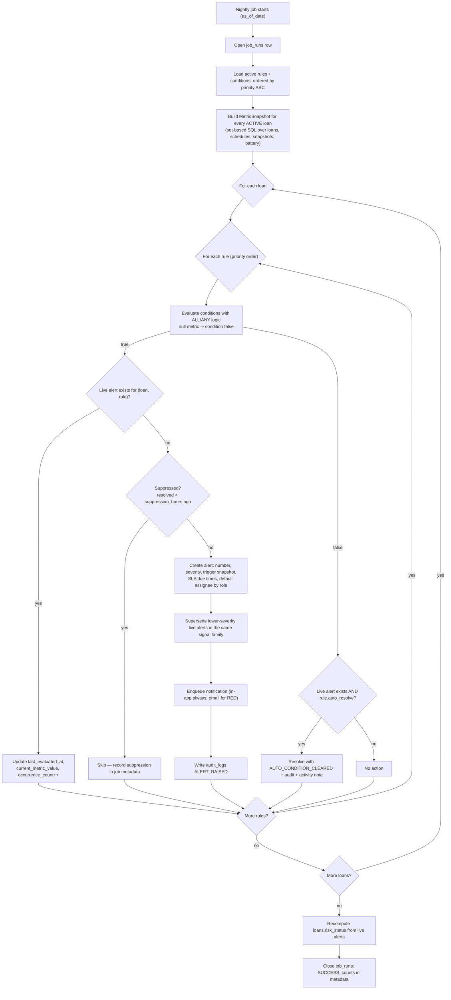
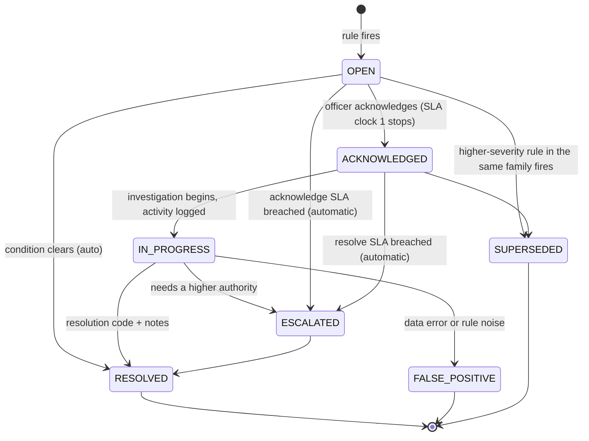

# 8. Risk Rule Engine & Early Warning System

**Audience:** Risk analysts, portfolio managers, backend engineers
**Engine version:** `rule-engine@1.0.0`

---

## 8.1 Purpose

Repayment data tells you a loan is already broken. Telematics tells you it is *breaking*. The early
warning system fuses both, plus battery and route-behaviour signals, into a nightly evaluation that
puts a named officer on a named problem with a deadline.

**Design contract:**

| Requirement | Mechanism |
|-------------|-----------|
| Rules are data, not code | `risk_rules` + `risk_rule_conditions` rows; the admin UI edits them |
| Adding a new signal must not require an engine change | Metric provider registry keyed by `metric_code` |
| No alert storms | Deduplication by unique index on (loan, rule) while live; suppression window; severity supersession |
| No silent healing | Auto-resolve writes an audit entry and keeps the alert history |
| Silence is not health | A stale telematics feed is itself an alert condition |
| Every alert is explainable | The evaluated metric value and the threshold that fired are stored on the alert |
| Testable without a database | Evaluation is a pure function over a `MetricSnapshot` |

---

## 8.2 Severity model

| Severity | Meaning | Default acknowledge SLA | Default resolve SLA | Default owner |
|----------|---------|------------------------|---------------------|---------------|
| **GREEN** | Not an alert — the absence of any live YELLOW/RED. Shown as loan status. | — | — | — |
| **YELLOW** | Deterioration detected. Contact and understand. | 48 h | 10 working days | Portfolio Manager |
| **RED** | Material distress or failure. Act now. | 4 h | 3 working days | Risk Manager |

A loan's `risk_status` is derived: `RED` if any live RED alert, else `YELLOW` if any live YELLOW,
else `GREEN`.

---

## 8.3 Metric registry

Each metric is a registered provider function. The nightly job computes them **set-based** for all
active loans in one pass, not per-loan.

| `metric_code` | Unit | Source | Definition |
|---------------|------|--------|------------|
| `DAYS_PAST_DUE` | days | `loans.days_past_due` | Max DPD across unpaid instalments |
| `CONSECUTIVE_MISSED_EMI` | count | `repayment_schedules` | Consecutive instalments with status OVERDUE |
| `OVERDUE_AMOUNT` | NPR | `loans.overdue_amount` | Principal + interest + penalty overdue |
| `PARTIAL_PAYMENT_COUNT_90D` | count | `repayments` | Payments < instalment due in the last 90 days |
| `USAGE_CHANGE_PCT` | % | `loan_monitoring_snapshots` | `(avg_km_7d − baseline_km) / baseline_km × 100`; negative = decline |
| `USAGE_CHANGE_PCT_30D` | % | snapshots | 30-day average vs baseline |
| `ZERO_KM_STREAK` | days | snapshots | Consecutive days with `daily_km = 0` |
| `ACTIVE_DAYS_30D` | days | snapshots | Days with `daily_km > 0` in the last 30 |
| `AVG_DAILY_KM_7D` | km | snapshots | |
| `REVENUE_CHANGE_PCT` | % | snapshots | Inferred 30-day revenue vs the underwriting projection |
| `CHARGING_CHANGE_PCT` | % | snapshots | 30-day charging sessions vs baseline |
| `CHARGING_SESSIONS_30D` | count | snapshots | |
| `BATTERY_SOH` | % | `battery_metrics` latest | State of health |
| `BATTERY_MIN_SOC_7D` | % | `battery_metrics` | Deep-discharge behaviour |
| `ROUTE_DEVIATION_PCT` | % | snapshots | Share of distance off the financed corridor (7-day avg) |
| `DAYS_SINCE_TELEMETRY` | days | snapshots | Data-feed staleness |
| `MAINTENANCE_DOWNTIME_30D` | days | `maintenance_events` | Sum of downtime days |
| `DSCR_ACTUAL` | ratio | snapshots ÷ loan | Inferred monthly contribution ÷ EMI |
| `LTV_CURRENT` | % | loans + depreciation | Outstanding ÷ estimated current value (Phase 2) |

**Adding a metric** = write one provider function + register it + insert a seed row. No engine change,
no migration.

```python
# backend/app/risk/metrics.py
METRIC_REGISTRY: dict[str, MetricProvider] = {}

def metric(code: str):
    def wrapper(fn: MetricProvider):
        METRIC_REGISTRY[code] = fn
        return fn
    return wrapper

@metric("USAGE_CHANGE_PCT")
def usage_change_pct(snapshot: LoanSnapshotRow) -> Decimal | None:
    if not snapshot.baseline_daily_km:
        return None                      # no baseline yet -> condition cannot fire
    return ((snapshot.avg_daily_km_7d - snapshot.baseline_daily_km)
            / snapshot.baseline_daily_km) * 100
```

**Null semantics:** a metric returning `None` (insufficient history, no baseline, no telemetry)
makes its condition evaluate to **false**, never true. A missing signal never fabricates an alert —
but `DAYS_SINCE_TELEMETRY` exists precisely so that missing signals are still noticed.

---

## 8.4 Rule grammar

A rule = metadata + N conditions joined by `ALL` (AND) or `ANY` (OR).

```json
{
  "rule_code": "USAGE_DROP_MODERATE",
  "name": "Daily usage down 20-35% versus baseline",
  "description": "Sustained fall in daily kilometres suggests reduced operation, illness, competition or informal sale of the vehicle.",
  "category": "USAGE",
  "severity": "YELLOW",
  "condition_logic": "ALL",
  "evaluation_frequency": "DAILY",
  "suppression_hours": 168,
  "auto_resolve": true,
  "assign_to_role": "PORTFOLIO_MANAGER",
  "sla_hours_acknowledge": 48,
  "sla_hours_resolve": 240,
  "priority": 40,
  "recommended_action": "Call the borrower. Confirm the vehicle is still in their possession and operating on the financed route. Check for illness, permit issues, competition or a change of driver. Record the outcome as an activity note.",
  "conditions": [
    {"metric_code": "USAGE_CHANGE_PCT", "operator": "LTE", "threshold_value": -20, "window_days": 7,  "aggregation": "AVG", "sequence_no": 1},
    {"metric_code": "USAGE_CHANGE_PCT", "operator": "GT",  "threshold_value": -35, "window_days": 7,  "aggregation": "AVG", "sequence_no": 2},
    {"metric_code": "ACTIVE_DAYS_30D",  "operator": "GTE", "threshold_value": 5,   "window_days": 30, "aggregation": "COUNT","sequence_no": 3}
  ]
}
```

The third condition is a **noise guard**: a vehicle that barely operated at all in the last month is
handled by the inactivity rules, not by the percentage-change rule.

**Operators:** `GT`, `GTE`, `LT`, `LTE`, `EQ`, `NEQ`, `BETWEEN` (uses `threshold_value_2`),
`IN` (uses `threshold_values`).

---

## 8.5 Default rule catalogue

All 22 rules ship seeded, active, and fully editable. Priority orders evaluation (lower first) so
that supersession works correctly.

### 8.5.1 Repayment rules

| Priority | Rule code | Severity | Conditions (logic) | Recommended action |
|----------|-----------|----------|--------------------|--------------------|
| 10 | `EMI_OVERDUE_30_PLUS` | **RED** | `DAYS_PAST_DUE > 30` | Formal demand notice; assess restructure vs recovery; verify vehicle location |
| 11 | `EMI_MISSED_CONSECUTIVE` | **RED** | `CONSECUTIVE_MISSED_EMI >= 2` | Escalate to Risk Manager; field visit within 48 h |
| 12 | `EMI_OVERDUE_90_PLUS` | **RED** | `DAYS_PAST_DUE > 90` | Classification review; initiate recovery process |
| 20 | `EMI_OVERDUE_1_30` | YELLOW | `DAYS_PAST_DUE BETWEEN 1 AND 30` | Reminder call and SMS; confirm payment date |
| 25 | `PARTIAL_PAYMENT_PATTERN` | YELLOW | `PARTIAL_PAYMENT_COUNT_90D >= 2` | Review cash-flow; consider EMI-date change to match earnings cycle |
| 26 | `OVERDUE_AMOUNT_MATERIAL` | YELLOW | `OVERDUE_AMOUNT >= 50000` | Prioritise collection contact |

### 8.5.2 Usage rules

| Priority | Rule code | Severity | Conditions | Recommended action |
|----------|-----------|----------|-----------|--------------------|
| 15 | `VEHICLE_INACTIVE_7D` | **RED** | `ZERO_KM_STREAK >= 7` | Immediate field verification — possible sale, seizure, major breakdown or accident |
| 16 | `USAGE_COLLAPSE` | **RED** | `USAGE_CHANGE_PCT <= -50` AND `ACTIVE_DAYS_30D >= 3` | Field visit; verify possession and operating status |
| 17 | `ROUTE_ABANDONED` | **RED** | `ROUTE_DEVIATION_PCT >= 60` (7-day avg) | Vehicle no longer on the financed route — re-underwrite or treat as covenant breach |
| 30 | `VEHICLE_INACTIVE_3D` | YELLOW | `ZERO_KM_STREAK BETWEEN 3 AND 6` | Call the borrower; check for breakdown or driver absence |
| 40 | `USAGE_DROP_MODERATE` | YELLOW | `-35 < USAGE_CHANGE_PCT <= -20` AND `ACTIVE_DAYS_30D >= 5` | Call and record the reason |
| 41 | `LOW_ACTIVE_DAYS` | YELLOW | `ACTIVE_DAYS_30D <= 15` | Investigate under-utilisation |
| 42 | `ROUTE_DEVIATION_MODERATE` | YELLOW | `ROUTE_DEVIATION_PCT BETWEEN 30 AND 59.99` | Confirm the operating pattern; the route assumption may need revision |

### 8.5.3 Revenue rules

| Priority | Rule code | Severity | Conditions | Recommended action |
|----------|-----------|----------|-----------|--------------------|
| 18 | `REVENUE_COLLAPSE` | **RED** | `REVENUE_CHANGE_PCT <= -40` | Re-assess affordability; restructure discussion |
| 45 | `REVENUE_DECLINE` | YELLOW | `-40 < REVENUE_CHANGE_PCT <= -20` | Review route economics; check competition and fare changes |
| 46 | `DSCR_BELOW_ONE` | YELLOW | `DSCR_ACTUAL < 1.0` | Inferred earnings no longer cover the EMI — review before it becomes arrears |

### 8.5.4 Battery & charging rules

| Priority | Rule code | Severity | Conditions | Recommended action |
|----------|-----------|----------|-----------|--------------------|
| 19 | `BATTERY_HEALTH_CRITICAL` | **RED** | `BATTERY_SOH < 70` | Collateral value materially impaired; check warranty status; reassess LTV |
| 50 | `BATTERY_HEALTH_LOW` | YELLOW | `70 <= BATTERY_SOH < 80` | Advise service; monitor; confirm warranty coverage |
| 51 | `CHARGING_DROP_SEVERE` | YELLOW | `CHARGING_CHANGE_PCT <= -60` | Corroborate with usage; possible off-grid charging or vehicle idle |
| 52 | `CHARGING_DROP_MODERATE` | YELLOW | `-60 < CHARGING_CHANGE_PCT <= -30` | Monitor; call if it persists 14 days |
| 53 | `DEEP_DISCHARGE_PATTERN` | YELLOW | `BATTERY_MIN_SOC_7D < 10` | Advise the borrower — repeated deep discharge accelerates degradation |

### 8.5.5 Data-quality rules

| Priority | Rule code | Severity | Conditions | Recommended action |
|----------|-----------|----------|-----------|--------------------|
| 21 | `TELEMETRY_SILENT_5D` | **RED** | `DAYS_SINCE_TELEMETRY >= 5` | Device removed, tampered with, or vehicle disposed of — field verification required |
| 60 | `TELEMETRY_SILENT_2D` | YELLOW | `DAYS_SINCE_TELEMETRY BETWEEN 2 AND 4` | Contact the borrower / device provider |

**Why data quality is a first-class alert category:** without it, a borrower who unplugs the tracker
looks identical to a borrower whose vehicle is performing perfectly. Silence must cost something.

---

## 8.6 Evaluation algorithm



### 8.6.1 Signal families and supersession

Alerts within one family describe the same underlying phenomenon at different intensities. When a
higher-severity rule in a family fires, live lower-severity alerts in that family are closed as
`SUPERSEDED` with `superseded_by_alert_id` set — so the queue shows one actionable item, and the
history still shows the escalation path.

| Family | Members (ascending intensity) |
|--------|-------------------------------|
| `REPAYMENT_DELINQUENCY` | `EMI_OVERDUE_1_30` → `EMI_OVERDUE_30_PLUS` → `EMI_OVERDUE_90_PLUS` |
| `VEHICLE_INACTIVITY` | `VEHICLE_INACTIVE_3D` → `VEHICLE_INACTIVE_7D` |
| `USAGE_DECLINE` | `USAGE_DROP_MODERATE` → `USAGE_COLLAPSE` |
| `REVENUE_DECLINE` | `REVENUE_DECLINE` → `REVENUE_COLLAPSE` |
| `BATTERY_DEGRADATION` | `BATTERY_HEALTH_LOW` → `BATTERY_HEALTH_CRITICAL` |
| `ROUTE_DEVIATION` | `ROUTE_DEVIATION_MODERATE` → `ROUTE_ABANDONED` |
| `TELEMETRY_GAP` | `TELEMETRY_SILENT_2D` → `TELEMETRY_SILENT_5D` |
| `CHARGING_DECLINE` | `CHARGING_DROP_MODERATE` → `CHARGING_DROP_SEVERE` |

### 8.6.2 Pure evaluation core

```python
# backend/app/risk/engine.py
@dataclass(frozen=True)
class MetricSnapshot:
    loan_id: int
    as_of: date
    values: dict[str, Decimal | None]

def evaluate_condition(cond: RuleCondition, snap: MetricSnapshot) -> bool:
    v = snap.values.get(cond.metric_code)
    if v is None:
        return False                     # missing data never fires an alert
    t, t2 = cond.threshold_value, cond.threshold_value_2
    match cond.operator:
        case "GT":      return v >  t
        case "GTE":     return v >= t
        case "LT":      return v <  t
        case "LTE":     return v <= t
        case "EQ":      return v == t
        case "NEQ":     return v != t
        case "BETWEEN": return t <= v <= t2
        case "IN":      return v in {Decimal(str(x)) for x in cond.threshold_values}
    raise ValueError(f"Unsupported operator {cond.operator}")

def evaluate_rule(rule: Rule, snap: MetricSnapshot) -> RuleOutcome:
    results = [(c, evaluate_condition(c, snap)) for c in rule.conditions]
    fired = all(r for _, r in results) if rule.condition_logic == "ALL" \
            else any(r for _, r in results)
    return RuleOutcome(
        rule_code=rule.rule_code,
        fired=fired,
        evidence={c.metric_code: {"value": snap.values.get(c.metric_code),
                                  "operator": c.operator,
                                  "threshold": c.threshold_value,
                                  "passed": passed}
                  for c, passed in results},
    )
```

### 8.6.3 Idempotency and re-runs

The job is keyed by `(job_name, as_of_date)` with a unique index on successful runs. Re-running for
the same business date produces the same alerts (dedup index prevents duplicates) and the same
auto-resolutions. A failed run can be safely retried.

---

## 8.7 Alert lifecycle



**Transition rules**

| From → To | Who | Requires |
|-----------|-----|----------|
| OPEN → ACKNOWLEDGED | assignee or `alert:assign` holder | — |
| ACKNOWLEDGED → IN_PROGRESS | assignee | at least one activity note |
| any → RESOLVED | `alert:resolve` holder | `resolution_code` + notes ≥ 10 chars |
| any → FALSE_POSITIVE | `alert:resolve` holder | notes ≥ 20 chars explaining why |
| any → ESCALATED | system (SLA) or `alert:assign` holder | reassignment to a supervisor |
| auto-resolve | system | condition false and `rule.auto_resolve` |

**Resolution codes:** `PAYMENT_RECEIVED`, `CUSTOMER_CONTACTED`, `RESTRUCTURE_PROPOSED`,
`VEHICLE_VERIFIED`, `DEVICE_REPAIRED`, `ROUTE_CHANGE_APPROVED`, `FALSE_POSITIVE`,
`AUTO_CONDITION_CLEARED`, `ESCALATED_TO_LEGAL`, `LOAN_CLOSED`.

**SLA escalation job** (hourly): any alert past `acknowledge_due_at` unacknowledged, or past
`resolve_due_at` unresolved, moves to `ESCALATED`, is reassigned to the supervisor role, and
notifies. Escalations are counted per officer and shown on the portfolio dashboard.

---

## 8.8 Alert payload

```json
{
  "id": "9f4c1c2e-3d1a-4a2b-9c77-8a1b2c3d4e5f",
  "alert_number": "AL-2026-000451",
  "severity": "RED",
  "status": "OPEN",
  "alert_type": "REPAYMENT",
  "rule": {
    "code": "EMI_OVERDUE_30_PLUS",
    "name": "EMI overdue more than 30 days",
    "recommended_action": "Issue a formal demand notice. Assess restructure versus recovery. Verify vehicle location within 48 hours."
  },
  "loan": {
    "id": "…", "account_number": "LN-2026-000087",
    "principal_amount": 2890000.00, "outstanding_principal": 2786420.00,
    "emi_amount": 65748.00, "days_past_due": 47, "overdue_amount": 173244.00
  },
  "customer": {"id": "…", "name": "Manisha Bhandari", "phone": "+977-98XXXXXXXX", "code": "APP-2026-00054"},
  "vehicle": {"id": "…", "registration_number": "BA 3 CHA 8829", "model": "Tata Nexon EV Max"},
  "route": {"id": "…", "name": "Bhaktapur–Banepa", "grade": "B"},
  "trigger_condition": "Days past due = 47 (threshold: > 30)",
  "trigger_metrics": {
    "DAYS_PAST_DUE": {"value": 47, "operator": "GT", "threshold": 30, "passed": true}
  },
  "trigger_date": "2026-09-08",
  "current_metric_value": 47,
  "occurrence_count": 17,
  "supporting_context": {
    "usage_change_percent": -38.4,
    "avg_daily_km_7d": 92.5,
    "baseline_daily_km": 150.2,
    "charging_sessions_30d": 14,
    "days_since_last_telemetry": 1,
    "last_payment_date": "2026-07-15",
    "consecutive_missed_emi": 2
  },
  "assigned_to": {"id": "…", "name": "Kiran Shrestha", "role": "PORTFOLIO_MANAGER"},
  "acknowledge_due_at": "2026-09-08T14:30:00Z",
  "resolve_due_at": "2026-09-11T09:30:00Z",
  "sla_status": "ON_TRACK",
  "created_at": "2026-09-08T01:34:12Z"
}
```

`supporting_context` is deliberately included even when it did not trigger the rule: the officer
making the call needs the full picture, and the usage decline is what turns a collections call into
an informed conversation.

---

## 8.9 Behaviour score (composite health, 0–100)

Beyond binary alerts, each loan carries a nightly `behaviour_score` used for portfolio ranking and
for the risk table's sort order.

| Component | Weight | Metric | Curve |
|-----------|--------|--------|-------|
| Repayment | 45% | `DAYS_PAST_DUE` | 0→100, 5→85, 15→65, 30→40, 60→15, 90→0 |
| Usage stability | 25% | `USAGE_CHANGE_PCT` | −60→0, −40→20, −25→50, −10→80, 0→95, +10→100 |
| Operating consistency | 15% | `ACTIVE_DAYS_30D` | 0→0, 8→30, 15→60, 22→85, 26→100 |
| Asset health | 10% | `BATTERY_SOH` | 60→0, 70→35, 80→70, 90→90, 95→100 |
| Data quality | 5% | `DAYS_SINCE_TELEMETRY` | 0→100, 1→95, 2→70, 5→30, 10→0 |

Bands: ≥ 80 Healthy · 60–79 Watch · 40–59 Stressed · < 40 Critical. This is a *ranking* aid, not a
decision input; alerts remain the actionable artefact.

---

## 8.10 Administration

| Capability | Screen | Permission | Scope |
|-----------|--------|-----------|-------|
| List, filter, enable/disable rules | Admin → Risk Rules | `risk:config:read` / `risk:config:publish` | [M] |
| Edit thresholds, severity, SLA, assignee role, recommended action | Rule editor | `risk:config:publish` | [M] |
| Add/remove conditions from the metric registry | Rule editor | `risk:config:publish` | [M] |
| Create a new rule from scratch | Rule editor | `risk:config:publish` | [M] |
| Dry-run a rule against the last 90 days of snapshots (how many alerts would it have raised?) | Rule editor → "Test rule" | `risk:config:publish` | [S] |
| Rule performance report: fired / resolved genuine / false positive | Admin → Rule performance | `risk:config:read` | [S] |
| Per-portfolio rule overrides | — | — | [C] |

**Guard rails on editing:** changing a rule does not retro-close existing alerts; it takes effect at
the next evaluation. Deactivating a rule auto-resolves its live alerts with
`RULE_DEACTIVATED`. Every change writes an audit entry with the before/after condition set.

---

## 8.11 Tuning guidance

| Symptom | Likely cause | Adjustment |
|---------|--------------|------------|
| Officers ignore YELLOW alerts | Too many, too noisy | Widen thresholds, raise the noise-guard minimums, lengthen suppression |
| Alerts fire the day after disbursement | No baseline yet | Enforce a minimum 30-day on-book age before usage rules apply (add `LOAN_AGE_DAYS >= 30` as a condition) |
| Seasonal drop flags the whole book every monsoon | Baseline is absolute, not seasonal | Compare against a seasonally adjusted baseline, or suspend usage rules for routes with `monsoon_disruption_days > 30` during the flagged window |
| RED alerts arrive too late | Repayment-led detection | Lower `USAGE_COLLAPSE` threshold from −50% to −40%, or shorten `VEHICLE_INACTIVE_7D` to 5 days |
| High false-positive rate on one rule | Bad metric or bad threshold | Check the rule performance report; a rule resolving > 40% as FALSE_POSITIVE needs rework |

**Target operating point:** roughly 0.4–0.8 live alerts per active loan per year at RED, and
2–4 at YELLOW. Materially more than that and the queue stops being read.

---

## 8.12 Test cases

| ID | Given | When | Then |
|----|-------|------|------|
| RE-01 | Loan with instalment 5 days overdue | nightly run | exactly one YELLOW `EMI_OVERDUE_1_30`, SLA due times populated |
| RE-02 | That alert already OPEN | next nightly run | no duplicate; `occurrence_count = 2`; `last_evaluated_at` updated |
| RE-03 | Instalment paid | next run | alert auto-resolved, `resolution_code = AUTO_CONDITION_CLEARED`, activity note written |
| RE-04 | DPD crosses 31 | next run | RED `EMI_OVERDUE_30_PLUS` created; the YELLOW closed as `SUPERSEDED` with the link set |
| RE-05 | `baseline_daily_km` is null (loan 12 days old) | run | no usage alerts fire |
| RE-06 | Usage −25%, active days 6 | run | YELLOW `USAGE_DROP_MODERATE` |
| RE-07 | Usage −25%, active days 3 | run | no alert (noise guard) — inactivity rules govern |
| RE-08 | Zero km for 7 days | run | RED `VEHICLE_INACTIVE_7D`; the 3-day YELLOW superseded |
| RE-09 | No telemetry for 5 days | run | RED `TELEMETRY_SILENT_5D` **and** the loan flagged `MONITORING_DEGRADED` |
| RE-10 | Rule deactivated with a live alert | admin saves | alert resolved `RULE_DEACTIVATED`; audit entry written |
| RE-11 | Alert unacknowledged past `acknowledge_due_at` | hourly SLA job | status `ESCALATED`, reassigned to supervisor, notification sent |
| RE-12 | Rule with `condition_logic = ANY`, one of three true | run | alert fires |
| RE-13 | Same job re-run for the same `as_of_date` | run twice | identical alert set; no duplicates; second run recorded |
| RE-14 | Battery SOH 68% | run | RED `BATTERY_HEALTH_CRITICAL`; YELLOW `BATTERY_HEALTH_LOW` superseded |
| RE-15 | 10,000 active loans, 22 rules | run | completes in < 3 minutes; `job_runs.records_processed = 10000` |
