# 10. Testing Strategy

**Audience:** QA, engineers, engineering manager
**Guiding rule:** the scoring engine, the EMI calculation and the rule engine are where money is
made and lost. They get the deepest tests. Everything else gets proportionate coverage.

---

## 10.1 Test pyramid and targets

```
            ╱╲          E2E (Playwright)              ~10%   · 25-35 specs · the demo flow + regressions
           ╱──╲         Integration (pytest + real PG) ~30%   · every endpoint × permission, DB behaviour
          ╱────╲        Unit (pytest / vitest)         ~60%   · engines, calculators, rules, hooks, components
         ╱──────╲
```

| Layer | Tool | Runtime budget | Coverage gate |
|-------|------|----------------|---------------|
| Backend unit | pytest, hypothesis | < 60 s | **≥ 90%** on `engines/`, `domain/`; ≥ 80% on `services/` |
| Backend integration | pytest + testcontainers PostgreSQL | < 5 min | ≥ 70% overall |
| Frontend unit/component | Vitest + Testing Library | < 90 s | ≥ 70% on `lib/`, `components/` |
| E2E | Playwright (Chromium; Firefox/WebKit nightly) | < 12 min | Critical paths, not a percentage |
| Contract | `openapi-typescript` + `tsc` | < 30 s | Must compile |
| Security | bandit, semgrep, gitleaks, ZAP baseline, authorisation matrix | < 4 min | Zero high/critical |
| Performance | k6 | nightly | p95 within targets |

**Overall gate:** total coverage ≥ 70%, engine coverage ≥ 90%, no failing test, no high/critical
vulnerability. A pull request that lowers coverage on `engines/` is rejected automatically.

---

## 10.2 Unit testing

### 10.2.1 Scoring engine

**Example-based tests** — every worked example in [07-SCORING-ENGINE.md](07-SCORING-ENGINE.md) is a
test with the expected value to two decimal places. If the documentation and the code disagree, the
build fails, which keeps the specification honest.

```python
# tests/unit/engines/test_route_engine.py
def test_kathmandu_dhulikhel_reference_case(default_route_config):
    result = RouteScoringEngine().score(KTM_DHULIKHEL_INPUT, default_route_config)

    assert result.total_score == Decimal("90.12")
    assert result.grade == "A"
    assert result.charging_adequacy == "ADEQUATE"
    assert result.revenue_potential == "HIGH"
    assert result.recommendation == "ELIGIBLE"
    by_code = {c.code: c for c in result.components}
    assert by_code["CHARGING_INFRASTRUCTURE"].normalized_score == Decimal("91.13")
    assert by_code["ROAD_QUALITY"].normalized_score        == Decimal("88.25")
    assert by_code["DEMAND"].normalized_score              == Decimal("87.85")
    assert by_code["REVENUE_POTENTIAL"].normalized_score   == Decimal("98.67")
    assert by_code["ROUTE_RISK"].normalized_score          == Decimal("89.05")
```

**Property-based tests (hypothesis)** — the invariants must hold for *any* valid input:

| Property | Assertion |
|----------|-----------|
| Bounded | `0 ≤ total_score ≤ 100` |
| Additive | `abs(Σ weighted_score − total_score) ≤ 0.01` |
| Deterministic | Two runs with identical inputs are byte-identical |
| Weight-faithful | Each `weighted_score == normalized_score × weight` (within rounding) |
| Monotonic (charging) | More stations, all else equal, never lowers the score |
| Monotonic (road) | Better road condition, all else equal, never lowers the score |
| Monotonic (risk) | More monsoon disruption days, all else equal, never raises the score |
| Grade consistency | The returned grade is the band containing the returned score |
| Config independence | Changing an *inactive* component's weight does not change the score |

```python
@given(route_input=valid_route_inputs())
@settings(max_examples=500, deadline=None)
def test_scoring_invariants(route_input, default_route_config):
    r = RouteScoringEngine().score(route_input, default_route_config)
    assert Decimal(0) <= r.total_score <= Decimal(100)
    assert abs(sum(c.weighted_score for c in r.components) - r.total_score) <= Decimal("0.01")
```

**Boundary tests** — every grade threshold is tested at `min − 0.01`, `min`, `max`, `max + 0.01`.
Every `LINEAR` curve is tested below its first point, at each point, between points and above its
last point.

**Table of representative unit cases**

| ID | Case | Input highlight | Expected |
|----|------|-----------------|----------|
| RS-01 | Excellent urban route | 6 stations/30 km, PITCH/GOOD, 8 trips | 90.12, Grade A |
| RS-02 | No charging at all | 0 stations | Charging component ≤ 25 (cap), `INADEQUATE`, `NO_CHARGING_STATIONS` critical factor |
| RS-03 | Charging gap exceeds range | gap 130 km, range 140 km | ratio 0.93 → `INADEQUATE`, capped |
| RS-04 | Off-road, very poor | OFF_ROAD/VERY_POOR/STEEP | Road component < 25 |
| RS-05 | Heavy monsoon | 90 disruption days, SEVERE landslide | Risk component < 25 |
| RS-06 | Saturated competition | SATURATED, 1.5 trips/day | Demand component < 35 |
| RS-07 | Negative margin | operating cost > revenue | Revenue component collapses to 18.67 (margin and margin-ratio sub-factors clamp to 0; REVENUE_PER_KM is a gross signal and is unaffected), `THIN_MARGIN` fires |
| RS-08 | Exact boundary 80.00 | crafted inputs | Grade A (inclusive lower bound) |
| RS-09 | Exact boundary 79.99 | crafted inputs | Grade B |
| RS-10 | Missing required field | no `estimated_daily_trips` | `ValidationError` naming the field; nothing persisted |
| CS-01 | Blacklisted applicant | `is_blacklisted = true` | Score 0, Grade E, REJECT, `KO_BLACKLIST`, no components computed |
| CS-02 | Bureau score at floor | 550 | No knock-out (inclusive), credit sub-score 0 |
| CS-03 | Bureau score below floor | 549 | `KO_BUREAU_SCORE_FLOOR`, REJECT |
| CS-04 | Down payment 19.99% | | `KO_MIN_DOWN_PAYMENT`, REJECT |
| CS-05 | Down payment exactly 20% | | No knock-out; down-payment sub-score 30 |
| CS-06 | Thin file | 0 months history, no score | Credit component = 45, `THIN_CREDIT_FILE`, cannot auto-APPROVE |
| CS-07 | Reference borrower | the §7.5.7 example | 75.17, Grade B |
| CS-08 | Corporate applicant | business fields | Experience uses the business sub-factor set |
| CS-09 | Age 65 at maturity | 60 at application, 60-month tenure | No knock-out (inclusive) |
| CS-10 | Age 66 at maturity | | `KO_AGE_LIMIT`, REJECT |
| FS-01 | Reference combined | 90.12 / 75.17 / 90.96 | 84.31, Grade B, MANUAL_REVIEW |
| FS-02 | All gates pass | FOIR 0.45, DSCR 1.6, grades A/A, score 88 | APPROVE |
| FS-03 | DSCR below 1.0 | DSCR 0.95, score 82 | REJECT, `DSCR_BELOW_MINIMUM` — a high score does not rescue it |
| FS-04 | Score 49.9 | | REJECT |
| FS-05 | Score 50.0 | | MANUAL_REVIEW (boundary) |
| FS-06 | Requested exceeds LTV cap | requested 90% of price | `recommended_amount` clamped to the grade cap |
| FS-07 | EMI capacity binds | low income | `recommended_amount` from `amount_by_emi`, not LTV |
| FS-08 | Below product minimum | capacity implies NPR 80,000 | REJECT `AMOUNT_BELOW_MINIMUM` |
| FS-09 | Tenure capped by warranty | 84 requested, 36-month battery warranty | Tenure = 48 |

### 10.2.2 EMI and schedule calculator

| ID | Case | Assertion |
|----|------|-----------|
| EMI-01 | 2,960,000 @ 13% × 60 | EMI = 67,349.10 (±0.50) |
| EMI-02 | Zero interest | `EMI = P / n` exactly |
| EMI-03 | 1-month tenure | `EMI = P × (1 + r)` |
| EMI-04 | Schedule sums | `Σ principal_due == principal` **exactly**; `Σ interest_due == total_interest` |
| EMI-05 | Closing balance | Final instalment closing balance == 0.00 exactly |
| EMI-06 | Rounding residue | Absorbed in the last instalment; no instalment differs from the EMI by more than 1.00 |
| EMI-07 | Due dates | Monthly from `first_emi_date`; the 31st maps to the last day of shorter months |
| EMI-08 | Long tenure | 84 months produces 84 rows in ascending date order |
| EMI-09 | Decimal discipline | No `float` appears anywhere in the calculation (asserted by type check) |

### 10.2.3 Repayment allocation

| ID | Case | Expected |
|----|------|----------|
| RA-01 | Exact EMI on time | Instalment PAID, `days_late = 0`, DPD 0 |
| RA-02 | Partial payment | Allocated penalty → interest → principal; status PARTIAL; balance carried |
| RA-03 | Payment covering two instalments | Oldest first, then the next; both marked correctly |
| RA-04 | Advance payment (no due instalment) | `is_advance = true`, `schedule_id` null |
| RA-05 | Late payment with penalty | Penalty settled first |
| RA-06 | Overpayment | Excess applied forward |
| RA-07 | Duplicate idempotency key | Second call returns the first response; exactly one `repayments` row |
| RA-08 | Payment on a closed loan | 409, nothing written |

### 10.2.4 Rule engine

All 15 cases from [08-RISK-RULE-ENGINE.md](08-RISK-RULE-ENGINE.md) §8.12, run against an in-memory
`MetricSnapshot` with no database — fast, exhaustive, and easy to extend as rules are added.

### 10.2.5 Frontend unit/component

| Area | Tests |
|------|-------|
| `formatNPR` | Lakh/crore grouping, negatives, zero, nulls, very large values |
| BS date conversion | Known AD↔BS pairs across month boundaries |
| Zod schemas | Mirror the backend cases: required-when rules, ranges, cross-field |
| `<ScoreBadge>` | Correct colour, icon, label and `aria-label` for each grade band |
| `<RiskPill>` | Never renders colour without an icon and text |
| Component bar expander | Expands, renders sub-factors, is keyboard-operable |
| What-if slider | Debounces, calls the API once per settle, shows "indicative" caption |
| Table | Server-side sort/filter params, empty vs filtered-empty states |
| Error mapping | A 422 payload maps to the correct field errors and focuses the first |
| Permission gate | `<Can>` hides UI, and hiding is not relied on for security (documented in the test) |

---

## 10.3 Integration testing

Runs against a **real PostgreSQL** (testcontainers), migrations applied from scratch, seeded with
reference data. Each test runs in a transaction that is rolled back.

### 10.3.1 API tests — per endpoint

| Category | Assertions |
|----------|-----------|
| Happy path | Correct status, response shape matches the Pydantic model, side effects persisted |
| Validation | Each documented validation rule produces a 422 with the right `field` and `code` |
| Authentication | No token → 401; expired token → 401; malformed token → 401 |
| Authorisation | **Every role × every endpoint** asserted against the declared matrix (§10.6) |
| Row scope | A Field Officer cannot read another officer's alert (404, not 403) |
| Not found | Unknown UUID → 404 with the standard envelope |
| Conflict | Duplicate route, duplicate loan per application, stale `version` → 409 |
| Idempotency | Replayed key returns the original response; one row created |
| Audit | Every write produces exactly one `audit_logs` row with the right action and changed fields |
| Pagination | `page`, `page_size` (capped at 100), `total`, `pages` correct at boundaries |

### 10.3.2 Database behaviour tests

| ID | Test | Expected |
|----|------|----------|
| DB-01 | UPDATE on `audit_logs` | Raises; the trigger blocks it |
| DB-02 | DELETE on `route_assessments` | Raises |
| DB-03 | Two ACTIVE configs of the same type | Unique partial index violation |
| DB-04 | Publish with weights summing to 0.97 | Constraint trigger raises with the actual sum |
| DB-05 | Second open alert for the same (loan, rule) | Unique partial index violation |
| DB-06 | Two `is_current` financial versions | Unique partial index violation |
| DB-07 | Soft-deleted applicant's ID reused | Allowed (the unique index excludes deleted rows) |
| DB-08 | Telemetry insert for a future month | Lands in the correct partition, created ahead by the job |
| DB-09 | `updated_at` on UPDATE | Set by the trigger even when the application does not send it |
| DB-10 | Cascade delete of an assessment | Its components are removed; the parent route is untouched |
| DB-11 | FK to a non-existent route | Raises |
| DB-12 | Concurrent `PATCH` with the same `version` | Second returns 409 |

### 10.3.3 External provider tests

| Test | Approach |
|------|----------|
| Mock CIB determinism | The same ID always returns the same report — demos are stable |
| CIB timeout | Simulated timeout → 3 retries with backoff → circuit opens → 503 with the manual-entry path offered |
| CIB caching | Second fetch within the validity window does not call the provider |
| Telematics gap | Missing vehicle-days → `MONITORING_DEGRADED` set, stale-feed alert raised |
| Telematics bad data | `daily_km = 5000` rejected by validation; the row is not inserted; the failure is counted in `job_runs` |
| SMTP failure | Notification marked FAILED with a retry count; the business transaction still commits |

### 10.3.4 Background job tests

| ID | Test | Expected |
|----|------|----------|
| JOB-01 | `recompute_dpd` for a known dataset | DPD, outstanding, classification match hand-computed values |
| JOB-02 | Re-run for the same `as_of_date` | Identical result; no duplicates; unique index respected |
| JOB-03 | `rebuild_usage_baselines` with < 30 days of data | `baseline_daily_km` stays null; no usage alerts |
| JOB-04 | `evaluate_risk_rules` end to end | Correct alerts created, superseded and auto-resolved |
| JOB-05 | Job failure mid-run | `job_runs` marked FAILED with the error; partial work is transactionally safe |
| JOB-06 | SLA escalation | Breached alerts move to ESCALATED and are reassigned |

---

## 10.4 End-to-end testing (Playwright)

### 10.4.1 Critical specs

| ID | Spec | Steps |
|----|------|-------|
| E2E-01 | **The full demo flow** | All 17 steps of [12-DEMO-FLOW.md](12-DEMO-FLOW.md), asserting the key numbers on screen |
| E2E-02 | Login and RBAC | Each of the six roles logs in and sees exactly the expected navigation items |
| E2E-03 | Route creation → assessment | Create, assess, verify the score, grade, factor lists and the composition sum |
| E2E-04 | Application → APPROVE | A strong applicant reaches APPROVE and books a loan |
| E2E-05 | Application → REJECT via knock-out | A blacklisted applicant is rejected with the reason shown and no scoring performed |
| E2E-06 | Override with justification | Overriding without a justification is blocked; with one it succeeds and appears in the audit log |
| E2E-07 | Repayment posting | Post a payment, verify schedule, DPD and portfolio figures update |
| E2E-08 | Alert lifecycle | Trigger, acknowledge, add an activity, assign, resolve; verify the audit trail |
| E2E-09 | Configuration publish | Clone, change a weight, fail publish at 97%, fix to 100%, publish, re-assess a route and see the changed score |
| E2E-10 | Permission denial | A Credit Officer navigating directly to `/admin/settings` gets the 403 page |
| E2E-11 | Session expiry | An expired access token refreshes silently mid-form with no data loss |
| E2E-12 | Form resilience | Fill a 6-step wizard, reload the page, resume from the saved draft |
| E2E-13 | Responsive | The alert queue and alert detail are fully usable at 375px |
| E2E-14 | Accessibility | axe-core scan on the ten most-used screens; zero critical or serious violations |

### 10.4.2 Conventions

- Tests use `data-testid` attributes, never CSS classes or text that may be translated.
- Each spec seeds its own data through the API and cleans up, so specs are order-independent and
  parallelisable.
- Network is not stubbed — E2E runs against the real compose stack with mock providers.
- Visual regression snapshots on five key screens (dashboard, route result, underwriting result,
  alert detail, scoring configuration), with a 0.2% pixel tolerance.

---

## 10.5 Performance testing (k6)

| Scenario | Load | Target |
|----------|------|--------|
| Dashboard read | 50 concurrent users, 5 min | p95 < 400 ms, error rate < 0.1% |
| Route assessment | 20 rps, 3 min | p95 < 800 ms |
| Full application assessment | 10 rps, 3 min | p95 < 1500 ms |
| Portfolio table (10k loans) | 50 concurrent, paginated | p95 < 500 ms |
| Nightly rule evaluation | 10,000 loans × 22 rules | Completes < 3 min |
| Telemetry ingest | 10,000 rows | < 30 s using bulk insert |
| Stress | Ramp to 500 users | Graceful degradation, no data corruption, recovery within 2 min of load removal |
| Soak | 20 users, 4 hours | No memory growth, no connection-pool exhaustion |

Performance tests run nightly against staging with a production-shaped dataset (100k applications,
10k loans, 3M telemetry rows) generated by a seed script. Results are trended so a regression is
visible as a step change, not discovered in production.

---

## 10.6 Security testing

### 10.6.1 The authorisation matrix test

The single most valuable test in the suite. It enumerates every route from the live OpenAPI schema,
calls each as each of the six roles with a valid token, and compares the outcome to a declared
matrix. **A new endpoint missing its permission dependency fails the build.**

```python
# tests/security/test_authorization_matrix.py
@pytest.mark.parametrize("role", ALL_ROLES)
@pytest.mark.parametrize("route", enumerate_routes_from_openapi())
async def test_route_enforces_declared_permission(client, role, route):
    token = await token_for(role)
    resp = await client.request(route.method, route.path_with_sample_ids,
                                headers={"Authorization": f"Bearer {token}"},
                                json=route.sample_body)
    expected = AUTHZ_MATRIX[route.operation_id][role]      # "ALLOW" | "DENY"
    if expected == "DENY":
        assert resp.status_code in (403, 404), \
            f"{role} unexpectedly permitted {route.method} {route.path}"
    else:
        assert resp.status_code != 403, \
            f"{role} unexpectedly denied {route.method} {route.path}"
```

### 10.6.2 Other security tests

| Test | Method |
|------|--------|
| SQL injection | Payload corpus against every string query parameter and body field; assert no 500 and no data leakage |
| XSS | Stored payloads in every free-text field; assert they render as text on retrieval |
| IDOR | Authenticate as user A, request user B's application/alert/loan by UUID; expect 404 |
| Mass assignment | POST with `status`, `created_by`, `final_score` in the body; assert they are ignored |
| Rate limiting | 10 rapid login attempts → 429 with `Retry-After`; audit entry written |
| Lockout | 5 wrong passwords → 423; correct password still refused until expiry |
| Token tampering | Modified signature, `alg: none`, wrong `aud`, expired `exp` → all 401 |
| Refresh reuse | Use a rotated refresh token → 401, whole family revoked, audit event written |
| Password policy | Weak, short and previously used passwords rejected |
| File upload | `.exe` renamed to `.pdf` (magic-byte check), 11 MB file, path-traversal filename, polyglot file |
| Sensitive data in logs | Grep the captured log stream for a known password, token and national ID — must not appear |
| Headers | Assert every security header is present on a sample of responses |
| Enumeration | Login and forgot-password responses identical for existing and non-existing emails, within a timing tolerance |

---

## 10.7 Test data strategy

| Type | Approach |
|------|----------|
| Unit fixtures | Hand-written Pydantic objects for the documented reference cases |
| Factories | `factory-boy` with deterministic sequences for entities; `Faker` seeded with a fixed seed |
| Integration seed | `01_reference_data.sql` only, plus per-test factory creation |
| E2E seed | The full demo pack ([16-SAMPLE-DATA.md](16-SAMPLE-DATA.md)), reset before each run |
| Performance seed | Generated: 100k applications, 10k loans, 3M telemetry rows |
| Production data | **Never** used in a non-production environment. If a restore is needed for debugging, anonymisation runs as part of the restore. |
| Reproducibility | Every random generator is seeded; a failing test is reproducible from its seed, printed on failure |

---

## 10.8 CI pipeline

```mermaid
flowchart LR
    A[Push / PR] --> B["Lint: ruff, black, mypy, eslint, tsc, prettier"]
    B --> C["Backend unit + hypothesis (60s)"]
    C --> D["Frontend unit/component (90s)"]
    D --> E["Integration: testcontainers PostgreSQL (5m)"]
    E --> F["Security: bandit, semgrep, gitleaks, pip-audit, npm audit"]
    F --> G["Authorisation matrix test"]
    G --> H["Build images, Trivy scan"]
    H --> I["E2E: Playwright on the compose stack (12m)"]
    I --> J["Coverage gates: overall ≥70%, engines ≥90%"]
    J --> K{"All green?"}
    K -->|yes| L["Deploy to staging + smoke tests"]
    K -->|no| M["Block merge, annotate the PR"]
    L --> N["Nightly: k6 performance, ZAP baseline, full-browser E2E"]
```



**Merge protection:** all checks green, one approving review, coverage gates met, no unresolved
conversations. `main` is always deployable.

---

## 10.9 Definition of done (per user story)

- [ ] Acceptance criteria demonstrably met
- [ ] Unit tests for the new logic (engine changes: ≥ 90% coverage on the changed file)
- [ ] Integration test for any new or changed endpoint, including its permission
- [ ] The authorisation matrix updated for any new endpoint
- [ ] E2E updated when a critical path changed
- [ ] Validation implemented on **both** sides (Zod and Pydantic) and tested
- [ ] Error states, empty states and loading states implemented
- [ ] Audit logging added for any new write
- [ ] Responsive at 375px, 768px and 1440px
- [ ] Keyboard-operable; axe scan clean on the changed screen
- [ ] API documentation regenerated; the affected `docs/` section updated
- [ ] `engine_version` bumped and a changelog entry added if the engine changed
- [ ] No new high/critical vulnerabilities
- [ ] Peer-reviewed and merged to `main` with CI green

---

## 10.10 Manual / exploratory testing

Automation cannot judge whether a screen is *usable*. Before each release:

| Session | Focus | Who |
|---------|-------|-----|
| UAT script walkthrough | The four user journeys, timed, by real users | Business users |
| Exploratory: underwriting | Try to make the engine contradict itself | Risk analyst |
| Exploratory: alerts | Try to create a duplicate or an unresolvable alert | Portfolio manager |
| Exploratory: permissions | Try to reach something you should not | Security officer |
| Data-entry realism | Complete a real file end to end with real (anonymised) documents | Credit officer |
| Accessibility | Complete the demo flow using only a keyboard, then only a screen reader | QA |
| Localisation sanity | Devanagari names, long names, NPR figures over a crore | QA |

---

## 10.11 Bug severity and SLA

| Severity | Definition | Fix SLA |
|----------|-----------|---------|
| **S1 Critical** | Wrong score, wrong EMI, wrong decision, data loss, security breach, total outage | Immediate hotfix |
| **S2 High** | A core flow blocked with no workaround; alerts not generating | Next release, ≤ 3 days |
| **S3 Medium** | Feature degraded but with a workaround | Next sprint |
| **S4 Low** | Cosmetic, copy, minor UX | Backlog |

**Any defect in the scoring engine, the EMI calculator or the rule engine is S1 by default**,
regardless of apparent impact, and requires a regression test in the same pull request as the fix.
