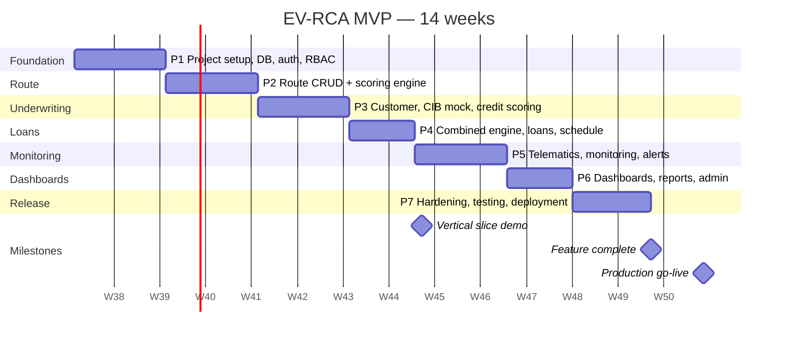
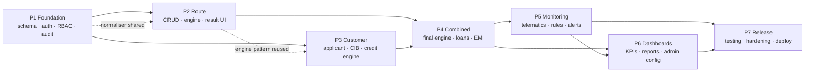

# 11. MVP Development Roadmap

**Team:** 1 Frontend engineer · 2 Backend engineers · 1 Full-stack/DevOps · 0.5 Designer · 0.5 PM/BA · 0.5 QA
**Duration:** 14 weeks to production-ready MVP · **Vertical slice demo at week 8**
**Complexity scale:** S (≤ 1 day) · M (2–3 days) · L (4–6 days) · XL (> 1 week, must be split)

---

## 11.1 Timeline

**Parallelisation:** frontend runs one phase behind backend on each module, working against the
OpenAPI contract with MSW mocks, so neither team blocks the other. Design delivers screens two weeks
ahead of the phase that builds them.

---

## Phase 1 — Foundation (weeks 1–2)

**Goal:** a deployable, authenticated, role-aware skeleton with the full schema in place.

| # | Task | Complexity | Depends on |
|---|------|-----------|------------|
| 1.1 | Monorepo scaffold, `docker-compose.yml`, `.env.example`, Makefile | M | — |
| 1.2 | FastAPI skeleton: settings, middleware chain (request-id, CORS, error handler, metrics), health endpoints | M | 1.1 |
| 1.3 | SQLAlchemy 2.0 base, session management, repository pattern | M | 1.2 |
| 1.4 | Alembic setup + migration 001: **complete schema** ([db/schema.sql](../db/schema.sql)) | L | 1.3 |
| 1.5 | Seed script: roles, permissions, role_permissions, system_settings, default scoring configurations, default risk rules, vehicle models, charging stations | L | 1.4 |
| 1.6 | Auth: login, Argon2id, JWT issue/verify, refresh rotation with reuse detection, logout, lockout | L | 1.3 |
| 1.7 | RBAC: `require_permission` dependency, permission loading, row-scope helpers | M | 1.6 |
| 1.8 | Audit service: transactional writer, redaction, immutability triggers verified | M | 1.4 |
| 1.9 | Next.js scaffold: App Router, Tailwind + design tokens, shadcn/ui, layout shell (header, sidebar, breadcrumbs) | L | 1.1 |
| 1.10 | Auth UI: login, forgot/reset password, session handling, silent refresh interceptor | L | 1.9, 1.6 |
| 1.11 | `openapi-typescript` generation wired into the build; typed API client wrapper | M | 1.2, 1.9 |
| 1.12 | CI pipeline: lint, typecheck, unit, integration with testcontainers, coverage gates | L | 1.2, 1.9 |
| 1.13 | User management API + screen (Screen 26) | L | 1.7 |
| 1.14 | Global state components: loading skeletons, empty states, error boundaries, toasts | M | 1.9 |

**Deliverables:** running stack (`docker compose up`), full database schema, working login for all six
seeded roles, role-appropriate navigation, user management, CI green, audit logging proven.

**Definition of Done**
- [ ] `docker compose up` produces a working app on a clean machine in under 5 minutes
- [ ] All 28 tables created by migration; `alembic downgrade base && upgrade head` round-trips
- [ ] Six seeded users, one per role, each seeing only their permitted navigation
- [ ] Access token expires in 15 min and refreshes silently without user-visible interruption
- [ ] Refresh-token reuse revokes the family and writes `SECURITY_REFRESH_REUSE`
- [ ] `UPDATE` on `audit_logs` raises at the database level (test proves it)
- [ ] CI runs on every push with coverage gates enforced

---

## Phase 2 — Route Assessment (weeks 3–4)

**Goal:** Module 1 complete and demonstrable on its own.

| # | Task | Complexity | Depends on |
|---|------|-----------|------------|
| 2.1 | Route CRUD API with full validation and soft delete | L | 1.7 |
| 2.2 | Charging station registry API + corridor linking | M | 2.1 |
| 2.3 | Scoring configuration service: load active config, in-process cache keyed by version | M | 1.4 |
| 2.4 | Normaliser primitives (`BANDED`, `LINEAR`, `COMPOSITE`) with property-based tests | M | 2.3 |
| 2.5 | **Route scoring engine** — 5 components, derived inputs, caps | L | 2.4 |
| 2.6 | Factor rule evaluator producing risk/positive factor lists | M | 2.5 |
| 2.7 | Explanation generator (templated narrative from components and factors) | M | 2.6 |
| 2.8 | Assessment persistence: assessment + components + route denormalisation + audit, one transaction | M | 2.5 |
| 2.9 | `POST /routes/{id}/assess`, `POST /scoring/route`, assessment history endpoints | M | 2.8 |
| 2.10 | Route list screen with filters, sorting, pagination (Screen 4) | L | 2.1 |
| 2.11 | Add/Edit route form with live derived panel (Screen 5) | L | 2.1 |
| 2.12 | Assessment modal (Screen 6) | S | 2.9 |
| 2.13 | **Route score result screen** — gauge, component bars, factors, charging strip (Screen 7) | XL → split into 7a gauge+recommendation, 7b composition, 7c factors+explanation, 7d charging analysis | 2.9 |
| 2.14 | Route detail with tabs and assessment history (Screen 8) | L | 2.9 |
| 2.15 | Staleness flagging job and UI indicator | S | 2.8 |

**Deliverables:** create a route, assess it, see a fully explained score.

**Definition of Done**
- [ ] The Kathmandu–Dhulikhel reference case returns exactly 90.12 / Grade A
- [ ] `Σ weighted_score == total_score` within 0.01 for 500 hypothesis-generated inputs
- [ ] Re-running an assessment produces a new immutable row; history is queryable
- [ ] A route missing a required field returns 422 naming every missing field, and writes nothing
- [ ] Score result screen renders every component expandable to its sub-factors
- [ ] Class C route shows the waiver requirement
- [ ] Route list filters and sorts server-side under 400 ms with 500 routes

---

## Phase 3 — Customer Underwriting (weeks 5–6)

**Goal:** Module 2 complete.

| # | Task | Complexity | Depends on |
|---|------|-----------|------------|
| 3.1 | Applicant CRUD with type-conditional validation, ID encryption, duplicate detection by hash | L | 1.7 |
| 3.2 | Financial profile versioning + obligations sub-resource with derived totals | L | 3.1 |
| 3.3 | Document upload: storage, magic-byte validation, checksum, authenticated download | M | 3.1 |
| 3.4 | **Mock CIB provider** — deterministic by ID, seeded distribution of realistic profiles | M | 3.1 |
| 3.5 | CIB adapter interface, caching by validity window, retry/circuit breaker, manual-entry path | M | 3.4 |
| 3.6 | Knock-out rule evaluator | M | 3.5 |
| 3.7 | **Customer scoring engine** — 6 components with type-conditional experience sub-factors | L | 2.4, 3.5 |
| 3.8 | DTI / FOIR / disposable income calculators | S | 3.2 |
| 3.9 | Customer scoring persistence + `POST /scoring/customer` | M | 3.7 |
| 3.10 | Customer list + add customer wizard (Screens 9, 10) | L | 3.1 |
| 3.11 | Customer profile with summary rail and tabs (Screen 11) | L | 3.1 |
| 3.12 | Financial information form with live calculation panel (Screen 12) | L | 3.2 |
| 3.13 | Credit assessment screen: bureau card, repayment strip, knock-out checklist, score breakdown (Screen 13) | XL → split into 13a bureau, 13b knock-outs, 13c score | 3.9 |
| 3.14 | Document upload UI with type validation and preview | M | 3.3 |

**Deliverables:** register an applicant, capture financials, pull a bureau report, get an explained
credit score with knock-outs.

**Definition of Done**
- [ ] Six applicant types each show and require the correct field set
- [ ] Duplicate national ID is detected before save and offers the existing record
- [ ] National ID is encrypted at rest and masked in every response by default
- [ ] Mock CIB returns the same report for the same ID every time
- [ ] A blacklisted applicant short-circuits to REJECT with no component scoring performed
- [ ] The reference borrower returns exactly 75.17 / Grade B
- [ ] Bureau outage degrades to manual entry without a 500

---

## Phase 4 — Combined Risk & Loan Management (weeks 7–8)

**Goal:** the end-to-end vertical slice — the week-8 demo milestone.

| # | Task | Complexity | Depends on |
|---|------|-----------|------------|
| 4.1 | Loan application CRUD, wizard state, status machine | L | 3.2, 2.1 |
| 4.2 | Vehicle model master + vehicle instance API | M | 1.7 |
| 4.3 | **Vehicle economics calculator** — energy, contribution, DSCR, payback | M | 4.2 |
| 4.4 | **Combined risk engine** — weighted final score, grading | M | 2.5, 3.7, 4.3 |
| 4.5 | **Loan structuring engine** — LTV caps, EMI capacity, tenure caps, pricing | L | 4.4 |
| 4.6 | **EMI calculator** with exact decimal discipline | M | — |
| 4.7 | Decision matrix + reason generator | M | 4.5 |
| 4.8 | `POST /applications/{id}/assess` orchestration, one transaction, full persistence | L | 4.7 |
| 4.9 | Decision endpoint with override justification enforcement | M | 4.8 |
| 4.10 | Loan booking + **amortisation schedule generation** | L | 4.6 |
| 4.11 | Repayment posting with allocation, DPD, classification, idempotency | L | 4.10 |
| 4.12 | Application wizard, 6 steps (Screen 15) | XL → split per step group | 4.1 |
| 4.13 | **Underwriting result screen** with what-if sliders (Screen 14) | XL → split into 14a decision+contributions, 14b reasons, 14c structure comparison, 14d what-if | 4.8 |
| 4.14 | Decision modal with override flow | M | 4.9 |
| 4.15 | Loan detail + repayment schedule + record-payment modal (Screens 16, 17) | L | 4.11 |
| 4.16 | `POST /scoring/final`, `POST /scoring/emi` stateless endpoints | S | 4.5 |

**Deliverables:** application → assessment → decision → loan → schedule → repayment, working
end to end.

**Definition of Done**
- [ ] The reference application returns final 84.31, Grade B, MANUAL_REVIEW, recommended NPR 2,960,000
- [ ] `Σ principal_due == principal` exactly across the generated schedule
- [ ] Final instalment closing balance is exactly 0.00
- [ ] An override without a ≥ 20-character justification is refused with a clear message
- [ ] Every assessment persists config version, engine version and input snapshot
- [ ] A duplicate `POST /loans` with the same idempotency key creates exactly one loan
- [ ] **Week-8 milestone: the first 12 steps of the demo flow run unaided on staging**

---

## Phase 5 — Portfolio Monitoring & Early Warning (weeks 9–10)

**Goal:** Module 3 complete.

| # | Task | Complexity | Depends on |
|---|------|-----------|------------|
| 5.1 | **Mock telematics provider** — profile-driven daily series with injectable distress scenarios | L | 4.10 |
| 5.2 | Telemetry ingestion job: validation, bulk upsert, partition routing, degraded flagging | L | 5.1 |
| 5.3 | Battery metrics and charging session ingestion | M | 5.2 |
| 5.4 | DPD / outstanding / classification recompute job | M | 4.11 |
| 5.5 | Usage baseline job (window functions → `loan_monitoring_snapshots`) | L | 5.2 |
| 5.6 | Metric provider registry (19 metrics) | L | 5.5 |
| 5.7 | **Rule engine** — pure evaluation, ALL/ANY, null semantics | L | 5.6 |
| 5.8 | Alert service: creation, dedup, supersession, suppression, auto-resolve | L | 5.7 |
| 5.9 | Alert lifecycle API: assign, acknowledge, activities, resolve, escalate | M | 5.8 |
| 5.10 | SLA escalation job + notification dispatch (in-app + SMTP) | M | 5.9 |
| 5.11 | Behaviour score calculator | S | 5.5 |
| 5.12 | Job runner CLI + `job_runs` tracking + Prometheus gauges | M | 5.2 |
| 5.13 | Portfolio dashboard + risk table (Screen 18) | L | 5.4 |
| 5.14 | Vehicle monitoring screen with 5 charts and threshold bands (Screen 19) | XL → split into 19a tiles+usage, 19b charging+battery, 19c adherence+maintenance | 5.5 |
| 5.15 | Customer behaviour screen with the combined repayment/usage timeline (Screen 20) | L | 5.5 |
| 5.16 | Alert queue (Screen 21) | L | 5.9 |
| 5.17 | Alert detail with evidence, context charts and resolution (Screen 22) | L | 5.9 |
| 5.18 | Notification centre in the header | M | 5.10 |

**Deliverables:** a booked loan is monitored nightly, produces alerts, and those alerts can be
worked to resolution.

**Definition of Done**
- [ ] Nightly job ingests telemetry, rebuilds baselines and evaluates rules idempotently
- [ ] All 22 seeded rules evaluate correctly; the 15 rule-engine test cases pass
- [ ] No duplicate alert is ever created for the same (loan, rule) while one is live
- [ ] Escalation from YELLOW to RED supersedes correctly with the link preserved
- [ ] A silent telematics feed raises an alert rather than reading as healthy
- [ ] The combined behaviour timeline visibly shows usage decline preceding payment failure on the demo data
- [ ] 10,000 loans × 22 rules evaluate in under 3 minutes

---

## Phase 6 — Dashboards, Reporting & Admin (weeks 11–12)

**Goal:** the management and configuration surface.

| # | Task | Complexity | Depends on |
|---|------|-----------|------------|
| 6.1 | Materialised views + refresh function + nightly refresh job | M | 5.4 |
| 6.2 | `GET /dashboard/summary` with all KPIs and chart datasets | L | 6.1 |
| 6.3 | Main dashboard with role variants (Screen 3) | XL → split into 3a KPI row, 3b charts, 3c attention table, 3d role variants | 6.2 |
| 6.4 | Report endpoints + CSV export with audit | L | 6.1 |
| 6.5 | Risk, portfolio and application report screens (Screens 23–25) | L | 6.4 |
| 6.6 | Scoring configuration API: draft, edit, validate weights, publish, archive | L | 2.3 |
| 6.7 | **Scoring configuration screen** with weight sliders, curve editor and live preview (Screen 27) | XL → split into 27a weights, 27b thresholds, 27c curve editor, 27d publish diff | 6.6 |
| 6.8 | Risk rules API + condition builder | L | 5.7 |
| 6.9 | Risk rules screen with the plain-language condition builder (Screen 28) | XL → split into 28a list, 28b rule editor, 28c condition builder | 6.8 |
| 6.10 | System settings API + screen (Screen 29) | L | 1.7 |
| 6.11 | Audit log API + screen with before/after diff viewer (Screen 30) | L | 1.8 |
| 6.12 | PDF export for route assessment and credit appraisal memo | L | 6.4 |

**Deliverables:** a Risk Manager can change policy without an engineer, and a management dashboard
tells the story.

**Definition of Done**
- [ ] Dashboard loads in under 2.5 s with 10,000 loans in the database
- [ ] Publishing a configuration with weights at 97% is refused with the actual sum shown
- [ ] Changing the charging weight from 30% to 35% and re-assessing produces a different, correct score
- [ ] Every configuration publish, rule change and setting change appears in the audit log with a diff
- [ ] CSV exports carry the applied filters and are audit-logged with the row count
- [ ] The audit log diff viewer shows redacted values as `***`, never plaintext secrets

---

## Phase 7 — Testing, Hardening & Deployment (weeks 13–14)

**Goal:** production-ready.

| # | Task | Complexity | Depends on |
|---|------|-----------|------------|
| 7.1 | Complete the E2E suite (14 specs incl. the full demo flow) | L | all |
| 7.2 | Authorisation matrix test across all endpoints × six roles | M | all |
| 7.3 | Security test suite (injection, IDOR, upload, headers, tokens, rate limits) | L | all |
| 7.4 | Performance testing with a production-shaped dataset; index tuning from `pg_stat_statements` | L | all |
| 7.5 | Accessibility audit and remediation (axe + manual keyboard/screen-reader passes) | M | all |
| 7.6 | Production Docker images (multi-stage, non-root, pinned digests), Nginx config with TLS and headers | M | — |
| 7.7 | Backup automation, encryption, off-site copy, **restore drill** | M | 7.6 |
| 7.8 | Prometheus + Grafana + Loki, dashboards and alert rules | M | 7.6 |
| 7.9 | Runbooks: deployment, rollback, disaster recovery, incident response | M | 7.7 |
| 7.10 | UAT with real users; defect triage and fixes | L | 7.1 |
| 7.11 | Demo data pack finalisation and reset script | M | 7.1 |
| 7.12 | User documentation + a 45-minute training walkthrough per role | M | 7.10 |
| 7.13 | Go-live checklist execution and production deployment | M | all |

**Definition of Done**
- [ ] Every item on the §9.16 security checklist ticked
- [ ] All 14 E2E specs green on three consecutive runs
- [ ] Performance targets met with 100k applications / 10k loans / 3M telemetry rows
- [ ] Restore drill completed and timed within the 8-hour RTO
- [ ] Monitoring live with alerting verified by a deliberate induced failure
- [ ] UAT signed off by Risk, Credit and Portfolio representatives
- [ ] Zero S1/S2 defects open
- [ ] Production deployed, smoke-tested and handed over with runbooks

---

## 11.2 Dependency graph

**Critical path:** P1 → P2 → P4 → P5 → P7. P3 can overlap P2 by one week (different engineers,
shared normaliser). P6 can start once P4 lands, since dashboards need loans but not alerts for the
first three tasks.

---

## 11.3 Milestones and gates

| Milestone | Week | Gate criteria | Decision |
|-----------|------|---------------|----------|
| **M1 Foundation ready** | 2 | Stack runs, auth works for six roles, schema complete, CI green | Proceed to modules |
| **M2 Route module demo** | 4 | A route is assessed and fully explained on screen | Show to Risk for weight feedback |
| **M3 Underwriting demo** | 6 | A customer is scored with knock-outs and reasons | Show to Credit for field-set feedback |
| **M4 Vertical slice** | 8 | Demo steps 1–12 run unaided on staging | **Go/no-go review with the investment committee** |
| **M5 Monitoring demo** | 10 | Alerts generate, escalate and resolve | Show to Portfolio for rule-threshold feedback |
| **M6 Feature complete** | 12 | All [M] requirements implemented | Freeze scope; enter hardening |
| **M7 Go-live** | 14 | Security checklist, UAT sign-off, restore drill, zero S1/S2 | **Production release** |

---

## 11.4 Risk register (delivery)

| Risk | Likelihood | Impact | Mitigation | Trigger for action |
|------|-----------|--------|------------|--------------------|
| Scoring weights not signed off in time | High | Medium | Build with documented defaults; weights are configuration, so late sign-off is a data change | No sign-off by week 6 → ship defaults, flag in release notes |
| The result screens are underestimated | High | Medium | Explicitly split into 4 sub-tasks each; design delivered by week 3 | Slippage > 2 days → drop the charging strip visualisation to Phase 2 |
| Telematics mock is unrealistic, so alerts look fake in the demo | Medium | High | Invest a full day in scenario-driven generation with clear distress arcs | Review the generated series with Portfolio at week 9 |
| Dashboard performance on real volumes | Medium | Medium | Materialised views from day one; performance test in week 13 | p95 > 2.5 s → add a read replica |
| Scope creep from stakeholder demos | High | High | Every request goes to the backlog with a MUST/SHOULD/COULD tag; only the PM can change MUST | Any MUST added → something else moves out |
| Key-person dependency on the engine | Medium | High | Two engineers pair on the engines; documentation-as-tests keeps the spec executable | — |
| UAT reveals a data-entry burden that officers reject | Medium | High | Time a real file at week 8, not week 13 | > 35 minutes → cut fields or add defaults |

---

## 11.5 Post-MVP (Phase 8+, indicative)

| Quarter | Theme | Headline items |
|---------|-------|----------------|
| Q1 after launch | Integration | Live CIB, live telematics, SMS notifications, four-eyes approval, PDF reports |
| Q2 | Intelligence | Configuration preview/simulation, rule dry-run, first statistical calibration review, risk-based pricing |
| Q3 | Reach | Field officer mobile app, Nepali localisation, dealer portal, core-banking integration |
| Q4 | Scale | ML probability-of-default, IFRS-9 ECL staging, battery-based residual value, multi-branch analytics |

Detail in [13-FUTURE-ENHANCEMENTS.md](13-FUTURE-ENHANCEMENTS.md).
