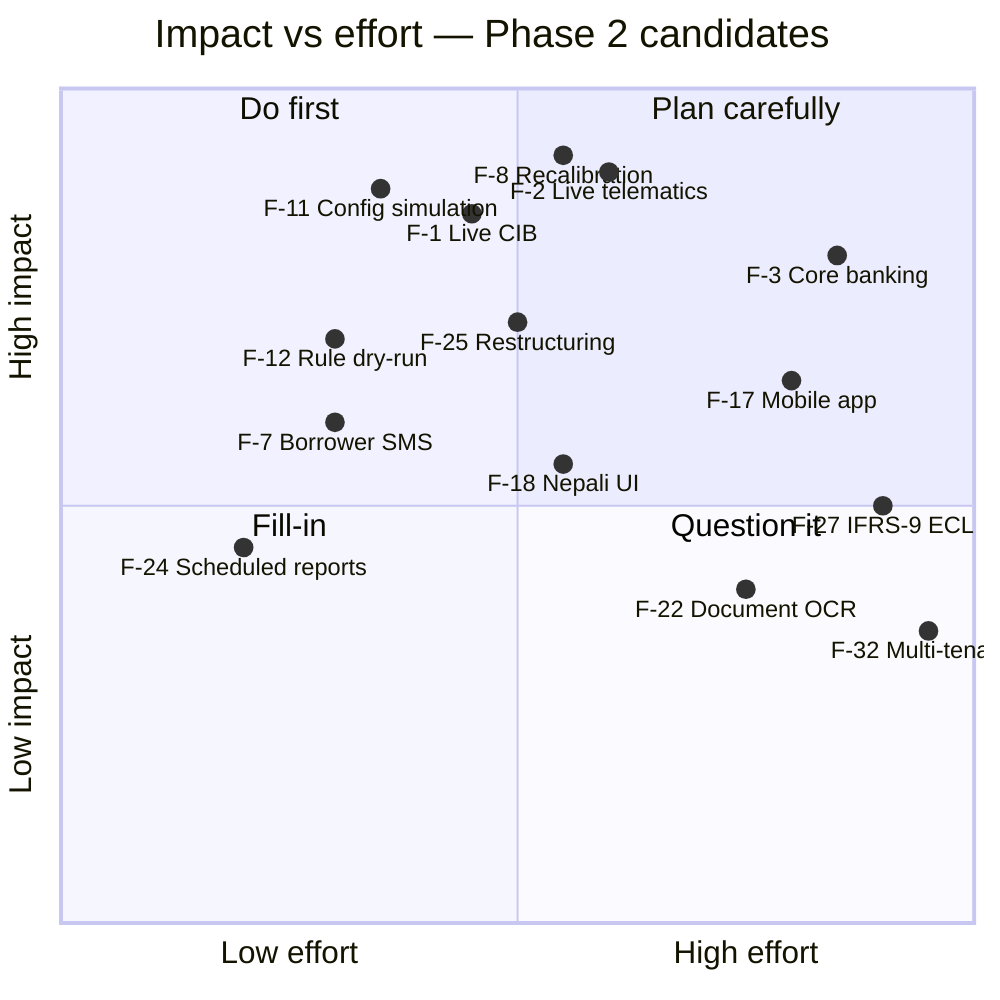

# 13. Future Enhancements

Everything here is explicitly **out of the MVP**. Each item states why it was deferred and what must
be true before it is worth building.

Tags: **[S]** SHOULD — Phase 2, within ~3 months of launch · **[C]** COULD — later, subject to
evidence.

---

## 13.1 Integration

| # | Enhancement | Tag | Why deferred | Precondition |
|---|-------------|-----|--------------|--------------|
| F-1 | **Live credit bureau integration** — replace `MockCIBProvider` with the contracted provider | **[S]** | Commercial contract and per-enquiry billing are business decisions; the adapter interface makes the swap a one-class change | Signed contract, credentials, test environment |
| F-2 | **Live telematics integration** — OEM cloud APIs and aftermarket OBD platforms | **[S]** | Depends on which devices the lender mandates in its loan covenant | Device policy agreed; at least one provider contracted |
| F-3 | **Core banking integration** — push approved loans, pull repayment postings | **[S]** | Removes double entry, the largest operational friction after launch | CBS integration team availability, API or file interface defined |
| F-4 | **Payment gateway / digital collection** — borrower pays via wallet or bank transfer, auto-reconciled | **[C]** | Touches money movement; a much heavier compliance surface | Treasury and compliance approval |
| F-5 | **Charging network API** — live station availability, tariffs and outages feeding route assessment | **[C]** | No consolidated national API exists yet; the manual registry is adequate at current volumes | A charging operator willing to expose a feed |
| F-6 | **Insurance integration** — policy verification and expiry monitoring as an alert condition | **[C]** | Currently a manual sanction condition | Insurer API |
| F-7 | **SMS / IVR to borrowers** — payment reminders and confirmations | **[S]** | MVP notifies staff, not customers; customer messaging needs consent handling and templates | SMS gateway, consent policy |

---

## 13.2 Credit intelligence

| # | Enhancement | Tag | Why deferred | Precondition |
|---|-------------|-----|--------------|--------------|
| F-8 | **Statistical recalibration** — fit component weights logistically against realised default | **[S]** | Impossible without outcome data; the expert scorecard is the deliberate first step | ~300 loans at 12+ months on book |
| F-9 | **Probability of default model** — replace or supplement the grade with a calibrated PD | **[C]** | Same data constraint; also needs model-governance sign-off | F-8 complete; model risk policy in place |
| F-10 | **Loss given default / recovery model** — using realised repossession and resale outcomes | **[C]** | Needs a repossession history | ~50 recovery events |
| F-11 | **Configuration simulation** — run a draft configuration over the historical book and show grade/decision migration | **[S]** | The single highest-value safeguard against a well-meant weight change loosening credit; deferred only because it needs a body of decided applications | ~200 decided applications |
| F-12 | **Rule dry-run against history** — "this rule would have raised 14 alerts" | **[S]** | Needs 90 days of monitoring snapshots | Phase 5 data accumulated |
| F-13 | **Risk-based pricing engine** — rate as a continuous function of PD and LGD rather than a grade premium table | **[C]** | Requires F-9 and F-10 | Pricing policy approval |
| F-14 | **Route learning loop** — feed realised performance on a corridor back into its score | **[C]** | Conceptually the most valuable idea in the product; needs enough loans per corridor to be statistically meaningful | ≥ 30 matured loans on a single corridor |
| F-15 | **Peer benchmarking** — "this borrower vs the median operator on this route" as an underwriting input, not just a monitoring view | **[C]** | Needs corridor density | F-14 data |
| F-16 | **Fraud detection** — device-sharing, identity reuse, income-inflation patterns | **[C]** | Requires volume and labelled fraud cases | 1,000+ applications |

---

## 13.3 Product surface

| # | Enhancement | Tag | Why deferred | Precondition |
|---|-------------|-----|--------------|--------------|
| F-17 | **Field officer mobile app** (React Native or PWA) with offline capture, photo upload, GPS-stamped visits | **[S]** | The responsive web UI covers the MVP; a native app earns its cost once field volume is real | ≥ 200 field visits/month |
| F-18 | **Nepali (नेपाली) localisation** — full UI translation, Bikram Sambat date entry (not just display) | **[S]** | English is acceptable for head-office and branch staff at launch; field roles benefit most | Translation resource; the i18n scaffolding is already in place |
| F-19 | **Borrower portal** — statement, schedule, payment history, alerts affecting them | **[C]** | A separate authentication and support surface | Customer support model defined |
| F-20 | **Dealer / vendor portal** — quotation upload, delivery confirmation | **[C]** | Requires dealer onboarding | Dealer network agreement |
| F-21 | **E-signature on sanction letters** | **[C]** | Legal admissibility must be confirmed | Legal opinion |
| F-22 | **Document OCR / e-KYC** — extract data from citizenship, PAN and licence images | **[C]** | Nepali document OCR accuracy is the open question; bad extraction is worse than manual entry | Accuracy ≥ 95% on a 200-document sample |
| F-23 | **In-app collaboration** — comments and @mentions on applications and alerts | **[C]** | Email and the activity timeline suffice initially | User demand |
| F-24 | **Scheduled report distribution** — email a weekly portfolio pack to a distribution list | **[S]** | Manual export is acceptable at MVP volumes | SMTP configured, recipients agreed |

---

## 13.4 Operations and finance

| # | Enhancement | Tag | Why deferred | Precondition |
|---|-------------|-----|--------------|--------------|
| F-25 | **Loan restructuring and moratorium** — regenerate the schedule, retain the original | **[S]** | Real portfolios need it within the first year; not needed for the MVP demo | Policy defined for restructure eligibility |
| F-26 | **Foreclosure and settlement** handling | **[S]** | Same reasoning | Policy defined |
| F-27 | **IFRS-9 ECL staging** — Stage 1/2/3 classification and expected-credit-loss computation | **[C]** | Needs PD/LGD (F-9, F-10) and finance sign-off | Finance requirement confirmed |
| F-28 | **Repossession workflow** — seizure, storage, valuation, auction | **[C]** | Downstream of collections; separate operational process | Recovery unit engagement |
| F-29 | **Battery-health residual value** — collateral value as a function of state of health and age, feeding LTV monitoring | **[C]** | Genuinely novel for EV lending, but needs a resale price series | ≥ 20 observed EV resales |
| F-30 | **Refinancing / top-up offers** driven by behaviour score and paid-down LTV | **[C]** | Needs a matured book | 12 months of portfolio |
| F-31 | **Multi-branch analytics and targets** | **[S]** | Branch scoping exists in the schema; the reporting layer is what is missing | Branch structure loaded |
| F-32 | **Multi-tenancy** — one deployment serving several institutions | **[C]** | Row-level security and tenant isolation are a significant rework; only relevant if the product is sold as SaaS | Commercial decision to sell as SaaS |

---

## 13.5 Platform and engineering

| # | Enhancement | Tag | Why deferred | Precondition |
|---|-------------|-----|--------------|--------------|
| F-33 | **Redis + Celery adoption** | **[S]** | Cron-driven jobs are adequate below ~1,000 loans; the CLI entry points are already Celery-compatible | Job runtime > 10 min or retry needs |
| F-34 | **Read replica for dashboards and reports** | **[S]** | Materialised views carry the MVP | Dashboard p95 > 2.5 s |
| F-35 | **PgBouncer connection pooling** | **[S]** | Not needed at 50 concurrent users | > 200 concurrent users |
| F-36 | **Extract `monitoring` and `risk` into a separate service** | **[C]** | Module boundaries are already the extraction seam; do it only when team or scale demands | Two teams, or telemetry volume forcing separate scaling |
| F-37 | **Time-series store for telemetry** (TimescaleDB or similar) | **[C]** | Monthly partitions plus rollups handle 24 months comfortably | > 50M telemetry rows |
| F-38 | **Blue/green or canary deployment** | **[S]** | The MVP restart window is acceptable | 99.9% availability target |
| F-39 | **Automated database failover** | **[C]** | Manual replica promotion meets the 2-hour RTO | RTO tightened below 30 min |
| F-40 | **Full OpenTelemetry tracing** | **[C]** | Request-id correlation plus structured logs is sufficient for a monolith | Service extraction (F-36) |
| F-41 | **Feature flags** for progressive rollout of engine changes | **[S]** | Configuration versioning already covers risk-policy change; flags would cover code change | Multiple concurrent engine versions needed |
| F-42 | **Public API for partners** with API keys and quotas | **[C]** | No partner demand yet | Partner agreement |

---

## 13.6 Prioritisation view

**Recommended Phase 2 (first three months post-launch), in order:**
1. **F-11** configuration simulation — protects the credit standard as soon as people start tuning
2. **F-1** live bureau — removes the biggest "is this real?" objection
3. **F-12** rule dry-run — stops alert-fatigue before it sets in
4. **F-25/F-26** restructuring and foreclosure — the first real portfolio will need them
5. **F-2** live telematics — the highest-value integration, but gated on device policy
6. **F-33/F-34** Redis/Celery and a read replica — only when the measurements say so

---

## 13.7 Explicitly not planned

Stated so that scope conversations end quickly.

| Not building | Reason |
|--------------|--------|
| A general-purpose loan origination system for all products | This platform is deliberately EV-specific; genericising it would destroy the route model that makes it valuable |
| A general ledger or accounting module | The core banking system owns this |
| A CRM | Out of domain |
| Cryptocurrency or blockchain anything | No problem here that it solves |
| An LLM chatbot for credit decisions | Credit decisions must be deterministic, reproducible and explainable by construction. A stochastic model cannot satisfy the audit requirement that a March decision be reproducible in September. LLM assistance for *drafting* narrative memos from the structured output is a defensible future item; LLM *deciding* is not. |
| Real-time second-by-second GPS tracking | Daily aggregates answer every credit question at a fraction of the cost, storage and privacy exposure |
